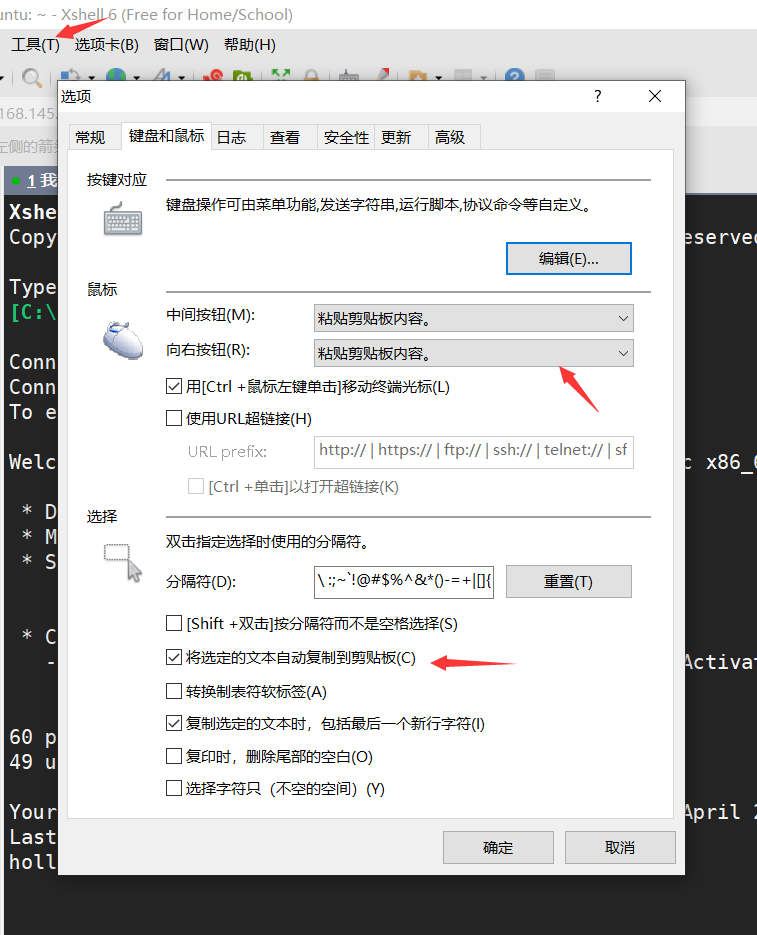
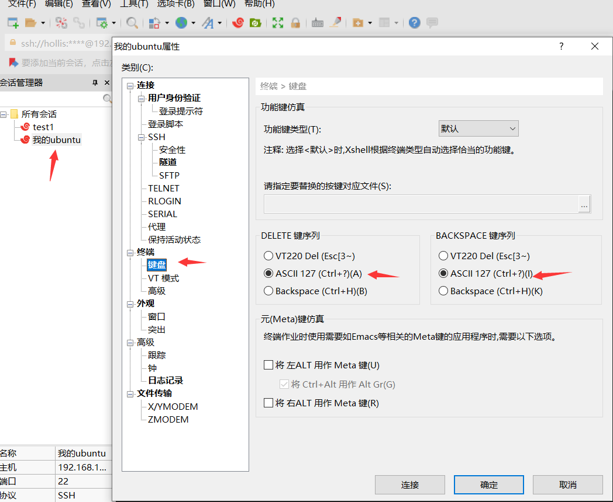
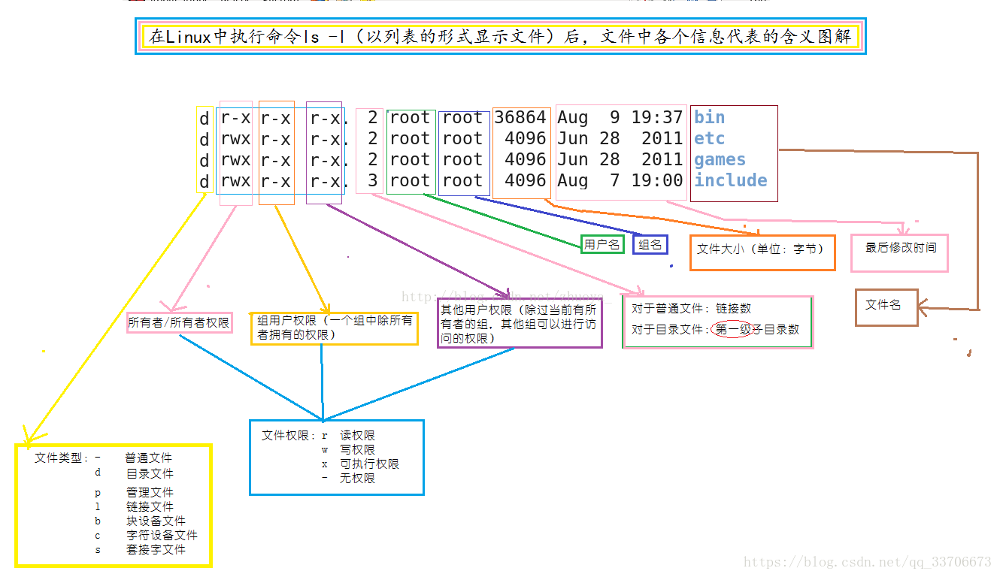
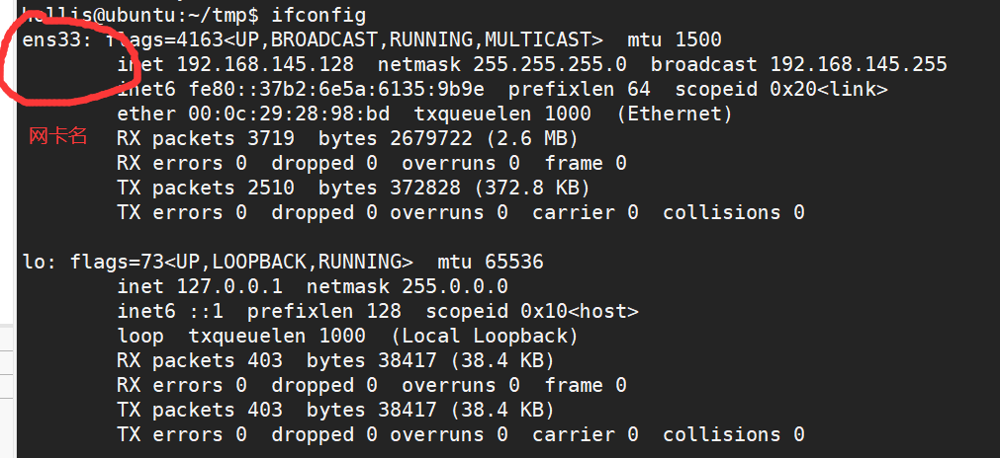

[toc]

# 环境安装

* [文件存储](D:\王道训练营python)

* python3.6：多个python可以共存于1台PC

* Pycharm professional：若电脑存在旧版本pycharm，新版本安装会自动卸载旧版（可以选择保留设置）。

  > pycharm 常用快捷键
  >
  > CRTL+ALT+L（大写），pep8f风格代码整理
  >
  > crtl+b，跳转函数定义处 
  >
  > crtl+鼠标移动函数调用处，显示函数注释（被3个引号包裹的注释）

* ubuntu：[清华镜像下载](https://mirrors.tuna.tsinghua.edu.cn/#) 

  * [apt与apt-get的区别](https://blog.csdn.net/liudsl/article/details/79200134)

* VMWare：VM workstation，载入ubuntu镜像，虚拟磁盘分配40GB。

  * [ubuntu网卡消失解决](https://www.cnblogs.com/renoyuan/p/11791940.html) 

* winscp：windows端和linux主机之间互传数据的工具

* xshell：windows端连接host主机的工具。连接过程中会要求输入host的ip地址（`ifconfig`可查）、用户名、密码、端口（22）。对xshell进行如下简单设置可提高效率，CRTL+A（E）快速移动到命令行行首（尾）。

  * xshell远程连接主机要求主机必须安装ssh服务`sudo apt install ssh`，**并且固定IP（不然ip一变就会连不上）**。
  
  
  
  


# 系统介绍

* 服务器版（server）和桌面版（desktop）：桌面版面向普通用户，包含GUI、一些娱乐应用等，服务器则面向服务器，包含托管站点的一些必备软件，如Mysql、应用框架等，稳定，一般不含GUI。
* redhat系列：linux内核，包含redhat、centos、fedora等，基于yum包安装。rhel（red hat enterprise linux）**商业公司redhat进行维护**，稳定、付费。centos(community enterprise linux)是redhat根据开源规则开放的一款社区Linux系统，较稳定、免费。fedora稳定性较差，适合桌面系统。
* debian系列：linux内核，包含debian、ubuntu等，基于apt安装。**社区版Linux**，开源免费，稳定性较好。其中ubuntu为桌面系统。
* freeBSD：自由免费的类linux系统，采用ports包管理，基于源代码分发，稳定高效，适合作为服务器，但对硬件的支持没有Linux完备，所以并不适合作为桌面系统。
* gentoo：Linux世界最年轻的发行版本，拥有媲美 FreeBSD的广受美誉的ports系统 ——Portage包管理系统。Portage基于源代码分发，必须编译后才能运行，在经过各种定制的编译参数优化后，能将机器的硬件性能发挥到极致。


系统查看

* 查看linux内核版本：`uname -a` 

* 查看当前的发行版信息：`cat /proc/version`  ，可以看是redhat还是centos等

* 查看本机cpu信息：`cat /proc/cpuinfo` 


# 包管理

## 源码安装软件

参考文档：**[linux源码安装的步骤](https://www.cnblogs.com/benwu/articles/8436209.html)** 


**源码是无法直接在linux上安装的，必须先使用编译工具gcc转为二进制可行性文件后才能安装**，这个过程分为两步：

1. 使用gcc编译器将源码编译成目标文件 
2. 再次使用gcc编译器将目标文件链接成二进制文件

**一个软件的源码往往分散在多个源文件中，彼此存在先后关系，因此gcc编译时，对编译顺序有所要求。**

linux的`make`命令可以帮助用户简化这个流程。当执行`make`命令时，该命令会在当前文件夹寻找Makefile文件，**Makefile文件浓缩了整个编译流程，能够指导make如何去编译。而Makefile文件又是由configure命令产生**，configure会根据当前系统环境动态生成一个适合本系统的Makefile文件。

因此，他们几个的关系是这样的，`configure==>Makefile文件生成-->make` 。

在此基础上，归纳linux的源码安装步骤如下：

1. 下载源码文件到某文件夹，解压缩。可以从官网下载后拖进linux，也可以像下例使用wget（或许还要安装）

   ```shell
   #以memcached为例
   cd /usr/local
   mkdir memcached
   wget http://memcached.org/files/memcached-1.4.29.tar.gz
   tar -xzf memcached-1.4.29.tar.gz
   ```

2. config命令生成MakeFile文件

   ```shell
   #prefix参数用于指定步骤4的安装目录
   ./configure --prefix=/usr/local/memcached/
   ```

3. make编译链接生成二进制文件

   ```shell
   #make clean可有可无，用来清除上一次编译生成的目标文件，防止软件包中含有残留目标文件
   make clean;make
   ```

4. make install 安装上一步生成的二进制文件到系统中

   ```shell
   make install 
   ../configure --prefix=/usr/local/gcc-4.4.0 --enable-languages=c,c++,java,objc --disable-multilib
   
   ```


这里补充一些关于linux软件安装目录选择的知识：

* `/usr`，系统级程序存放目录，可以理解为`C:/Windows/`
  * `/usr/lib`存放linux函数库文件，可理解为`C:/Windows/System32`  
  * `/usr/local`，用于存放用户级程序，可理解为`C:/Progrem Files/` 
    * `/usr/local/src`：用户级别的源码
  * `/usr/src`：系统级别的源码目录
* `/opt`，用户级别的第三方程序，名字可以任取，也可以叫`/software`等等，类似于`D:/software` 

## 编译安装软件

相当于免安装版的软件，下载后直接是二进制文件包，可以直接使用，但下载时一定要注意平台。

## rpm yum dpkg apt联系与区别

rpm、yum是小红帽**Redhat**系列的包管理工具，dpkg、apt是**Debian**系列的包管理工具。

rpm（readhat package manager）能够对本地包执行简单的管理，例如安装、卸载、更新等，但是无法解决包与包之间的依赖关系，类似于windows控制面板自带的程序卸载安装。

yum（yellow dog updater modified）是一个基于rpm的包管理工具，可以**在线下载安装、自动处理包与包之间的依赖关系等**。

而dpkg（debian package manager）与apt的关系正如rpm与yum的关系。

关于他们在使用语法上的区别，可以[参考这里](https://blog.csdn.net/qq_26182553/article/details/79869666?utm_medium=distribute.pc_relevant_t0.none-task-blog-BlogCommendFromMachineLearnPai2-1.nonecase&depth_1-utm_source=distribute.pc_relevant_t0.none-task-blog-BlogCommendFromMachineLearnPai2-1.nonecase) 。

# 用户配置

* 切换用户：`su user1`，切换到用户user1，user缺省时为root用户。root用户命令提示符前缀为`#`，普通用户是`$` 

* 添加用户：`useradd -m <user_name> -s /bin/bash`，添加名为username的普通用户，m表示在home目录下创建用户目录，s表示指定解释器并在家目录作相应配置

* 设置密码：`passwd <user_name>` 

* 删除用户：`userdel [-r] <user>`，删除用户user1，r表示同时删除用户文件夹

* 退出当前用户：`exit` 

* 查看本机用户数：`cat /etc/passwd`。每行格式为如下，共7个字段。uid>=1000的均为用户，id<1000的为系统服务 。

  ```shell
  用户名：是否加密：uid：gid：用户的简单说明：家目录：shell解释器
  ```

* 给用户添加sudo权限：

  *  编辑`/etc/sudoers `文件，配置相应用户 。参考：https://www.cnblogs.com/sucretan2010/p/14681477.html  
  *  `sudo addgroup xiongda adm`，adm是具有root权限的用户组

* [更改用户终端颜色](https://www.cnblogs.com/lepeCoder/p/7630423.html) 


用户组

* 查看用户组：`cat /etc/group`，每行格式如下，为4个字段。

  ```shell
  # 用户组:用户组密码：group id：用户列表
  adm:x:4:syslog,hollis
  ```

  

# 目录及文件操作

## 目录

* 进入目录：`cd dir` 
* 显示当前路径：`pwd` 


## 创建移动

* 文件显示：`ls [-l -a ]`，显示当前目录下所有文件、目录。l：显示文件的详细信息，a：显示所有文件（含以`.`开头的隐藏文件和`..`上级目录）  



* 创建文件夹：`mkdir [-p] dirname`，在当前目录创建名为dirname的文件夹，-p表示递归创建多级路径。
* 文件创建：`touch file` ；
* 链接文件创建：`ln [-s] 源文件 链接文件名`，创建链接指向源文件。[-s]表示符号（软）链接，无s为硬链接。
* 删除文件夹：`rmdir dirname`，当前目录删除名为dirname的**空文件夹**，若文件夹非空，将会报错


* 文件复制：`cp [-f -i -r] 文件1 [文件2 ...] 文件夹1`，拷贝文件1到文件夹1。拷贝的同时可以重命名，如`cp ./main.c ../main1.c`。
  * f：若目标路径存在重名文件，直接覆盖。
  * i则表示覆盖前询问。
  * r：递归，拷贝文件夹时需要使用
* 文件剪切：`mv [-f -i ] 源文件 目标文件`：移动源文件至目标文件处。若目标文件存在，相当于直接“剪切”，若目标文件夹不存在，则为移动的同时重命名。**mv拷贝文件夹不需要使用r参数**。
* 文件/目录删除：`rm [-f -r ] dir1 [di2 ...]`：删除（多个）文件夹或文件，f表示强制删除无需询问，r表示递归，删除文件夹及其所有子文件时使用。


## 权限配置

* 权限配置：`chmod [who][+|-|=][mode]文件名  `，各参数意义如下：who表示执行对象，分为user、group、others，分别以ugo表示，**当who缺省时，表示all所有人**。+-分别表示添加、删除权限，mode表示模式，分为r（读，4）、w（写，2）、x（执行，1）。使用chmod更改文件权限有两种方式，使用rwx字母或数字，示例如下。

  * 文件掩码：`umask xxx`，控制linux创建文件后的默认权限（666/777-x），**只对当前本次会话生效**。xxx缺省时为查看当前用户umask。Linu默认普通用户为002，超级用户为022，所以普通用户、超级用户创建后默认权限为：文件（664,644）、文件夹（775,755）。
  * 用户污染：若root用户在其他用户文件夹下创建文件夹（755），则其他用户无权修改该文件夹（r-x），此为污染。但允许删除（具备执行权限）。

  ```shell
  chmod g+r,o-r example.txt #为同组增加权限、其他人删除可读权限
  chmod 644 example.txt #效果等价于 u:rw,g:r,o:r
  ```
  
* 更改文件所有者、组：`chown user:group（初始用户组） file [-R]`，group可以缺省，也可以选择和用户同名（linux每个用户都有一个和自己同名的初始组），R参数表示递归地更改文件夹所有文件。

  


## 打包压缩

* 文件打包：`tar -x|c|z|r|vf 打包文件夹名称 源文件`，c=create，创建打包文件。v，显示过程。f，使用磁盘文件且为最后1个参数，**必带参数**。z，打包（解包）的同时使用gzip压缩（解压）。x，释放打包文件，释放文件不可指定释放路径，如`tar -xf day3.tar`，若释放路径存在同名文件，将被覆盖。r，追加文件到打包文件。
* `.tar?`，linux不以后缀区分文件，如此命名只是方便人们阅读识别。另外，tar的文件大小可能比实际打包文件大小大得多，如此设计是考虑性能，为了日后方便追加文件。
* 文件压缩：`gzip/bzip [-d] 源文件`，只能压缩单文件（所以打包和压缩往往同时进行）。d，解压文件。
* 查看文件的md5校验和：`md5sum 文件名` ，生成1个哈希值 

## 查找

文件查找：`find 起始目录 查找条件`，在起始目录下寻找满足查找条件的文件，查找条件可以使用逻辑表达式，与`-a`、或`-o`、非`!`，如`find /home/user –name "0718" –a -type d `表示在对应目录下查找名为0718的文件夹。

```shell
-name '字串'	#查找文件名匹配所给字串的所有文件，字串内必须使用双（单）引号包裹，可使用通配符
#通配符和正则表达式稍微有所区别，如*在通配符中可以表示0或多个任意字符（含*、.等特殊符号），而在正则中为重复前面的字符0或多次，#不能单独使用

-gidn	#查找属于 ID 号为 n 的用户组的所有文件
-uidn	#查找属于 ID 号为 n 的用户的所有文件。 
-group'字串'	#查找属于用户组名为所给字串的所有的文件
-user '字串'	#查找属于用户名为所给字串的所有的文件
-empty	#查找大小为 0 的目录或文件，若有多个空文件夹嵌套，只会删除最底层的空文件夹
-perm 权限 #查找具有指定权限的文件和目录，权限的表示表示为 755，644。 
-size n[bckw]	#查找指定文件大小的文件，n后面的字符表示单位，分别为位、字节、缺省为b，代表512字节的块。 
-type x #查找类型为x的文件，x 为下列字符之一： 
#b块设备文件 
#c字符设备文件    
#d目录文件
#p命名管道（FIFO）
#f普通文件
#l符号链接文件（symboliclinks）
#s socket 文件
-cmin +/-n #显示内容n分钟之前（之内）被修改过的文件
-mtimen	+/-n	#查找n天以前文件内容被修改过的所有文件。

```


* 树型显示：`tree[-aACdDfFgilnNpqstux][-I<范本样式>][-P<范本样 式>][目录...] `，ubuntu下需要先安装`apt-get install tree`，
* **磁盘使用情况查看**：

  * `df -h 目录`：**显示分区占用**磁盘情况，H=human-readable，显示单位将以K、M、GB等单位显示。
  * `du -h [--max-depth=?]文件`：disk usage，**显示当前文件夹下的文件占用**情况，max-depth表示显示时的文件夹递归深度。而`ls -lh`显示的文件夹大小只是文件夹的名字大小（目录下只存储文件名字，名字指向索引结点）

# 文件查看

* 文件内容查看：`cat [-b -n ]文件名`，b、n，对非空、空行显示编号。`dev/null`黑洞文件，可以将任何不必要的输出重定向`>`到该文件，将不会在屏幕显示。

* 字符统计：`wc [-c -l -w] 文件名`。c，统计字节数。l，统计行数。w，统计字数，所谓的字是指被空白、换行分隔的字符串。如，统计当前目录下有多少个文件，`ls -l|wc -l` 

* 显示文件内容的前/后几行：`head/tail -n 行数 文件名` 

* 单页浏览文件：`more`或者`less` 

* 文件内容查找：`grep [] 正则表达式`，区别于`find -name 'str'`中使用的系统通配符，如`ls /home/hollis/tmp |grep ^a`，表示搜索对应目录下以a开始的文件

  ```shell
  #grep常用参数
  -F	#每个模式作为固定的字符串对待,在搜索特定符号时有效，如^、$ 
  -c	#只显示匹配行的数量。 
  -i	#比较时不区分大小写。 
  -n	#在输出前加上匹配串所在的行号。 
  ```
  
* 文件内容排序：`sort 文件名`，对文件内容进行排序，按照字符（编码）顺序排

* 文件内容去重：`uniq 文件名`，只会对文件内容相邻的内容进行去重，因此，常常搭配sort配合使用，`sort 文件名|uniq `

* 文本内容替换：管道查找替换，`sed [-i] 's/原字符串/替换字符串' 文件名（可使用通配符）`，能够**在不打开vim的情况下批量查找替换**，**i表示对文件原地修改**，否则只是返回内存副本。如`sed -i 's/print/myprint' *.py` 替换当前文件夹下所有py文件里的print字段为myprint。

* 文件类型查看：`file 文件名`，其中ELF是linux下可执行文件类型（类似于EXE在Windows），若是文本，可查看文本编码和文本模式（with CRLF）。Linux不识别window下的`\r\n`。

* 文件转码：`iconv -f 原编码 -t目标编码 文件名` ，汉字编码gbk：2个字节，utf8：3个字节

* 文件md5值：`md5sum flile_name`，常用与对比两个文件是否内容一致

  

# 命令组合

* 管道：`|`，将前一个命令的输出作为后一个命令的输入，如`history|head -10`。
  
  管道| 与重定向>的区别：管道用于连接两个命令，重定向用来输出定向，命令后跟的是控制台或者文本 。

* 参数过滤器：`xargs []`，**参数过滤器**，多与管道连用，默认使用`echo`，**去除参数中的换行、多个空格转单空格**。有些命令不支持管道，此时就需要`xargs`对参数进行处理，如`find . -empty|xargs rm -rf`，`find`返回的结果以多行呈现，需要以xargs转为单行参数，然后传给rm。

  **当参数位置不在后一个命令的末尾时**，使用`-i`选项，如`find . -name "*.txt" |xargs  -i cp {} d3 ` ，寻找所有以txt结尾的文件拷贝到d3文件夹。

* 重命名命令：格式为`alias la="ls -al --color=auto"`，原命令用双引号包裹。若只是在命令行执行，则用户退出后失效。可在`~/.bashrc`（环境变量配置）或`/etc/bashrc`文件中添加该语句，分别针对当前用户和所有用户，执行`source ~/.bashrc`后生效。

* 查看命令位置：`which 命令`   

* **封装自己的命令**：写一个shell脚本，可以使用`$num`传递多个参数。将其拷贝到`/usr/bin`目录下，命令名就是脚本名 

  ```shell
  #封装自己的剪切命令 $1接收第1个参数 $2接收第2个参数
  mymv $1 $2
  ```

  

* 将sh脚本作为系统命令：将可执行的sh文件放入`/bin`中，确保可执行权限。此后任意地方键入命令前几个字母可以按TAB补全。

# 网络

* 路由查看：`route -n`，可查看路由表、网关信息等

* 网络配置：`ifconfig`

* 网卡关闭/开启：`ipconfig 网卡名 down/up`，用于远程开关服务器。关闭网卡后，使用`ifconfig`只会显示Lo的相关信息（不会有网卡的信息）

  

* 固定ip设置：以root权限编辑文件`/etc/network/interfaces`文件

  ```shell
  #下面的ens33h换成具体的网卡名字
  auto ens33
  iface ens33 inet static
  address 192.168.0.104
  netmask 255.255.255.0
  gateway 192.168.0.1                   
  ```

* 远程拷贝：`scp [-r] 源主机 远端主机`，其中源主机可以直接写明文件路径，远端主机的文件路径格式为`user@ip:path`，如`scp file3 king@192.168.4.52:~/ ` 。参数r表示递归拷贝文件夹

* 无密钥登录（[原理](https://www.cnblogs.com/diffx/p/9553587.html)）：`ssh user@ip`，注意，**ubuntu下默认root不可远程登录**，因为每台linux主机必定存在root用户，此时，若被暴力破解得到root的密码，则免密登录状态下服务器会直接遭受攻击。**假设主机A要免密登录主机B**，则步骤如下：

  1. A主机`ssh -keygen`生成公钥、私钥对，其生成位置为`~/.ssh`。每个人生成的钥匙对都不一样，**公钥用于加密，私钥用于解密**。主机A向主机B发起ssh登录请求时，主机B的公钥就会发送给A，用于AB之间的信息加密。当A将user、passwd加密后发送给主机B后，B就用自己的私钥解密。

     ```shell
     ssh-keygen
     ```

  2. 将`id_rsa.pub`作为公钥，放到B主机上，可记为“**公钥放在要登录的目标服务器上**”。

     ```shell
     ssh-copy-id -i .ssh/id_rsa.pub  user_name@B_host 
     ```

     上述命令会自动将A的公钥文件追加写入到`~/.ssh/authorized_keys`文件。

  3. A使用`ssh user@ip`尝试免密登录主机B，若失败，重复步骤1-3。

* [查看端口状态](https://blog.csdn.net/qq_35180983/article/details/82500424)：`netstat -an|grep [TCP| UDP| port]`

# 进程

* 进程状态：
  * Run：运行态、就绪态
  * Sleep：阻塞态，等待资源的满足或被唤醒，不在就绪队列中
  * Traced：暂停，用于调试，追踪程序
  * Zomby：僵死，进程运行结束，等待被回收
* 查看当前进程快照：`ps -el[L]f `，以pid区分进程，L为查看线程 。`ps -aux` 显示进程的CPU、内存使用情况。linux的cpu使用情况为程序对当前核的占用率，cpu最大利用率=核数* 100%。
* 动态查看进程：`top [-p pid]`，实时查看进程状态。按下`H`查看线程
* 杀死进程：`kill -9 pid ` 
  * ctrl+c 终止一个进程等于`kill -2 pid` ，crtl+z 暂停一个进程等于`kill -19 pid`，  使用` kill -18 pid` 进程继续  。
* 改变进程优先级：Linux中共有140个优先级，其中为公平调度分配60-99共40个优先级，为实时调度共分配-40-59共100个优先级，数字越小优先级越高。使用`top`查看到的优先级为0-39等效于ps中看到的60-99。使用`sudo renice +-x -p pid`为指定进程增加（减少）优先级x。


# 环境变量

环境变量：[关于~/.bashrc;.etc/.bash_profile之间的区别](https://www.cnblogs.com/triple-y/p/11107133.html) 

* `/etc/profile` ：此文件为系统的**每个用户**设置环境信息。当用户登录时,该文件被执行，并从``/etc/profile``.d目录的配置文件中搜集shell的设置
* `/etc/bashrc`：为每一个运行`shell`的用户执行此文件。当shell被打开时，该文件被读取
* `~/.bash_profile` : 当前用户的环境变量信息。用户登录时，执行一次。
* `~/.bashrc` ：用户登录时，被`.bash_profile` 读取执行 
* `~/.bash_logout`：用户退出时，执行


`/etc/`中的环境变量相当于全局，`~/bash_profile`中的变量相当于局部。

# 其他

* 查看历史命令：`history`，显示存于缓存中的命令。正常关闭会话后，其会追加写入到`~/.bash_histrory`，非正常关闭或同时开启多个终端，可能会导致[写入覆盖](https://blog.csdn.net/weixin_34311757/article/details/91544518) 
* 立即执行shell文件：`source 文件名`，可使修改过的脚本文件立即生效（否则登录后才会生效）,常用与修改配置
* 查看内存（memory）：`free` 
* 定时任务编写：`crontab -e`，选择对应编辑器后打开，命令格式为`minite hour(0-23) dayofmonth(1-31) month(1-12) week(0-7) yourCommand` 。保存后立即生效。

## VIM

* VIM状态：分为命令状态和编辑状态。命令状态下不可编辑，键入值均作为命令处理，如`:q`表示退出。命令状态按下`i`切换编辑状态，编辑状态按`esc`切换到命令状态

### 写入退出

```shell
:w #写入
:q #为修改状况下直接退出
:q! #强制退出
:wq #写入并退出
:%!xxd #查看文本编码内容
:set nu	#显示行号 set nonu #关闭行号显示
```


### 删除修改

* 删除字符：`x`
* 删除行：`ndd`，删除光标所在行在内的n行，若n缺省，则删除光标所在行。`D`表示删除光标到行尾的文本，常用于删除注释语句
* 复制行 ：`nyy`，复制光标所在行在内的n行，若n缺省，则只复制光标所在行
* 粘贴：`p`，在光标下一行进行粘贴
* 撤销：`u`

### 光标移动

* 移动到行首、尾：`^`、`$`，类似于正则表达式
* 移动到文档首、尾：`gg`、`G`
* 移动到页面的首尾：`H`、`L`，助记为high、low
* 翻页：
  * 向上、下翻页：`crtl+b`、`crtl+f`，即back、forward
  * 向上、下翻半页：`crtl+u`、`crtl+d`，即up、down
* 快速定位：`nG`，快速定位到n行

### 查找替换

* 查找：`/目标字符串`，回车后会高亮显示，按`n`下一处，按`N`回滚到上一处。
* 查找替换：`:[op]s/原字符串/目标字符串/[设置]`，s=substitute
  * op字段规则如下：（1）`:s/`，缺省，仅限于光标所在行查找替换，（2）`:n,ms/`，在n-m行之间查找替换（3）`:%s/`，全局查找替换 
  * 设置字段规则如下：`i`，忽略大小写；`g`全部匹配，若未写g则只对某行第一个查找到的字符串生效

### 块选

* 块选：vim不能使用鼠标进行块选，使用`crtl+v`在光标位置上下左右移动光标块选。选中后可以执行删除、复制等快捷键。若需要在选中位置批量写入文本，步骤如下：
  * 块选相应部分
  * 按`I`（大写）进行插入，此时光标会回到一开始进行块选的地方
  * 写入对应文本后，按esc。短暂延迟后，刚才所选部分即可批量写入文本。常用于批量注释。

### 多窗口

* 多窗口：`:sp`（split）相对于当前光标所在窗口纵向生成窗口，`:vsp`横向生成。窗口之间使用`crtl+w w`切换

# Shell

* 单、双、反引号：单引号`''`所见即所得，以字符串进行输出。双引号`""`会对`$`、`\`等特殊字符进行自动转换，其余字符依旧原样输出，反引号包裹命令，将命令作为参数。

  ```shell
  echo `$HOME` #输出$HOME
  echo "$HOME" #输出/home/hollis
  echo `ls ~/tmp`
  ```

* `#!`：读作shebang，脚本开头用于指定编译器，如`#!usr/python3` ，指定后可以使用`./`运行。#和！之间不能有空格。windows下不添加不影响。