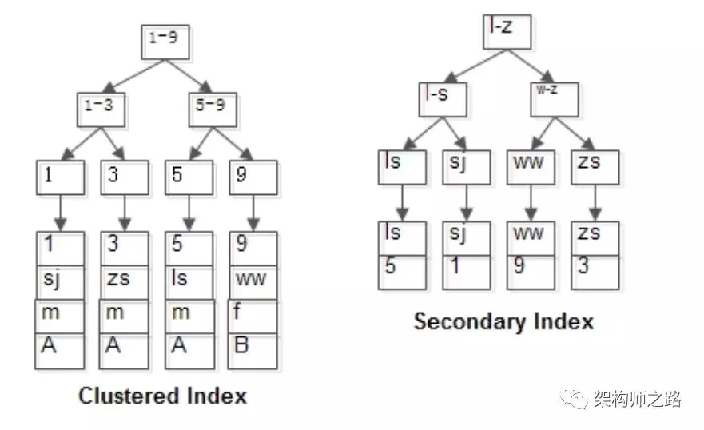
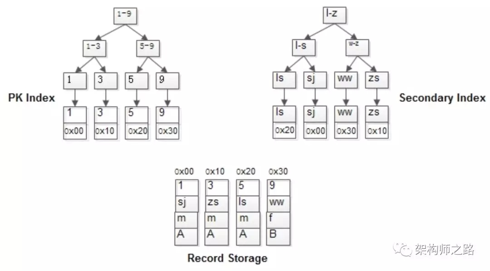
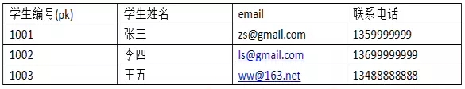
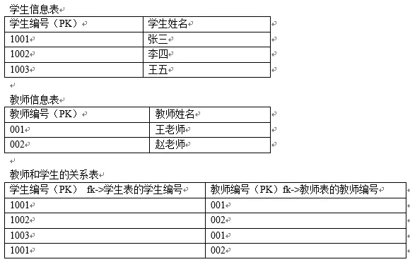
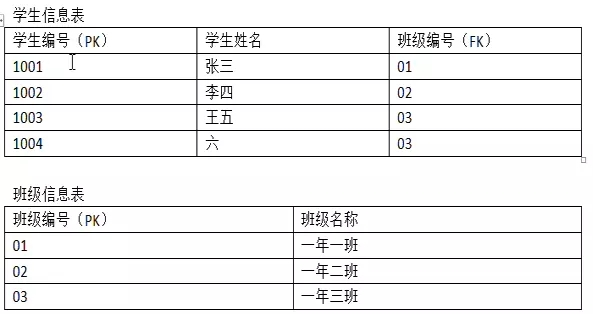

[toc]

# Mysql

mysql，一种关系型数据库，基于TCP通信（各类语言都支持mysql的原因之一），默认开放3306端口，传输SQL语句。


关系型数据库：以行和列的形式来存储数据，对应一张二维表。二维表的行定义被称作“关系模式”，即是对该表关系的描述。**一个关系型数据库就是由多个二维表及其之间的关系组成的一个数据组织**。

关系型数据库的读取、查询较为方便，强调[事务](##事务) 的ACID原则。存储海量数据时，由于多表关联、表级锁等特性，读写性能不足，且只具备纵向扩展的能力。


# 语法规范

Mysql语法规范

* 语句末尾使用`;`结束

* 不区分大小写，但**建议关键字大写，表名、列名小写**

* 每条命令根据需要，可以进行缩进或换行，以增强可读性

* 注释：（1）#注释（2）`-- `+注释，注意两个横杠之后有空格（3）`/*注释*/`

* 不区分字符、字符串，统统使用单引号包裹；**当表名、字段名等与sql关键字重名时，需要使用反引号包裹**。

  ```mysql
  create table `select` (`desc` char(32));	#反引号使用示例
  insert into student(name) values('ZhangSan');	#插入示例
  ```


# 配置

查看当前mysql的版本：mysql环境，`select version()`；命令行，`mysql --version`或者`mysql -V`


Mysql服务相关：

* Mysql启动/停止：

  * windows：以管理员权限进入**cmd界面**，执行`net start(stop) mysqlxxx`，mysqlxxx表示服务名（我的计算机，右键，管理可查）
  * linux：`sudo service mysql start` ，使用`ps -elf|grep mysql`查看相关服务是否启动
* 用户登录：**必须先启动mysql服务才可以登录**
  * windows下，roo用户可以通过安装以后自动生成的“ mysql command line ”启动
  * 命令行，执行`mysql [-h localhost] [-P 3306] -u user_name  -p[password]`，p参数和密码之间不允许有空格，或者省略直接回车，在下一行提示输入。
* 退出mysql环境：`exit`或者`crtl+c`
* mysql历史命令记录：`~/.mysql_history`  

 


乱码问题 

```
在路径：mysql的数据存储路径下 找到my.ini文件
修改内容1：
	找到[mysql]命令，大概在63行左右，在其下一行添加 
		default-character-set=utf8
修改内容2:
	找到[mysqld]命令，大概在76行左右，在其下一行添加
		character-set-server=utf8
		collation-server=utf8_general_ci

修改完毕后，重启MySQL57服务
```


# 备份恢复

备份并非直接备份数据，而是备份生成该数据库的执行语句。

```mysql
#命令行环境执行 

#备份
mysqldump -u user_name -p'password' db_name>backup.sql	#备份指定数据库
mysqldump -u user_name -p'password' db_name t_name [t1_name..]>backup.sql#备份指定数据库的若干表 
mysqldump -u user_name -p'password' db_name>backup.sql	#备份指定数据库
mysqldump -u user_name -p'password' --databases db1 [db2 ...]>backup.sql #备份若干数据库
mysqldump -u user_name -p'password' --all-databases>backup.sql #备份所有数据库

#备份的同时压缩，利用管道符|
mysqldump -u user_name -p'password' db_name|gzip>back.sql	#备份指定数据库

#恢复
mysql -u user_name -p'password' new_db_name<backup.sql #恢复
```


# 数据库命令

* 新建：`create database <dbname> [charset utf-8]` 
* 删除：`drop database <dbname>` 
* 显示：`show databases`，查看当前用户可见的数据库  
* 查看创建信息：`show create database <dbname>`
* 进入 ：`use <dbname>`，必须先进入数据库才能查看该库中的表 ，类似于`cd folder_name`进入文件夹
* 查看当前使用数据库：`select database()` ， 类似于`pwd` 


# 表的增删改查

### select

查询：SELECT关键字 （[select完整语法和执行顺序及虚拟表](https://www.jb51.net/article/161719.htm)  ）。可以使用`EXPLAIN select_command`模拟mysql的查询顺序，分析性能瓶颈（[关于explain语句的执行结果](https://www.jianshu.com/p/ea3fc71fdc45)）

```mysql
select [distinct] c [as c1] [,..] 	# distinct表示对查询结果去重
from table_name [as 't_name']  # as 可以为列名，表名取别名 用引号包裹，as 可以省略
[limit start,count]	 # limit表示分页查看，从start条记录起（含）开始查看count条记录，序号从0开始计数 

#查询常量，可以是表达式、函数
select version();
select 5*8;

#多表查询as示例, “.”运算符用于“表名.字段名”
select s.id as student_id, c.id as class_id from student as s,class as c
```

查看表结构：`desc t1`，desc=describe

显示：

* `show tables [from db_name]`：显示指定数据库的表，缺省时为当前数据库。

* `show create table <table_name>`：显示该表的创建信息

### create

创建表：`create table <table_name> (<column_name> <column_type> <约束>)`。

[mysql数据类型](https://www.runoob.com/mysql/mysql-data-types.html)  

```mysql
create table student(
id int auto_increment primary key, # AUTO_INCREMENT 自增，用于主键
name char(32) not null, # 非空
age int not null default 20, # 默认值
register_date date not null);
```

### drop

删除表：`DROP TABLE [IF EXISTS] table_name1 [ ,table_name2]` ，批量删除，删除不存在的表会报错 


### insert

插入：`insert into <tb_name> (column1,[,...]) values (var1,[,...])`，

```mysql
#指定字段名插入,缺省的字段应当允许其为null或具备默认值 
insert into student (name,age,register_date) values ('ZhangSan',23,'2020-01-01') 

#全字段插入
insert into student values('ZhangSan',23,'2020-01-01');

#一次插入多行，values部分以，分隔
insert into student(name,age) values('ZhangSan',12),('Lisi',20);
```

### delete

删除：`delete from table_name where condition` ，根据指定条件筛选相关数据并删除 ，是行删除。当where子句缺省时，就是删除全表数据。

```mysql
delete from student where name='ZhangSan';	#删除表中所有名为ZhangSan的数据项
```

对于删除整张表，有更快捷的办法

```mysql
truncate table <tb_name>; # 删除以后再新建一张结构相同的表 
```


### update

修改：`update <tb_name> set <filed_name>=var [where]` ，支持一次修改多个字段 。当没有where做条件限制时，update会修改全部信息。

```mysql
update student set name='ZhangSan',age=33  where id>4; #修改所有id>4的数据项
```

### alter

修改字段名：`alter table <tb_name> [drop| add| modify| change| alter]`，分别对应删除、增加、修改字段名、修改默认值。**注意，alter相比其他关键字其后多了一个`table`** 

```mysql
#drop示例
alter table student drop age #删除表中age字段，是 列删除

#add示例 
#新增sex字段，int类型，默认添加在表尾，可使用after、first指定该字段的位置
#还可以新增外键 
alter table student add sex int [after field_name|first] 

#modify小改，改字段类型；change大改，改字段名+字段类型
alter table student modify sex char(1)	#modify相当于重新声明字段，会覆盖上一次的信息
alter table student change sex SEX char(10)	#change +旧子字段名+新字段名+类型 

#alter示例
alter table student alter sex set default 'MALE'	#修改sex默认值
alter table student alter sex drop default 'MALE'	#丢弃sex默认值
```


### 增删改查总结

由于增删改查是最常用的几个命令，所以放在一起，总结如下

* 创建表：`create table <tb_name>`
* 删除表： `drop table <tb_name>` 
* 插入： `insert into <tb_name> <col> values(val)` 
* 修改：
  * `update <tb_name> set <col> = <val> `
  * `alter table <tb_name> <operation> <col>`


### 条件查询

条件判断：`where condition1 [and or] condititon2 [,...] `，类似于编程语言中的`if`判断，其后跟条件。


运算符

```mysql
大于：>
小于：<
大于等于：>=
小于等于：<=
等于：=   不能用于null判断
不等于：!=  或 <>
安全等于: <=>  可以用于null值判断
```

逻辑运算

```mysql
逻辑与：&& 或 and
逻辑或：|| 或 or
逻辑非：! 或 not
逻辑异或：^ 或 xor
```


逻辑判断符号：


* 等于：`=`；不等于，`<>`、`!=`；大于：`>`、`>=`
* `in` （相当于or运算）、`not in`；`any()`、`all()` ，类似于python里的any 、all，但仅支持对select返回的结果运算。

  ```mysql
  select * from student where (name,age)=('ZhangSan',19);	#支持类似于python元组解包的写法
  select * from student where name='ZhangSan' and age=19;	#与上一种写法类似 
  select * from student where hometown in ('杭州','宁波');#in 用法示例 
  ```


范围判断：

* `in (a,...)`，判断是否属于集合，可以不只是数字；
* `between <start> and <end>`，闭区间 

  ```mysql
  select * from student where id in (3,8);	#查找编号为3、8的学生
  select * from student where id between 3 and 8;	#查找编号为3-8的学生
  ```


模糊搜索：`LIKE`配合`%`、`_`实现模糊搜索。`%`类似于`*`通配符表示任意多个字符，`_`类似于`.`匹配任意1个字符。当单独使用LIKE语句时，效果相当于`=`。

  ```mysql
  select * from student where name like Zhang% 	#搜索表中所有Zhang开头的数据 
  select * from student where name like Zhang_ 	#搜索表中所有名为Zhangx形式的数据  
  ```


null的特殊性，**mysql中null必须用专门的语句`is null`、`is not null`来判断，不可使用`=`、`<>`运算符**。

  ```mysql
  select * from student where sex is null;
  ```


ifnull 函数

```mysql
SELECT ep1.*,IFNULL(ep2.ename,'无') as 'leader' from emp as ep1 LEFT JOIN emp as ep2 
on ep1.mgr = ep2.id
ORDER BY ep2.ename;
```


### 排序

排序：`SELECT 字段名 FROM 表名 [WHERE] ORDER BY [RAND()] 字段名[ASC|DESC] [,字段名2 DESC]`。rand()表示随机排序，字段排序默认按照升序排序 。排序+limit配合使用可以实现取“ 前k大 ”的效果

```mysql
select * from student order by grades desc,id asc;	#按照grades字段降序排列，id字段升序
select * from student order by grades desc limit 0,3	#取成绩前3名 
```


# 聚合函数

聚合函数通常会和分组查询一起使用，用于统计每组的数据 

语法： `SELECT 聚合函数(列名) FROM 表名 [where 条件];`

```mysql
#统计count(*)
select count(*) from student where sex='f';	#统计男生数

#求某个字段的最大值max,最小值min
select max(id) from student where sex='m';	

#求和sum
select sum(grades) from student where sex='f';	#女生的总成绩

#均值 avg，会自动跳过值为null
select avg(grades) from student where sex='f';	#女生的平均成绩

```


# 分组


单独分组没有什么意义，**分组的目的是为了统计**，所以常常和聚合函数一起使用。

分组语法：

```mysql
# GROUP BY 的字段名 往往也需要在 SELECT 后面显示 
SELECT 字段1,字段2... FROM 表名  [where 条件] GROUP BY 字段1 [HAVING 条件];
```

where和having的区别是，where是用于分组前的条件筛选，而having用于分组后。


e.g. 假设有表如下：

```mysql
+----+------+-----+----------+
| id | name | age | hometown |
+----+------+-----+----------+
|  1 | 张三 |  25 | 杭州     |
|  2 | 李四 |  20 | 台州     |
|  3 | 王五 |  16 | 台州     |
|  4 | 赵六 |  17 | 宁波     | 
|  5 | 钱七 |  29 | 宁波     |
+----+------+-----+----------+ 
```

使用`group by`关键字对表数据进行简单分组

```mysql
# 只是分组的话 等价于 
# select distinct hometown from student; # 对结果去重 
select hometown from student group by hometown;	#按照家乡对学生分组
+----------+
| hometown |
+----------+
| 台州     |
| 宁波     |
| 杭州     |
+----------+
```

分组的基础上，配合其余函数

```mysql
# 显示详细的分组信息 
SELECT hometown,GROUP_CONCAT(name) FROM student GROUP BY hometown;	
+----------+--------------------+
| hometown | GROUP_CONCAT(name) |
+----------+--------------------+
| 台州     | 李四,王五          |
| 宁波     | 赵六,钱七          |
| 杭州     | 张三               |
+----------+--------------------+

# 分隔符使用
SELECT hometown,GROUP_CONCAT(name SEPARATOR '--') FROM student GROUP BY hometown;
+----------+-----------------------------------+
| hometown | GROUP_CONCAT(name SEPARATOR '--') |
+----------+-----------------------------------+
| 台州     | 李四--王五                        |
| 宁波     | 赵六--钱七                        |
| 杭州     | 张三                              |
+----------+-----------------------------------+


# 配合count函数使用
SELECT hometown,GROUP_CONCAT(name),COUNT(*) FROM student GROUP BY hometown;
+----------+--------------------+----------+
| hometown | GROUP_CONCAT(name) | COUNT(*) |
+----------+--------------------+----------+
| 台州     | 李四,王五          |        2 |
| 宁波     | 赵六,钱七          |        2 |
| 杭州     | 张三               |        1 |
+----------+--------------------+----------+


#配合having 过滤
SELECT hometown,GROUP_CONCAT(NAME),COUNT(*)
FROM student
GROUP BY hometown
HAVING COUNT(*)>1;	#筛选组员数大于1的分组
+----------+--------------------+----------+
| hometown | GROUP_CONCAT(NAME) | COUNT(*) |
+----------+--------------------+----------+
| 台州     | 李四,王五          |        2 |
| 宁波     | 赵六,钱七          |        2 |
+----------+--------------------+----------+

#配合with rollup函数
SELECT hometown,GROUP_CONCAT(NAME),COUNT(*) FROM student
GROUP BY hometown
WITH ROLLUP;
+----------+--------------------------+----------+
| hometown | GROUP_CONCAT(NAME)       | COUNT(*) |
+----------+--------------------------+----------+
| 台州     | 李四,王五                |        2 |
| 宁波     | 赵六,钱七                |        2 |
| 杭州     | 张三                     |        1 |
| NULL     | 李四,王五,赵六,钱七,张三 |        5 |
+----------+--------------------------+----------+
```


# 子查询

嵌套select，**一个select的查询结果嵌套在另外一个select查询中**。


select查询得到的结果，可以是标量，也可以是多行多列的表。无论结果如何，**将其视为一张临时表，灵活使用多表查询的语法。**

标量子查询：子查询返回`1*1`的数据。 

```mysql
# 查询最低价格的商品信息
SELECT  *  FROM t_product WHERE price = (
	SELECT min(price) FROM t_product );
```

临时表子查询

```mysql
# 查询 每个分类的id以及对应的商品数量
# LEFT JOIN 拼接一个 select查询得到的中间表 
SELECT category.cid,category.cname,v.total
FROM t_category as category LEFT JOIN
		(SELECT cno,count(*) as 'total' FROM t_product GROUP BY cno) as v 
on category.cid = v.cno;
```

```mysql
# exists 拼接一个 临时表 
SELECT * FROM t_category as category where EXISTS
	# 查询得到临时表 存在商品明细的商品分类
	(SELECT * FROM t_category,t_product WHERE t_category.cid = t_product.cno);
```


## 视图

**视图**：**存储select语句返回的结果，一张虚表**，数据源于原表。若原表数据发生变化，视图也会跟随变化，**可以认为视图是一个自定义的select函数**，输入源数据，输出目的数据。使用视图，可以降低复杂查询的select语句编写难度，在子查询中，一旦条件增加，**多个select嵌套一来使语句可读性下降，二来不利用重用**。而视图作为虚表存储此中间结果，正能解决问题。


视图操作：

* 创建视图：`CREATE VIEW <view_name> as (select语句)` ，使用view关键字 ，视图名建议以V开头，便于区分 
* 查看视图：`show tables`，被视作table对待
* 查询视图：`select field [,..] from view_name`，被视作table对待
* 删除视图：`DROP VIEW <view_name>` 


# 外键 

关联两张表，约束字段数据，使其只能**引用另外一张表的列值**。外键引用保持数据的一致性，但大量关联会降低查改速度。


**创建外键**

创建表时一同创建外键

```mysql
create table(
id int PRIMARY KEY,
# 外键创建
[CONSTRAINT symbol] 	# 外键别名，可以在删除外键时使用，若省略，系统会自动命名
FOREIGN KEY (字段名) REFERENCES <主表>(主表引用字段)		#外键创建 
[ON DELETE|UPDATE {RESTRICT|CASCADE|SET NULL|NO ACTION|SET DEFAULT}]	#修饰字段

)
```

`references `的构建关系是 `从表 --> 主表` 。

跟随操作，当外键删除时，本字段做如何变化。`ON DELETE|UPDATE` 为事件触发条件，其动作含义如下

* RESTRICT（限制外表中的外键改动）
* CASCADE（跟随外键改动）
* SET NULL（设空值）   
* SET DEFAULT（设默认值）
*  NO ACTION（无动作，默认的

e.g

```mysql
# 假设存在主表 dept 
create table emp(
eid int primary key auto_increment,
name varchar(20) not null,
dept_id int, # 部门id 
constraint fkey_01 foreign key (dept_id) references  dept (id); 
)
```


通过`alter .. add` 为已有字段增加外键。外键字段类型应当和本表已有字段类型一致，否则添加失败。添加时有无数据均可。

```mysql
ALTER TABLE <表名> ADD [CONSTRAINT symbol]	#为外键取别名
FOREIGN KEY (字段名) REFERENCES <主表> (主表引用字段);	# field为本表已有字段，ref_tab为引用表
```

e.g.

```mysql
# 为product表字段增加一个外键关联 cid 指向 category表的id 
ALTER TABLE product add FOREIGN key(cid) REFERENCES category(cid); 
```


外键信息可以通过`show create table tabl_name`查看。


删除外键约束：`ALTER TABLE <表名> DROP FOREIGN KEY <symbol>`  


外键约束体现：

* 从表插入的数据不可以是主表引用字段未出现的数据
* 主表不可随意删除已经被子表引用的字段


***

一对多外键创建示例

```mysql
# 创建分类表 

CREATE table category(
cid int PRIMARY key auto_increment,
cname VARCHAR(50)
);


# 创建商品表 
CREATE table product(
pid int PRIMARY KEY auto_increment,
pname VARCHAR(50),
price double,
cid int # 外键
);

# 添加外键使用 关键词 add 
ALTER TABLE product add FOREIGN key(cid) REFERENCES category(cid); 
```


多对多外键创建示例 

```mysql
# 创建学生表
CREATE TABLE student (
	sid INT PRIMARY KEY auto_increment,
	sname VARCHAR (50)
);

# 创建课程表 
CREATE TABLE course (
	cid INT PRIMARY KEY auto_increment,
	cname VARCHAR (20)
);

# 创建中间表 
CREATE TABLE s_c_table (
	sno INT,
	cno INT,
	CONSTRAINT skey FOREIGN KEY (sno) REFERENCES student (sid),
	CONSTRAINT ckey FOREIGN KEY (cno) REFERENCES course (cid)
);
```


# 多表查询

## 交叉查询

交叉查询，会将多个表的结果无条件地连接在一起（笛卡尔积），是一种错误的做法 

```mysq
select * from t_category,t_product;
```

通过条件过滤，也就是连接查询，可以过滤笛卡尔积。

## 内连接

内连接，就是取交集。

隐式内连接 

```mysql
select [字段,字段,字段] from a,b where 连接条件 (b表里面的外键 = a表里面的主键 ) 
```

显式内连接

```mysql
select [字段,字段,字段] from a [inner] join b on 连接条件 [ where 其它条件]
```


e.g 

```mysql
# 没有使用inner join关键字 
select *from t_category  c, t_product  p WHERE c.cid = p.cno;  

# 外键关联 取交集
SELECT * FROM t_product tp INNER JOIN t_category tc ON tp.cno = tc.cid WHERE tc.cname = '手机数码';
```


**内连接的`on`关键字可以这么理解，取出A表的一行数据，然后按照on条件去匹配B表的结果。** 当没有on时，意味着没有条件过滤，就是简单的笛卡尔积，`1*n`，n是B表的所有行。


## 外连接

外连接，会保证某一张表的所有数据，然后再扩展取交集

### 左连接

`A left join B`，**保证左表数据显示完全**。

以join左边的表为主表，展示主表的所有数据。根据条件查询连接右边表的数据，若满足条件则展示,若不满足则以null显示。

```mysql
select 字段 from a left [outer] join b on 条件
```

e.g.

```mysql
# 查询所有类别下的商品信息，就算该类别下没有商品也需要将该类别的信息展示出来
SELECT * FROM t_category c LEFT OUTER JOIN t_product p ON c.cid = p.cno
```


### 右连接

`B right join B`，同理 左连接，**保证右表显示完全**。


### union连接

联合查询不是多表连接查询的一种方式。**联合查询是将多条查询语句的查询结果合并成一个结果并去掉重复数据。**

```mysql
查询语句1 union 查询语句2 union 查询语句3 ...
```


e.g 

```mysql
# 拼接左右连接的结果 
# 用左外的A union 右外的B
SELECT * FROM t_category c LEFT OUTER JOIN t_product p ON c.cid = p.cno
union  # 拼接
SELECT * FROM t_category c RIGHT  OUTER JOIN t_product p ON c.cid = p.cno
```


## 自关联

一张表的字段，通过外键关联，指向本表的主键。


地区级联操作示例，pid表示上一级行政地区的id。

| aid（地区ID） | pid（父id） | atitle（地区名） |      |
| ------------- | ----------- | ---------------- | ---- |
| 01            | null        | 浙江省           |      |
| 02            | 01          | 杭州市           |      |

自关联查询的思想是，将一个表看做两个表，然后通过内连接查询。

```mysql
#查询浙江省的所有市
select * from  areas as city	#取别名为city
inner join areas as province 	#取别名为province
on city.pid=province.aid	
where  province.atitle='浙江省' 
```


# mysql 常用函数

会查询，不用记忆

## 字符串函数 

| 函数                                  | 用法                                                         |
| ------------------------------------- | ------------------------------------------------------------ |
| CONCAT(S1,S2,......,Sn)               | 连接S1,S2,......,Sn为一个字符串                              |
| CONCAT_WS(separator, S1,S2,......,Sn) | 连接S1一直到Sn，并且中间以separator作为分隔符                |
| CHAR_LENGTH(s)                        | 返回字符串s的字符数                                          |
| LENGTH(s)                             | 返回字符串s的字节数，和字符集有关                            |
| INSERT(str, index , len, instr)       | 将字符串str从第index位置开始，len个字符长的子串替换为字符串instr |
| UPPER(s) 或 UCASE(s)                  | 将字符串s的所有字母转成大写字母                              |
| LOWER(s)  或LCASE(s)                  | 将字符串s的所有字母转成小写字母                              |
| LEFT(s,n)                             | 返回字符串s最左边的n个字符                                   |
| RIGHT(s,n)                            | 返回字符串s最右边的n个字符                                   |
| LPAD(str, len, pad)                   | 用字符串pad对str最左边进行填充，直到str的长度为len个字符     |
| RPAD(str ,len, pad)                   | 用字符串pad对str最右边进行填充，直到str的长度为len个字符     |
| LTRIM(s)                              | 去掉字符串s左侧的空格                                        |
| RTRIM(s)                              | 去掉字符串s右侧的空格                                        |
| TRIM(s)                               | 去掉字符串s开始与结尾的空格                                  |
| TRIM(【BOTH 】s1 FROM s)              | 去掉字符串s开始与结尾的s1                                    |
| TRIM(【LEADING】s1 FROM s)            | 去掉字符串s开始处的s1                                        |
| TRIM(【TRAILING】s1 FROM s)           | 去掉字符串s结尾处的s1                                        |
| REPEAT(str, n)                        | 返回str重复n次的结果                                         |
| REPLACE（str, a, b）                  | 用字符串b替换字符串str中所有出现的字符串a                    |
| STRCMP(s1,s2)                         | 比较字符串s1,s2                                              |
| SUBSTRING(s,index,len)                | 返回从字符串s的index位置其len个字符                          |


e.g. 

```mysql

SELECT UPPER('hello'); -- HELLO
SELECT CONCAT('你好,' , uname) FROM t_user;
```


## 数值函数

| 函数          | 用法                                 |
| ------------- | ------------------------------------ |
| ABS(x)        | 返回x的绝对值                        |
| CEIL(x)       | 返回大于x的最小整数值                |
| FLOOR(x)      | 返回小于x的最大整数值                |
| MOD(x,y)      | 返回x/y的模                          |
| RAND()        | 返回0~1的随机值                      |
| ROUND(x,y)    | 返回参数x的四舍五入的有y位的小数的值 |
| TRUNCATE(x,y) | 返回数字x截断为y位小数的结果         |
| SQRT(x)       | 返回x的平方根                        |
| POW(x,y)      | 返回x的y次方                         |

e.g

```mysql
select abs(-12);
select rand()*100;
```


## 日期函数

| 函数                                                         | 用法                                                         |
| ------------------------------------------------------------ | ------------------------------------------------------------ |
| **CURDATE()** 或 CURRENT_DATE()                              | 返回当前日期                                                 |
| **CURTIME()** 或 CURRENT_TIME()                              | 返回当前时间                                                 |
| **NOW()** / SYSDATE() / CURRENT_TIMESTAMP() / LOCALTIME() / LOCALTIMESTAMP() | 返回当前系统日期时间                                         |
| **YEAR(date) / MONTH(date) / DAY(date) / HOUR(time) / MINUTE(time) / SECOND(time)** | 返回具体的时间值                                             |
| WEEK(date) / WEEKOFYEAR(date)                                | 返回一年中的第几周                                           |
| DAYOFWEEK()                                                  | 返回今天是一周的第几天，注意：周日是1，周一是2，。。。周六是7 |
| WEEKDAY(date)                                                | 返回周几，注意，周1是0，周2是1，。。。周日是6                |
| DAYNAME(date)                                                | 返回星期：MONDAY,TUESDAY.....SUNDAY                          |
| MONTHNAME(date)                                              | 返回月份：January，。。。。。                                |
| DATEDIFF(date1,date2) / TIMEDIFF(time1, time2)               | 返回date1 - date2的日期间隔 / 返回time1 - time2的时间间隔    |
| DATE_ADD(datetime, INTERVAL  expr type)                      | 返回与给定日期时间相差INTERVAL时间段的日期时间               |
| DATE_FORMAT(datetime ,fmt)                                   | 按照字符串fmt格式化日期datetime值                            |
| STR_TO_DATE(str, fmt)                                        | 按照字符串fmt对str进行解析，解析为一个日期                   |


## 流程函数

| 函数                                                         | 用法                                         |
| ------------------------------------------------------------ | -------------------------------------------- |
| IF(value,t ,f)                                               | 如果value是真，返回t，否则返回f              |
| IFNULL(value1, value2)                                       | 如果value1不为空，返回value1，否则返回value2 |
| CASE WHEN 条件1 THEN result1 WHEN 条件2 THEN result2 .... [ELSE resultn] END | 相当于Java的if...else if...else...           |
| CASE  expr WHEN 常量值1 THEN 值1 WHEN 常量值1 THEN 值1 .... [ELSE 值n] END | 相当于Java的switch...case...                 |

e.g.

```mysql
# if 
SELECT uname,IF(sex=1,1,0) FROM t_user

# ifNull
SELECT uname, IFNULL(sex, 1) FROM t_user;

# case
SELECT id,uname,age,CASE 
    WHEN IFNULL(age,0) <= 12 THEN '儿童'
    WHEN age <= 18 THEN '少年'
    WHEN age <= 40 THEN '中年'
    ELSE '老年' END '描述' 
FROM t_user;
```


## 其他函数

| 函数          | 用法                                    |
| ------------- | --------------------------------------- |
| database()    | 返回当前数据库名                        |
| version()     | 返回当前数据库版本                      |
| user()        | 返回当前登录用户名                      |
| password(str) | 返回字符串str的加密版本，41位长的字符串 |
| md5(str)      | 返回字符串str的md5值，也是一种加密方式  |


# 索引

索引，一种数据结构，便于快速查询。

**对数据库的字段建立索引可以显著加快查询速度**（当表数据较小时不明显）。但另一方面，**索引存储本身需要占用一定空间，建立太多的索引同时**，为了维护索引，相对地也会增加修改（索引）、删除（索引）、增加（索引）等操作的耗时。


mysql索引分类：

* 按照索引类型：
  * 普通索引：index，无限制
  * 唯一索引：unique，要求字段值唯一，字段允许为空。允许多个字段组合作为唯一索引
    * 主键索引：primary ，特殊的唯一索引，但不允许值为空，一个表必定拥有1个主键索引。
  * 全文索引：fulltext，检索文本关键字时具备优势，仅MyISAM引擎支持

* 按照索引字段数：

  * 单列索引：索引只包含一个字段

  * 联合（多列）索引：索引包含多个字段，遵循“最左匹配原则”，比单独地为每个字段建立索引更加高效。

    * **mysql创建联合索引的规则**：先创建最左字段的索引，也就是排序，在第一个字段的基础上再进行第2字段的索引，以此类推。可见，第一字段在该复合索引中是绝对有序的，而之后的字段仅在第一字段重复排序相同时才能有序。例如，对字段`index(a,b,c)`建立联合索引，直接`where c=xx`是不能利用索引优势的，只能遍历得到。复合索引的这个特性直接决定了最左匹配原则 

    * 最左匹配原则（[mysql索引最左匹配原则的理解? - 沈杰的回答 - 知乎](https://www.zhihu.com/question/36996520/answer/93256153)）：检索数据时从联合索引`index(a,b[,..])`的最左字段开始匹配，可以加速以该字段开始的多字段索引，如`(a)、(a,b)、(a,b,c)`等。查询优化器会确定最终的索引方案，和`and`的书写顺序无关，如`where a and b`和`where b and a`等价。 

* 索引与行记录是否分开存储（[聚集索引与非聚集索引](https://mp.weixin.qq.com/s?__biz=MjM5ODYxMDA5OQ==&mid=2651961494&idx=1&sn=34f1874c1e36c2bc8ab9f74af6546ec5&chksm=bd2d0d4a8a5a845c566006efce0831e610604a43279aab03e0a6dde9422b63944e908fcc6c05&scene=21#wechat_redirect)）：

  * 聚集索引：InnoDB的索引，主键索引与行记录一起存储。普通索引存储主键索引（因此要求主键索引不要太长）。 

     

  * 非聚集索引：MyISAM的索引，索引与行记录分开存储，叶子节点存储索引和对应行的指针

    

 


mysql使用哈希、B+树等数据结构建立索引（[哈希值、B+树索引区别_](https://www.cnblogs.com/heiming/p/5865101.html)）：

哈希索引（key-value形式）：

* 哈希索引利于等值查询，时间复杂度为`O(1)`，优于B+树。但面对范围查询时，退化为`O(n)`，同时不支持**多列联合索引的最左匹配原则**。 

* 当表中存在大量重复键值时，由于哈希冲突的存在，索引效率降低。
* 哈希索引对磁盘的连续存储空间要求较高。

B+树：B+树为多路查找树，查找效率平均为`O(log_n)`。树的高度可以很低（意味着较少的IO次数），相邻叶子节点之间存在指针，范围查找效率高。对磁盘的连续存储空间要求低。


索引相关操作：

* 创建索引：`CREATE INDEX index_name ON table_name(file_name(len))`，若索引对象为字符串，需要指定索引长度，一般与该字符串字段等长。若不是字符串，可以不指定长度
* 添加索引：`ALTER TABLE table_name ADD INDEX(field)`  
* 查看索引：`SHOW INDEX FROM table_name` 
* 删除索引：`DROP INDEX index_name ON table_name` 

# 事务

**事务：一些不可被中断的操作序列，要么均执行成功，要么均不执行**。


事务只在innoDB引擎被支持。

事物的ACID原则：

* 原子性（Atomicity）：事务是一个不可分割的工作单位，事务中的操作要么都发生，要么都不发生。
* 一致性（Consistency）：事务前后数据的完整性必须保持一致，从一个状态到另一个状态
* 隔离性（Isolation）：多个用户并发访问数据库时，数据库为每一个用户开启的事务，彼此操作相互隔离
* 持久性（Durability）：事务一旦被提交，它对数据库中数据的改变就是永久性的


事务的原理：

事务开启之后，所**有的操作都会临时保存到事务日志**，事务日志只有在得到`commit`命令才会同步到数据表中，其他任何情况，例如中途执行异常，都会清空事务日志(rollback，断开连接)。


## 创建-提交-回滚

mysql默认自动提交事务，若要手动提交，则需先将事务的提交切换到手动。


方法1：

```mysql
#方法1
begin;		#标记事务开始
#do something here
rollback;	#回滚
commit;		#提交
```


方法2：

```mysql
start transaction;
#do something here
rollback work;	#回滚
commit work;	#提交
```


方法3：

关闭本次连接的自动提交，然后再手动提交

```mysql
show VARIABLES like '%commit%'; # 查看当前连接的自动提交是否开启
set autocommit = 0; # 设置自动提交的参数为off

# do something here 
rollback work;	#回滚
commit work;	#提交
```


## 并发

事务的并发问题：存在事务AB

* 脏读：事务A读取到了事务B中尚未提交的数据

* 不可重复读：事务A中前后两次查询得到的**数据内容**不一致，因为事务B在这一时间段更改（update）了数据 

* 幻读：事务A中前后两次查询得到的**数据数量**不一致，因为**事务B在这一时间段增删了数据并提交** 

  

设定[事务的隔离级别](https://www.cnblogs.com/wyaokai/p/10921323.html)可以解决上述问题。隔离级别越高，越能保证数据的完整性和一致性，但是对并发性能的影响也越大。

| 事务隔离级别                                  | 脏读 | 不可重复读 | 幻读 |
| --------------------------------------------- | ---- | ---------- | ---- |
| 读未提交（read uncommitted）                  | 是   | 是         | 是   |
| 不可重复读（read committed）                  | 否   | 是         | 是   |
| **可重复读（repeatable read，默认隔离级别）** | 否   | 否         | 是   |
| 串行化（serializable）                        | 否   | 否         | 否   |


事务隔离级别 具体阐述：

* 读未提交：即使事务B未提交，数据的更改对事物A也可见。
* 不可重复读（行锁）：只有事务B提交之后，数据更改对事务A才可见。但这会造成“ 不可重复读 ”问题，存在不可重复读的问题，自然也一定会存在“ 幻读 ”的问题。
* 可重复读（检索条件存在索引时为行锁，否则为表锁）：只有事务B提交之后，数据更改对事务A才可见。但是事物A进行`select`操作时，**保存的是事物A开始时的历史快照**，进行`insert、update`等修改操作时，会选择最新的数据快照，也就是事务B提交只有的数据版本。这可以解决“ 不可重复读 ”问题 ，但仍然存在幻读问题。（[锁升级导致的死锁案例](https://mp.weixin.qq.com/s?__biz=MjM5ODYxMDA5OQ==&mid=2651962432&idx=1&sn=3459e82428cb9bb1de4677fa6b5a1c2d&chksm=bd2d099c8a5a808af5926a8be9c900c0bca57a8b8e61b192272d919e38d607a03b5ac4e0990a&scene=21#wechat_redirect)）


查询当前事务隔离级别

```mysql
select @@tx_isolation;
```

设置事务的隔离级别 

```mysql
# set session transaction isolation level  隔离级别;
# eg: 设置事务隔离级别为read uncommitted
set session transaction isolation level read uncommitted;
```


# DCL语句

## 账户管理

查看所有用户：用户信息存储于 mysql.user 表中。

```mysql
select host,user,authentication_string from user;	#查看主机，用户，密码
```

### 创建账号

**单独创建账户**：`CREATE 'user'@'host' IDENTIFIED BY 'passwd' ` ，该命令创建的用户默认只有登录权限。

```mysql
-- user1用户只能在localhost这个IP登录mysql服务器
CREATE USER 'user1'@'localhost' IDENTIFIED BY '123';
-- user2用户可以在任何电脑上登录mysql服务器
CREATE USER 'user2'@'%' IDENTIFIED BY '123';
```


**删除用户**：`DROP USER 'user_name'@'host'`  


### 授权

**授权**：`GRANT <privilege_list> ON  <db_name> TO <'user'@'host'> IDENTIFIED BY 'passwd'` 。该命令在创建用户的同时授权，且只能root账户执行。

`privilege_list`，权限分配列表，多个权限以逗号分隔：

* 建表：create
* 删除：drop
* 改：insert；modify；change；alter；
* 查：select
* 全部权限：`all privileges` 

* `user@host`：“用户+访问主机名”，作为一个授权单位
* `db_name`，数据库：可以指定数据库的某几个表`db.xx`，或者数据库的全部表`db.*`，或者全部数据库的表`*.*`   

```mysql
# 授予 用户 user1 localhost连接下 对于 test数据库 所有表的 若干权限 
GRANT CREATE,ALTER,DROP,INSERT,UPDATE,DELETE,SELECT ON test.* TO 'user1'@'localhost';

# 授予 user2 对所有 数据库 数据表 的连接 
GRANT ALL ON *.* TO 'user2'@'%';
```


**查看账户权限**：`SHOW GRANTS FOR 'user'@'host'` 


**修改存在用户的权限**：

* 重新授予：`GRNAT privilege_liost ON db_name TO 'user'@'host' WITH GRANT OPTION`，修改权限后需要刷新`FLUSH PRIVILEGES` 。
* 撤销权限：`REVOKE privilege_list ON db_name from 'user'@'host'` ，同样权限修改后要刷新。

```mysql
# 撤销 user1 操作test数据库的所有 权限 
REVOKE ALL ON test.* FROM 'user1'@'localhost';
```


### 密码修改

root用户

```mysql
# mysqladmin -uroot -p password 新密码  
# 回车以后要求输入原密码 
mysqladmin -uroot -p password root
```


普通用户 

```mysql
# set password for '用户名'@'主机名' = password('新密码');
set password for 'user1'@'localhost' = password('666666');
```


***

root用户忘记密码 (windows下为例)

1. 关闭mysql服务 

```shell
# 以管理员权限运行cmd
net stop MYSQL57
```

2. 设置mysqld服务不检查权限密码

   ```shell
   # mysql 5.5
   mysqld --skip-grant-tables
   
   # mysql 5.7+ 
   # 修改my.ini文件
   # 在[mysqld]下方添加
   skip-grant-tables = true

3. 开启服务 ，登录

   ```shell
   # 以管理员权限运行cmd
   net start MYSQL57
   mysql -uroot  # 无密码登陆服务器
   ```

4. 修改root密码 

   ```shell
   # mysql 5.5
   update user set authentication_string=password("root") where user="root";
   
   # mysql 5.7+
   update mysql.user set authentication_string=password('root') where user='root';
   ```

5. 刷新，退出登录: 

   ```mysql
   flush privileges;
   exit;
   ```

6. 恢复配置文件 。步骤2中的my.ini文件，删除掉之前添加在[mysqld]下方的那一行

7. 以新密码登录 

# 主从同步

主从同步：主机负责写，从机拷贝主机的数据，增量更新，负责读。主从集群可以实现数据备份，提升容灾能力和并发时数据库的读性能。

主从同步是单向同步，从机允许修改数据库，但从机的修改不会对主机造成影响。


主从同步的机制：基于主机的二进制日志，主服务器使用二进制日志来记录数据库的变动情况，从服务器通过读取和执行该日志文件来保持和主服务器的 数据一致。

 


主从同步配置：主从数据库版本最好一致，否则会出现各种兼容错误。即使主从同步成功，也会在实际同步过程中执行sql语句失败导致停止同步。

**主机配置：**

1. [备份数据库](#配置)，供从机还原使用。根据需要，可以备份整个数据库或若干指定数据库。

2. 编辑server配置文件（需要root权限），开启二进制日志，配置唯一id（**range from 1 to 2^32 − 1**） 。linux下，配置文件分为global（[mysql]）、client（[client]）、server（[mysqld]），其中server配置文件为`/etc/mysql/mysql.conf.d/mysqld.cnf`，windows下，配置文件为`programdata/mysql/my.ini`  

   ```shell
   log-bin=mysql-bin #开启二进制日志
   server-id=1 #在主从集群中该id必须唯一
   
   #默认同步所有，可以额外配置不同步、同步指定数据库，多个数据库要分多行写
   binlog-ignore-db = mysql   	#不同步 
   binlog-ignore-db = test	#换行写
   binlog-do-db = game	#只同步
   ```

3. 重启mysql服务`sudo service mysql restart`使配置生效，可以使用`show variables like 'log%'`验证二进制日志是否已经开启（variables是mysql的环境变量）。

4. 进入mysql，`show master status`查看二进制日志文件名File及其位置Position，记录用于从机读取。

   ```mysql
   +------------------+----------+--------------+------------------+-------------------+
   | File             | Position | Binlog_Do_DB | Binlog_Ignore_DB | Executed_Gtid_Set |
   +------------------+----------+--------------+------------------+-------------------+
   | mysql-bin.000007 |      154 |              |                  |                   |
   +------------------+----------+--------------+------------------+-------------------+
   
   ```

   

5. 创建一个用于从机同步的账号，赋予`replication slave`权限，**并允许从机登录ip为远端登录**，可以是`%`或指定ip。

   ```mysql
   create user 'slave';	#不添加host即默认为%允许远端登录 
   grant replication slave on *.* to 'slave' with grant option;
   ```

**从机配置：**

1. 还原主服务备份的数据库

2. 编辑server配置文件，从机只需配置唯一id即可，该id在主从集群中必须唯一。重启mysql使配置生效。

3. 进入mysql，使用主机分配的账号连接主机。格式如下

   ```mysql
   CHANGE MASTER TO
   MASTER_HOST='192.168.145.130',
   MASTER_USER='slave',
   MASTER_PASSWORD='slave_passwd',
   MASTER_LOG_FILE='mysql-bin.000003',
   MASTER_LOG_POS=73;
   ```

4. 启动slave线程`start slave` 

5. 查看主从同步是否成功`show slave status\G`（\G表示将结果旋转，便于查看）。若结果中同时显示即为成功，转步骤7。

   ```mysql
   Slave_IO_Running: Yes
   Slave_SQL_Running: Yes
   ```

6. 当同步失败时，必须先`stop slave`停止同步线程，`show slave status\G`查看具体的同步报错` Last_IO_Errno`、`Last_SQL_Errno`。然后**重新开始步骤3-5**，直至显示成功。

   常见的错误：

   * `IO_Running: NO`：主机日志文件名、位置填写错误；主机ip填写错误、主机配置的从机账号不允许远端访问（可以`mysql -h host -u slave -p'slave'`验证）
   * `SQL_Running: NO`：主从句数据库版本不兼容，导致执行语句失败，如默认字符集不一样。

7. 简单验证主从同步，主机对数据库进行操作，从机成功同步，即同步成功。当未同步时，转步骤6。

***

**关于字符集的一些坑**：主从同步中若主机数据库和从机数据库默认创建字符集不一样，则会大概率同步出错。可以使用`show variables like 'char%'`查看当前环境的字符集设置。这与当前选中的数据库、编辑工具有关，当未选中某个具体数据库，命令返回的是全局设置。使用Navicat时，选择“编辑连接，编码：自动”，保持工具的编码规则与mysql的设置一致。

使用字符集的各个场景解析： 

| 场景       | 说明                                                         |
| ---------- | ------------------------------------------------------------ |
| client     | 为客户端使用的字符集                                         |
| connection | 为连接数据库的字符集设置类型，如果程序没有指明连接数据库使用的字符集类型则按照服务器端默认的字符集设置。 |
| database   | 为数据库服务器中某个库使用的字符集设定，如果建库时没有指明，将使用服务器安装时指定的字符集设置。 |
| results    | 为数据库给客户端返回时使用的字符集设定，如果没有指明，使用服务器默认的字符集。 |
| server     | 为服务器安装时指定的默认字符集设定。                         |
| system     | 为数据库系统使用的字符集设定。                               |

其中client、connection、results是客户端与mysql服务端交互直接相关的[三个设置](https://www.cnblogs.com/sunzn/archive/2013/03/14/2960248.html)。mysql本质是一种tcp通信，底层基于字节流传输，因此服务端有必要清楚客户端的编码方式，才能顺利解码传过来的字节流，然后按照自己的编码方式存储。这个过程如下：

```python
'sql command'.encode('gbk') # 客户端使用gbk编码，输入一条sql指令
command=data.decode('gbk') # 服务端按照gbk解码得到指令
# execute ，执行指令
```


5.7版本中，数据库默认字符集为`latin`，修改默认字符集的办法为：

1. 进入server（[mysqld]）配置文件，添加如下两行：

```mysql
[mysqld]
character-set-server=utf8
collation-server=utf8_general_ci
```

2. 进入global（[mysql]）配置文件`/etc/mysql/my.cnf`，添加一行 

```mysql
[mysql]
default-character-set=utf8
```

查看修改结果`show variables like 'char%'`

```mysql
+--------------------------+----------------------------+
| Variable_name            | Value                      |
+--------------------------+----------------------------+
| character_set_client     | utf8                       |
| character_set_connection | utf8                       |
| character_set_database   | utf8                       | 
| character_set_filesystem | binary                     |
| character_set_results    | utf8                       |
| character_set_server     | utf8                       |
| character_set_system     | utf8                       |
| character_sets_dir       | /usr/share/mysql/charsets/ |
+--------------------------+----------------------------+
```


# 设计范式

范式：[数据库的设计规范](https://www.jianshu.com/p/3e97c2a1687b)。遵循范式设计可以减少数据冗余。


ER（entry-relationship，实体关系）模型： 

* E（实体），设计实体就像定义一个类一样，指定从哪些方面描述对象，一个实体转为数据库的一个表
* R（关系），描述两个实体之间的对应规则，关系包括一对一、一对多、多对多 


## 1NF

1NF：**表字段的原子性，不可再分**，且表具备主键。不符合1NF的表，应当拆分字段信息。

下表不遵循1nf范式，联系方式字段可以拆分

 

拆分“ 联系方式 ”字段后，遵循1NF

 

## 2NF

2NF：针对联合主键，其余字段完全依赖于主键，不可只依赖于主键的部分。

下表 主键=（学生编号，教师编号），但“ 学生姓名 ”仅依赖于学生编号，和教师编号无关。“教师姓名”同理，不遵循2nf


将主键拆分，单独建表后遵循2nf。



## 3NF

3NF：非主键字段不可传递性地依赖于主键。

下表主键为学生编号，但是班级名称字段依赖于班级编号，班级编号再依赖于主键“ 学生编号 ”。不遵循3nf。

 


将“ 班级编号：班级名称 ”单独建表后，遵循3nf。



# 《架构师之路》 摘记

[架构师之路](https://mp.weixin.qq.com/s/syli7vs7Jw_VOTl5B2YUqg) 

****

[架构分类](https://mp.weixin.qq.com/s?__biz=MjM5ODYxMDA5OQ==&mid=2651963031&idx=1&sn=f52b724ff33ef008668ef9165c51d39b&chksm=bd2d0b4b8a5a825df41252dd381d0206e141f6a54f253086030113f14584bb11612308ce8e16&scene=21#wechat_redirect) ：

* 单库架构：字面意思，一个库进行数据存储

* 分组架构：**一主多从，主从同步。读写分离，主写从读**。常用于解决数据库的高并发读写，提升数据库的读性能

  > 分组架构为什么可以提升数据库的读性能？
  >
  > 互联网的应用往往是“读多写少”的需求，采用读写分离的方式，可以实现更高的并发访问。原本所有的读写压力都由一台服务器承担，现在有多个“兄弟”帮忙处理读请求，这样就减少了对后端大哥（Maste)的压力。同时，我们还能对从服务器进行负载均衡，让不同的读请求按照策略均匀的分配到不同的从服务器中，让读取更加顺畅。

* 分片架构：解决单库数据量大的问题，将一个数据库拆分成多个数据库。
  * 水平切分：同一张表切分到不同的数据库中**，按照行切分**。常用的有哈希拆分（按照某个字段的规律，例如求余）、范围拆分（若干行为一分片）。
  * 垂直切分：按照业务需求，可以对同一数据库的不同表拆分，也可以对同一张表的不同查询频率的字段拆分。对于后者，将常用的、较短的字段拆分为一个分片，将另外一些拆分为另一个分片，当数据库调取数据（block）的时候，一次就能加载更多常用的查询数据。这种形式的切分可以提升数据库的读写性能。

***