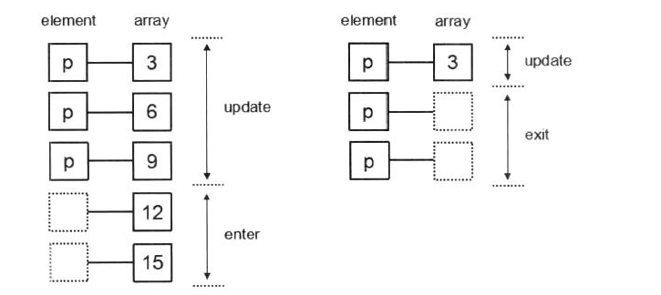
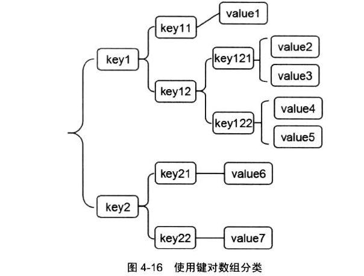
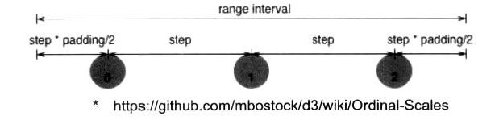
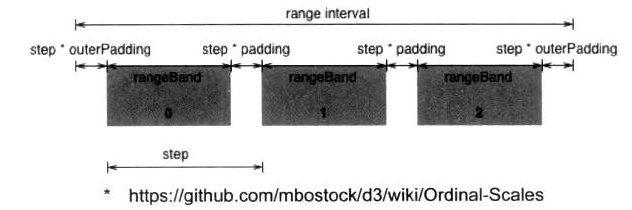
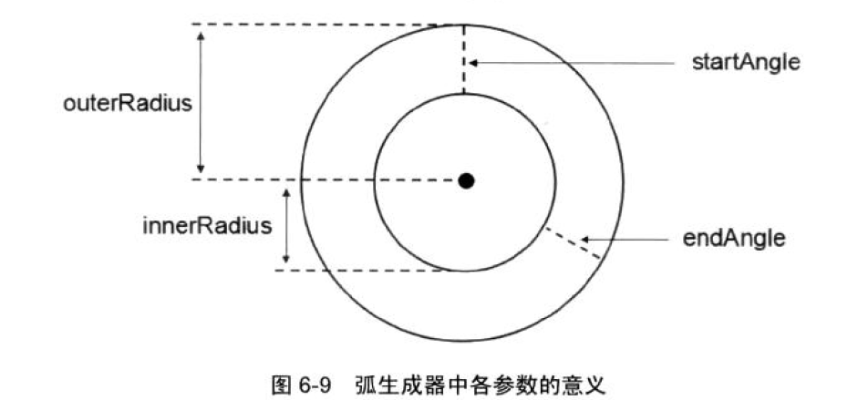
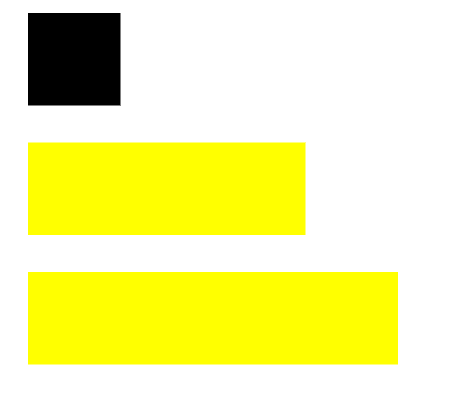
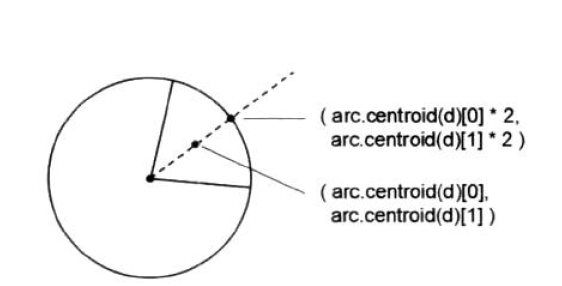
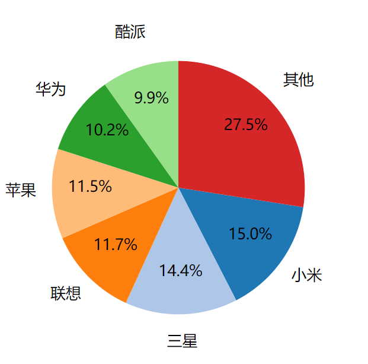

# SVG

手册：https://www.runoob.com/svg/svg-tutorial.html


# 版本

以v3.x 版本为例

# 选择集与数据绑定

## 选择 

选择元素的函数有两个：

* select，返回匹配元素的第一个
* selectAll，返回所有匹配元素

选择语法和jquery一样，同时也支持dom对象。`select`返回一个选择集，**支持链式调用**。

```javascript
d3.select('body')  //标签
d3.select('#test') //id选择
d3.select('.content') //样式
d3.select('ul li') //层级选择
d3.select(document.getElementByid('#test'))
d3.select('body').select('div') // 链式调用
```

根据需要可以自定义过滤器，语法为`selection.filter(函数)`

```js
//选择第2个p 
var p=d3.selectAll('body p').filter((d,i)=>i==2);
```

 查看选择集的状态，有三个函数使用。selection表示选择集，下同。

* selection.empty()，选择集是否为空（true/false）
* selection.node()，选择集的第一个元素
* selection.size()，选择集的个数

## 元素设置

基于选择集selection。

属性设置：

* `.attr(key,[val])`：val省略时，表示读取，否则为设置
* `.property(key,[val])`：用于input等标签的val更改，例如checkbox

样式设置：

* `.classed('cls',[true/false])`：设置某个样式，true表示应用该样式，false表示删除样式。
* `.attr('class',val)`：设置某个样式
* `.style('name',[value])`：读取、设置某个样式。支持字典形式参数`.style({'font-size':'30px'})` 

文字设置：

* `.tetx([val])`：读取设置元素的文本
* `html([val])`：同上，但是会解析内置的html标签。

## 添加删除元素

基于选择集selection。


添加。**和Jquery不同的是，d3在链式调用添加元素等函数后，返回的是新增的元素，而不是一开始的返回集。**

* `.append(name)`：添加元素

* `.insert(name,[before])`：插入元素，before是选择器语法

* `.remove()`：删除选择集的元素

```js
//d3语法,text()设置的是新增的p
d3.select('body').
append('p').text('d3 hello')
//JQ语法,先创建、设置元素，再添加
var a=$('<p></p>').text('jq hello');
$('body').add(a) //添加一个jq对象
```

## 数据绑定

将数据绑定到选择集上，以便后续的可视化操作，是d3的一大特色。所谓绑定到选择集，**就是给标签元素新增一个属性`__data__=value`。**相关函数有两个：

* `selection.datum([value])`：选择集中的每一个元素都绑定value，类似python字典的`{}.fromkeys(keys,val)`。value缺省时，表示读取元素的value。
* `selection.data([values[,key]])`：**所传values为一数组，默认按照索引顺序将选择集的元素与数据一一绑定。**key是一个键映射函数，用于指定绑定规则。

**函数调用后返回的依旧是原先的选择集。**

### datum()

datum示例

```js
var p=d3.selectAll('body').dataum(7);
console.log(p); //可以看到p会多出一个__data__属性
console.log(p.dataum());
```

将数据绑定到元素标签后，**常用的操作就是读取它，然后作为数据修改元素的属性。** 下例的text()函数中，传入一个匿名函数，参数为d,i分别表示当前元素在选择集的索引`index`和自己的`__data__`属性。

```js
p.dataum("test data")
.text(function(d,i){
    return 'index:'+i+'data:'+d;
})
```

**在被绑定数据的选择集中添加元素后，新元素就会继承该数据。**

```js
p.append('span').text('我是新增元素').datum()
```


### data()

data()将数组与选择集一一绑定。

```js
//有3个p段落，将分别绑定1、2、3，并且设置文本为__data__显示
d3.selectAll('p').data([1,2,3]).text(function(d){return d})
```

**当选择集元素数目与数组长度不一致时，data会自动处理，但这涉及以下几个概念，用于表示元素集和数组的关系**

* update：数组与选择集等长的部分
* enter：选择集小于数组，留空的部分，等待数据进入
* exit：选择集大于数组，等待被删除的部分



为选择集调用data()函数后，**默认返回选择集的update部分（和数组等长部分）**，同时，选择集会新增两个函数enter()、exit()，分别用于获取自身的enter留空部分、exit多余部分。

对于这两部分的处理，**可以参考以下模板**。思想是，对于enter，填补欠缺的元素，对于exit，删除多余的元素。此外**，要注意的是，update、enter、exit这三者返回的是一个选择集，含有不止1个元素，后续所有的函数操作都会对这些元素生效。**

```js
//d3 data 模板处理
var dataset=[1,2,3,4]; 
var update=p.data(dataset); //等长选择集
var enter=update.enter();
var exit=update.exit();

//update部分处理
f=d=>d; //匿名函数，仅表示操作
//1. update直接操作
update.text(f)
//2. enter部分先增加元素
enter.append('p').text(f);
//3. exit部分直接删除
exit.remove()
```

在上述模板的基础上，有一个快速使元素与数据等长的小技巧：**先清空子元素，再调用enter()**。这样一来，update和enter就可以统一操作，借用该技巧，可以方便统一的创建、更新元素。

```js
//创建一个柱形图
function demo()
{
    $('svg').empty(); //先清空svg里的所以元素，JQuery语法
    var rect=d3.select('svg').selectAll('rect')
    .enter(); 
    //批量设置
    rect.append('rect').attr('x', (d,i)=>i * rectStep) //x起点
                .attr('y',  (d,i)=>height - dataSet[i]) //y起点
                .attr('width', rectWidth)  //矩形宽
                .attr('height',  (d,i)=>dataSet[i]) //矩形高
                .attr('fill', 'black');
}
```


## 常用函数

d3为数据可视化服务，自然有许多数据的相关函数。常用函数如下：

排序

* d3.ascending(a,b)，若a<b，返回-1。和js自带的sort函数组合，对数组排序。d3.decending则是降序。

  ```js
  var num=[5,4,3,2,1]
  num.sort(d3.ascending) //传入key，
  ```

求值

* d3.min,d3.max：返回数组的最小值、最大值
* d3.extend()：[min,max]，以数组的形式返回参数数组的最小值、最大值
* d3.sum
* d3.mean：会自动忽略undefined和null

## 数据结构

### 映射

d3的一种数据结构Map，也就是字典。

* `.map([objects],[keys])`：构造映射，第一个是源数组，第二个是指定映射的键。类似python的`{}.fromkeys()` 
* `.has(key)`，判断是否存在key
* `.get(key)`，返回key值，若无则返回undefined。**map结构不支持`[]`索引**
* `.set(key,val)`，设定键值对，旧的键会被覆盖
* `.remove(key)`，删除键
* `.keys()`：返回所有key
* `.values()`：返回所有value
* `.size()`：字典大小

```js
var data=[{'name':'jhh','age':'15'},{'name':'jhk','age':'24'}]
var new_data=d3.map(data,d=>d['name']) //map结构

```

### 集合

* `.set(array)`：构建
* `.has`，判断元素是否存在
* `.add`，添加元素
* `.remove`，删除元素
* `.values()`，以数组形式返回
* `.size()`

### 嵌套

嵌套结构net，使用键对数组进行划分，便于快速查找。



* `.nest()`：表示接下来会构建一个新的嵌套结构，其他函数需要跟在此函数后
* `.key(function)`：指定嵌套结构的键
* `.entries(array)`：指定将被嵌套的数组

根据上述几个函数，即可构建一个嵌套

```js
var persons=[
    {name:'jhk',hometown:'xj',height:'short'},
    {name:'zx',hometown: 'bj',height:'tall'},
    {name:'xmw',hometown: 'nb',height:'short'},
    {name:'lxt',hometown: 'nb',height:'tall'},
];
var net=d3.nest()
    .key(d=>d.hometown) //第1个键
    .key(d=>d.name) //第2个键
    .entries(persons);
console.log(net);
/*树形结构如下
xj
	jhk
		jhk
bj
	zx
		zx
nb
	xmw
		xmw
    lxt
    	lxt
*/
```


# 比例尺和坐标轴

有时候，源数据本身并不适合绘图，例如，销售额3000，果真要绘制3000像素是不实际的。比例尺就是为了解决这个问题。

比例尺的本质就是一个函数，将一段区域转为另一端区域，方便svg作图**，将数据经过缩放变成便于绘图的实际像素，同时也可以将绘图和数据分开**。d3中坐标轴的绘制需要比例尺。

比例尺的源数据范围称作定义域(`domain`)，目标数据范围称作值域(`range`)，这也是d3比例尺最基础的两个属性。

## 定量比例尺

### 线性比例尺

线性比例尺，定义域、值域连续，且为线性映射关系，`y=kx+b` 

d3.scale.linear()，创建一个线性比例尺。有以下方法

* `.domain([numbers])`，定义域
* `.range([values])`，值域
* `(x)`，转换x到值域
* `.invert(y)`，输入y转换到定义域
* `.rangeRound([values])`，对输入的值域进行四舍五入
* `.clamp([boolean])`，默认为false，即使接收到一个超出定义域的值，也依旧按照比例关系输出值，可能会超出值域。设定为true后，输出值会锁定为值域。
* `.ticks([count])`，将定义域划分成count份。该方法主要用于更改默认的坐标刻度
* `.ticksFormat(count)`：格式化ticks()返回的坐标刻度。**返回一个函数**


```js
//创建一个线性比例尺,y=100x
var linear=d3.scale.linear()
    .domain([0,1])
    .range([0,100]);

console.log(linear(0.5)); //50
// linear.clamp(true),设置后，下一行就会输出100
console.log(linear(5)); //500,超出值域依旧输出
console.log(linear.invert(50)); //0.5

//比例尺创建之后，也可以修改 
linear.range([0,50]) //修改为y=50x
console.log(linear(0.5)) //25

//ticksformat用法
var ticks=linear.ticks(5); //分成5份
var myformat=linear.tickFormat(5,'$');
for(i in ticks){
   console.log(myformat(ticks[i]));}
/*
$0
$0.2
$0.4
$0.6
$0.8
$1
*/
```

### 指数和对数比例尺

和线性比例尺大同小异，关键在于设定指数和底数。

指数比例尺，本质是一个线性比例尺。**在创建比例尺的时候，会自动会定义域进行指数缩放，然后再得到缩放后的定义域与值域的线性比例关系，**`y=pow(x)*k+b`，**这时候的定义域就好比数学上x的范围**，而线性系数比的是`y=k*func(x)+b`。请看下例

```js
pow=d3.scale.pow().exponent(2); //x^2
pow(3) //9

//设定定义域、值域，其实是[0,4]-->[0,40]
pow.domain([0,2]).range([0,40])
pow(10) //10^2*10=1000，先指数再线性
```

对数比例尺同理，先对数缩放再找线性关系，`y=log(x)*k+b`

```js
var log=d3.scale.log().base(2);
//设定定义域、值域，其实是[0,3]-->[0,30]
log.domain([1,8]).range([0,30])
log(4) //log2(4)*10+0=20
```

## 量子比例尺

量子比例尺(quantize)的定义域连续，值域离散。依据离散值的数目对定义域等分，进行映射。

一个简单的量子比例尺示例。量子比例尺通常用于颜色配置。

```js
quan=d3.scale.quantize().domain([0,10]).range(['red','blue']);
//0-10被分成两份，前一段区域对应red，后一段对应blue
quan(4) //red
quan(6) //blue
```

## 阈值比例尺

设定阈值，将连续的定义域从$-\infty$到$+\infty$划分成多个区域，对应离散的值域。

```js
//-无穷-10 10-20,  20-30 30-无穷
var th=d3.scale.threshold().domain([10,20,30]).range(['red','blue','green','black'])
th(11) //blue 
th.invertExtent('blue') //反转离散值域，[10, 20]
```


## 序数比例尺

**序数比例尺的定义域、值域都是离散的，建立一种一一对应的映射。**

d3.scale.ordinal() 定义一个序数比例尺

* `ordial(x)`：输入定义域一个值，得到另一个值
* `domain([vlaues])`：设定定义域
* `range([values])`：设定值域
* `rangePoints(interval[,padding])`：**用连续区间代替range设定值域**，根据定义域中离散值的数量将值域分段，分段值即为值域离散值。
* `rangeBands(interval,[padding,outerPadding])`：和points类似，只是分段方法不同。
* `rangeBand()`：返回rangeBands()设定后每一段的宽度。


简单的序数比例尺，一一对应

```js
//1-5 与 abcde 一一对应 
var o=d3.scaleOrdinal().domain([1,2,3,4,5]).range(['a','b','c','d','e'])  
```

**使用`rangePoints`可以避免多次手动输入离散的值域，只要接收一个连续值域，就可以自动地根据定义域的离散数目，对值域划分。**这个函数的两个参数interval、padding示意如下： interval表示分隔点之间的间距，padding是边界部分留下的空白。

依据下图推导公式如下：假设有n个点，$(n-1)*step+step*padding=range$ ，则$step=\frac{range}{n-1+padding}$  





```js
/*
定义域有5个点，4段区间，值域也要被分成4段区间，(100-0)/4=25，因此值域自动被分割的点为 0 25 50 75 100
*/
var o=d3.scale.ordinal().domain([1,2,3,4,5]).rangePonints([0,100])

//增加参数padding
var o=d3.scale.ordinal().domain([1,2,3,4,5]).rangePonints([0,100],5)
o.range() //查看值域，按照上述公式推导可得step=11.11
//[27.77777777777778, 38.888888888888886, 50, 61.11111111111111, 72.22222222222223] 
```

**与rangePoints类似的是`rangeBands`，但是两者之间的划分方法不同。rangePoint中间是孤立的点，rangeBands是具备一定宽度的矩形。**如下图所示，相邻点间隔step，padding$\in (0,1)$ 表示内边距占比，如果等于0.5则矩形宽与空白等长。outerpadding则表示首尾两个矩形距离边界的距离，整个推导公式为：假设有n个点，整个range会被划出n个band，注意最后一个band没有内边距，$(n-1)*step+step*(1-p)+2*step*op=range$ ，$step=\frac{range}{2*op-p+n}$ 。实际使用时，不必纠结于step的计算。

rangeBands适合柱形图的绘制，rangeBand可以直接作为矩形的宽度，而padding也刚好可以作为矩形之间的空白。



```js
//rangeBands示例
var o=d3.scale.ordinal().domain([1,2,3,4,5]).rangeBands([0,100])
o.range() //[0,20,40,60,80,100] 
//设定空白后
o=d3.scale.ordinal().domain([1,2,3,4,5]).rangeBands([0,100],0.5,0.2)
o.range()  //[4.081632653061225, 24.489795918367346, 44.89795918367347, 65.3061224489796, 85.71428571428571]
o.rangeBand() //10.204081632653061
```


d3 提供了几个获取颜色的序数比例尺

* d3.scale.category10()：10种颜色
* d3.scale.category20()：20种颜色
* d3.scale.category20b()：20种颜色
* d3.scale.category20c()：20种颜色

上述几种比例尺会按照调用顺序依次返回一种新的颜色，无论输入值是什么

```js
colors=d3.scale.category10()
colors(1)  //"#1f77b4"
colors('jhk') //"#ff7f0e",即使输入的是字符串，也返回了颜色
```


## 坐标轴

d3的坐标轴绘制需要配合比例尺一起使用。

d3.svg.axis()，创建一个新的坐标轴对象

* `axis(selection)`，将坐标轴绘制到指定选择集上，该选择集必须含有svg元素或g元素。**`selection.call(axis)`，是等价的写法，也非常常用，**表示将选择集作为参数，传递给`axis` 。
* `.scale([scale])`，设定、获取坐标的比例尺。**比例尺本身已包含定义域、值域，是坐标对象最重要的一个属性。** 
* `.orient([orientation])`，设定或获取坐标轴的方向，有四个，top、bottom、left、right。top、bottom表示坐标轴是x轴，刻度分别在坐标轴的上方、下方，left、right表示坐标轴是y轴，刻度分别在坐标轴的左和右。
* `.ticks([count])`，设定或获取坐标轴的分段数，也就是count段，count+1个刻度。
* `.tickValues([values])`，设定或获取坐标轴的指定刻度，如`.tickValues([10,20])` 
* `.tickSize([inner,outter])`，设定或获取坐标轴的内外刻度长度。外刻度指的是首尾两端的刻度线。
* `.tickFormat(d3.format('格式控制符'))`，设置坐标轴的刻度样式


**坐标轴分别使用svg的path绘制轴线，line绘制刻度线，text标记刻度，但这些繁琐的操作都已经被d3封装，只要使用`axis(selection)`，就会自动地在选择集上新增若干元素，用以表示坐标轴**。

绘制标轴需要准备：

1. 一个容纳坐标轴的容器，建议是svg里的一个g元素`svg.append('g')` ，便于整体平移，因为通常会为画板设置边距等属性。

   ```js
   //点的起始绘制坐标
   var g=svg.append('g')
       .attr('transform','translate({0} {1})'.format(padding.left,height-padding.bottom-yAxisWidth));
   ```

   

2. 一个配置好属性的坐标轴对象 `d3.svg.axis()`

   ```js
   // x y 比例尺
   var xAxisWidth = yAxisWidth = 300;
   var xScale = d3.scale.linear()
       .domain([0, 1]).range([0, xAxisWidth]);
   var xAxis = d3.svg.axis().scale(xScale).orient('bottom'); //坐标轴对象
   ```

3. 绘制

   ```js
   g.call(xAxis);
   ```

## 散点图demo

要绘制二维的坐标轴，有几点是要注意的。

### y轴反转

d3的绘制起点位于画板的左上角，x向右变大，**y向下变大**，而图像的起点位于左下角，也就是通常看到的原点(0,0)位置。**这就涉及到y坐标比例尺的反转，**代码如下

```js
var yScale = d3.scale.linear()
	.domain([0, 1]).range([100, 0]); //y比例尺要反过来
```

**想象画笔现在停在画布的左上角**，从定义域的0开始绘制，画笔垂直向下移动100像素，描点……一直绘制到定义域的终点1，画笔相对于左上角移动0像素，描点。于是，一个符合正常视角的y坐标轴绘制完成。重复这个过程，想象比例尺没有反转的情况，是否刚好是颠倒的y轴？

### 点的绘制

既然坐标轴已然绘制，那么就要考虑散点图的绘制。**y比例尺是颠倒的，是否要更改坐标点的计算方式呢？答案是否定的**，事实上，坐标轴本身就已经说明了这一点。以0点为例，**直接应用这个颠倒的比例尺`yScale(0)`就能得到一个最大像素**，将0绘制在最底下，要记住svg的绘制起点位于左上角，d3的坐标轴底层也依旧使用path绘制。 


完整的散点图demo

```django



    <title>坐标轴示例</title>




    <div>
        <svg></svg>
    </div>




    <script>
        //定义画板
        var width = height = 400;
        var svg = d3.select('svg').attr('width', width).attr('height', height);
        var padding = {top: 50, right: 50, bottom: 50, left: 50};

        // x y 比例尺
        var xAxisWidth = yAxisWidth = 300;
        var xScale = d3.scale.linear()
            .domain([0, 1]).range([0, xAxisWidth]);
        var yScale = d3.scale.linear()
            .domain([0, 1]).range([yAxisWidth, 0]); //y比例尺要反过来

        // x y坐标轴
        var xAxis = d3.svg.axis().scale(xScale).orient('bottom');
        var yAxis = d3.svg.axis().scale(yScale).orient('left');

        //x y坐标轴容器 g 要整体平移 记住绘制起点
        svg.append('g')
            .attr('transform', 'translate({0} {1})'.format(padding.left, height - padding.bottom))
            .attr('class', 'axis').call(xAxis);

        //y轴的起点要额外注意，y向下变大
        svg.append('g')
            .attr('transform', 'translate({0} {1})'.format(padding.left, height - padding.bottom - yAxisWidth))
            .attr('class', 'axis').call(yAxis);

        //准备数据，绘制散点
        var centers = [[0.5, 0.5], [0.7, 0.8], [0.4, 0.9], [0.11, 0.32],
            [0.88, 0.25], [0.75, 0.12], [0.5, 0.1], [0.2, 0.3],
            [0.4, 0.1], [0.6, 0.7]]; //散点图圆心坐标
        //注意点的起始绘制坐标 ，x:left,y:左上角起点
        //学会用g整体平移 以后添加点的时候就会容易一些
        svg.append('g').attr('id', 'circles')
            .attr('transform', 'translate({0} {1})'.format(padding.left, height - padding.bottom - yAxisWidth))
            .selectAll('circle').data(centers)
            .enter().append('circle')  //点的参数设置
            .attr('cx', (d) => xScale(d[0]))
            .attr('cy', (d) => yScale(d[1]))
            .attr('r', 3)
            .attr('fill', 'skyblue');
        //添加文字
        d3.select('#circles').selectAll('text')
            .data(centers)
            .enter().append('text') //文字的参数设置
            .attr('x', d => xScale(d[0])).attr('y', d => yScale(d[1]))
            .attr('dy', '-1em')
            .text(function (d) {
                return '({0},{1})'.format(d[0], d[1]);
            })
            .style({'font-size': '7px', 'text-anchor': 'middle'});

    </script>

```


# 绘制

svg中的path可以生产任意的路径，但是如果手动指定若干节点，相当繁琐。d3的路径生成器就可以完成这部分复杂的工作。它的原理就是依据给定的数据，返回适合path的字符串，`<path d='路径生成器返回的字符串'>`。

## 颜色

计算机有两种色彩模式 ，一是RGB，一是HSL。

RGB，red、green、blue三通道相互叠加形成各种颜色，每个通道都有255种变化。

HSL，Hue色相、Saturation饱和度、Lightness明度。色相的范围是0-360度，0、120、240分别表示红色、绿色、蓝色。饱和度的范围是0-1，饱和度越大，颜色越鲜艳。明度的范围是0-1，明度越大，越接近白色。

RGB和HSL两种颜色可以相互转换。


创建一个颜色对象：

* `d3.rgb(r,g,b)`；`d3.hsl(h,s,l)` 
* `d3.rgb(color)`，color可以是一个十六进制字符#ffeeaa、字符串red形式。

颜色对象的方法

* `.brighter([k])`，各通道乘`0.7^-k`，颜色变得更加明亮，返回一个新的颜色对象。
* `.darker([k])`，与上面相反，颜色变得更暗。
* `.hsl()`，返回颜色对应的hsl值。
* `toString()`，以字符串形式返回颜色值，

## 插值

如果要计算介于两个颜色之间的颜色，就要用到插值`interpolate` 

```js
var a=d3.rgb(255,0,0); //红色
var b=d3.rgb(0,255,0); //绿色
var compute=d3.interpolate(a,b);

//渐变器，0表示红色，1表示绿色
console.log(compute(0.5)); //#808000
```

## 线段生成器

根据输入数据，**生成path的路径表达式**，常用于制作折线图。

d3.svg.line()，创建一个线段生成器

* `line(data)`，依据data数据绘制路径
* `line.x([x])`，x坐标访问器，用于复杂数据结构自定义x坐标访问手段，默认为`d=>d[0]`
* `line.y([y])`，同上，默认为`d=>d[1]`


直线生成器示例

```js
var lines = [[80, 80], [100, 80], [100, 100], [80, 100]]; //节点数据
var linePath = d3.svg.line(); //线段生成器，默认的规则既可以取出对应坐标 
var svg = d3.select('svg');

svg.append('path')
    .attr('d', linePath(lines)) //注意这里
    .attr('stroke', 'black')
    .attr('fill', 'none');
console.log(linePath(lines)); //"M80,80L100,80L100,100L80,100"

/*
<path d="M80,80L100,80L100,100L80,100" stroke="black" fill="none"></path>
*/
```

xy 坐标访问器的用法

```js
var lines1 = [80, 100, 120, 140]; //每一项都变成了一个数 
var linePath1 = d3.svg.line()
    .x(d => d) //xy坐标的访问方式都要重新定义
    .y((d, i) => (i % 2 ? 120 : 240));
```

## 弧生成器

凭借起始角度、终止角度、内外半径等参数，绘制弧线，常用于制作饼图。各参数意义如下 




弧生成器示例

```js
var dataset = {
            startAngle: 0, //y轴正方向为0度开始
            endAngle: Math.PI * 0.75
        };
        //创建一个弧生成器
        var arcPath = d3.svg.arc()
            .innerRadius(50).outerRadius(100); //内外半径
        var svg = d3.select('svg');
        svg.append('path')
            .attr('d', arcPath(dataset)) //注意数据格式
            .attr('stroke', 'black')
            .attr('fill', 'none')
            .attr('transform', 'translate(250,250)');
        //为弧添加文字
        //在整个图像平移的基础上，平移文字到弧中心
        //centroid可以计算弧的中心位置
        svg.append('text')
            .attr('transform', 'translate(250,250)'+'translate({0})'.format(arcPath.centroid(dataset)))
             .style('text-anchor','middle')
            .text('文字说明');
```

## 折线图demo

综合运用坐标轴、比例尺、路径生成器等知识点。

```js
function get_max_gdp(data) {
    //用于获取源数据中的最大gdp，便于确定比例尺
    var max = 0;
    for (var i = 0; i < data.length; i++) {
        //{country:xx,gdp:[[],...]}
        var current_gdp = d3.max(data[i].gdp, d => d[1]);
        if (current_gdp > max) {
            max = current_gdp;
        }
    }
    return max;
}

var dataset = [
    {
        country: "china",
        gdp: [[2000, 11920], [2001, 13170], [2002, 14550],
              [2003, 16500], [2004, 19440], [2005, 22870],
              [2006, 27930], [2007, 35040], [2008, 45470],
              [2009, 51050], [2010, 59490], [2011, 73140],
              [2012, 83860], [2013, 103550]] //[年份,GDP]
    },
    {
        country: "japan",
        gdp: [[2000, 47310], [2001, 41590], [2002, 39800],
              [2003, 43020], [2004, 46550], [2005, 45710],
              [2006, 43560], [2007, 43560], [2008, 48490],
              [2009, 50350], [2010, 54950], [2011, 59050],
              [2012, 59370], [2013, 48980]]
    }
];
var width = height = 400; //画板大小
var padding = {top: 50, left: 50, right: 50, bottom: 50}; //画板的上下左右边距
var gdpMax = get_max_gdp(dataset);

//x y比例尺
var xScale = d3.scale.linear()
    .domain([2000, 2013])
    .range([0, width - padding.left - padding.right]);
var yScale = d3.scale.linear()
    .domain([0, gdpMax * 1.1])
    .range([height - padding.top - padding.bottom, 0]);

//直线生成器
var linePath = d3.svg.line()
    .x(d => xScale(d[0]))  //[年,gdp]
    .y(d => yScale(d[1]));

//定义两个颜色
var colors = [d3.rgb(0, 0, 255), d3.rgb(0, 255, 0)];

//绘制
var svg = d3.select('svg').style({'width': width, 'height': height});
svg.selectAll('path')
    .data(dataset)
    .enter()
    .append('path')
    .attr('transform', 'translate({0},{1})'.format(padding.left, padding.top))
    .attr('d', (d, i) => linePath(d.gdp))
    .attr('fill', 'none')
    .attr('stroke-width', 3)
    .attr('stroke', (d, i) => colors[i]);

//添加坐标轴
var xAxis = d3.svg.axis()
    .scale(xScale)
    .ticks(5)
    .tickFormat(d3.format('d')) //不要添加,
    .orient('bottom');
var yAxis = d3.svg.axis()
    .scale(yScale)
    .orient('left');

//添加元素容纳坐标轴
svg.append('g')
    .classed('axis', true)
    .attr('transform', 'translate({0},{1})'.format(padding.left, height - padding.bottom))
    .call(xAxis);

svg.append('g')
    .classed('axis', true)
    .attr('transform', 'translate({0},{1})'.format(padding.left, padding.top))
    .call(yAxis);


//添加图注，矩形颜色填充
svg.selectAll('rect')
    .data(dataset)
    .enter()
    .append('rect')
    .attr('x', (d, i) => padding.left + i * 50)
    .attr('y', height - padding.bottom + 30)
    .attr('width', 20)
    .attr('height', 20)
    .attr('fill', (d, i) => colors[i]);

var texts = svg.append('g')
.attr('transform', 'translate({0},{1})'.format(padding.left, height - padding.bottom + 10));
texts.selectAll('text')
    .data(dataset)
    .enter()
    .append('text')
    .text((d, i) => d.country)
    .attr('x', (d, i) => i * 50)
    .attr('y', 20).attr('font-size', '10px');
```


# 动画

过渡和动画都是动态效果。区别是，过渡的起始状态、目标状态明确，动画时间确定，而动画在这些方面是不确定的。

## 过渡

每个选择集对象都含有`.transition()`方法，**与以往的选择集方法不同，调用该方法后，将返回一个过渡对象，而不是原先的选择集对象。**过渡对象不拥有append等选择集方法。

过渡对象方法：

* `.delay([delay])`，设定过渡开始的延迟时间，单位为毫秒
* `.duration([duration])`，设定过渡的持续时间，如果省略该方法，默认持续时间为250ms 
* `.ease(value)`，设定过渡样式 ，也就是如何过渡到目标状态。d3预置了几种过渡样式。
* `.attr(name,value)`，设定目标状态的属性
* `.style(name,value)`，设定目标状态的样式属性，如fill、color等
* `.text(value)`，设定目标状态文字
* `.remove()`，过渡结束后删除元素
* `.each(type,function(d,i){})`，对子元素循环设置。type包括start、end、interrupt，分别表示动画开始、结束、被打断。
* `.call()`，将过渡对象作为参数，传递给另外一个函数。用于坐标轴的过渡。
* `transion()`，过渡对象可以继续调用该方法，产生一个新的过渡对象


简单的动画效果

```js
//矩形长度拉伸
var svg = d3.select('svg');
svg.append('rect')
    .attr('x', 50).attr('y', 50)
    .attr('width', 200).attr('height', 200)
    .transition()
    .delay(500)   //延迟500ms开始
    .duration(2000) //过渡持续2000 ms
    .attr('width', 400); //目标状态的width 
	.style('fill','yellow');
```


**过渡还有一个要注意的地方是，过渡仅对当前选择集的最外层元素生效，而无视选择集的子元素。**如果需要选择子元素，有以下方法。

* `.select()`
* `.selectAll()`
* `.filter()`，过滤器。

```js
var svg = d3.select('svg');
var data = [50, 75, 100];
svg.append('g').selectAll('rect')  //选择所有rect元素进行动画过渡
    .data(data)
    .enter()
    .append('rect')
    .attr('x', 20).attr('y', (d, i) => 20 + i * (50 + 20))
    .attr('width', d => d).attr('height', 50)
    .filter((d, i) => i >= 1) //过滤器，第一个矩形不进行过渡
    .transition()
    .delay(500)
    .attr('width', (d) => d * 2)
    .style('fill', 'yellow');
```



## 散点图demo

制作一个散点图的动画，要求新增节点、删除节点、更新节点时，实现动画效果。

```django


    <title>散点图动画</title>



    <div>
        <svg></svg>
    </div>
    <div>
        <input type="button" value="更新" id="update">
        <input type="button" value="增加" id="add">
        <input type="button" value="减少" id="delete">
    </div>



    <script>
        var center = [[0.5, 0.5], [0.7, 0.8], [0.4, 0.9], [0.11, 0.32],
            [0.88, 0.25], [0.75, 0.12], [0.5, 0.1], [0.2, 0.3],
            [0.4, 0.1], [0.6, 0.7]]; //散点图圆心坐标
        var width = height = 500;


        //定义svg画板
        var svg = d3.select('svg')
            .attr('width', width)
            .attr('height', height);
        var padding = {top: 50, left: 50, bottom: 50, right: 50};

        //定义x y比例尺
        var xAxisWidth = width - padding.left - padding.right;
        var yAxisWidth = height - padding.top - padding.bottom;
        var xScale = d3.scale.linear()
            .domain([0, 1])
            .range([0, xAxisWidth]); //x坐标比例尺

        var yScale = d3.scale.linear()
            .domain([0, 1])
            .range([yAxisWidth, 0]); //y坐标比例尺,反过来绘制


        //定义x y坐标轴
        var xAxis = d3.svg.axis()
            .scale(xScale)
            .orient('bottom');

        var yAxis = d3.svg.axis()
            .scale(yScale)
            .orient('left');

        //绘制坐标轴
        svg.append('g') //x轴
            .attr('transform', 'translate({0} {1})'.format(padding.left, height - padding.bottom))
            .attr('class', 'axis')
            .call(xAxis);

        svg.append('g')
            .attr('transform', 'translate({0} {1})'.format(padding.left, padding.top))
            .attr('class', 'axis')
            .call(yAxis);

        //绘制散点
        /*要求过渡动画：
        1. 添加点时，从原点移动到指定位置
        2. 删除点时，点缓慢变成白色
        3. 更新点时， 点过渡到指定位置
        */

        //绘制函数
        draw_circles();
        function draw_circles() {
            /*添加删除更新 灵活利用d3的data绑定 update enter exit*/
            var update = svg.selectAll('circle').data(center);
            var enter = update.enter();
            var exit = update.exit();

            //现有点更新
            update.transition().duration(1000)
                .attr('cx', d => xScale(d[0]))
                .attr('cy', d => yScale(d[1]))
                .attr('transform', 'translate({0} {1})'.format(padding.left, padding.top));

            //新增点
            enter.append('circle')
                 .attr('transform', 'translate({0} {1})'.format(padding.left, padding.top))
                .attr('cx', xScale(0))
                .attr('cy', yScale(0))
                .attr('fill', 'black')
                .attr('r', '10')
                .transition().duration(1000)
                .attr('cx', d => xScale(d[0]))
                .attr('cy', d => yScale(d[1]))
                .attr('r', 5)
                .attr('fill', 'skyblue')
                .attr('transform', 'translate({0} {1})'.format(padding.left, padding.top));

            //删除点
            exit.transition().duration(500).attr('r',20)
                .transition().duration(1000)
                .attr('fill', 'white').attr('r', 0)
                .remove();
        }


        //给按钮绑定事件
        //添加点
        $('#add').click(function () {
            center.push([Math.random(), Math.random()]);
            draw_circles();
        });

        //删除点
        $('#delete').click(function () {
            center.pop();
            draw_circles();
        });

        //更新现有点
        $('#update').click(function () {
            for (var i = 0; i < center.length; i++) {
                center[i] = [Math.random(), Math.random()];
                draw_circles();
            }
        })
    </script>

```


# 交互

## 监听器

d3能创建交互式图标，选择集有一个方法`.on()`，用来设定事件的监听器。语法如下：`selector.on('event',function(){})` ，event表示事件名称。

```js
//对比dom
dom.onClick=function(){}

//对比Jquery
j.click(function(){})

//d3
d.on('click',function(){})
```

**每一个选择集可以设定多个监听器，但是要为不同的响应事件创建别名**，否则新的监听器会覆盖旧的监听器。别名创建的语法：`event.name`，用`.`在事件名后添加别名。

另外，过渡对象没有`.on()`方法。


常见的键鼠事件：

* click：单击
* mouseover：鼠标悬浮
* mouseout：鼠标移出
* mousemove：鼠标移动
* mousedown：鼠标按下
* mouseup：鼠标按钮松开
* keydown：按下任意按键触发，不区分字母的大小写
* keypress：按下字符按键（字母、数字、加减号、回车）触发，区分大小写。
* keyup：释放按键时触发。


鼠标事件

```js
//创建一个矩形
//鼠标悬浮时变色 显示文字 鼠标移出时 恢复原状
var svg = d3.select('svg').attr('width', 400).attr('height', 400);

svg.append('rect')
    .attr('x', 50).attr('y', 50)
    .attr('width', 100).attr('height', 200)
    .on('mouseover', function () {
    	//鼠标悬浮动画1 填充  色改变
        d3.select(this)  // 将当前dom对象转为d3对象
            .attr('fill', 'yellow');
})
    .on('mouseover.text', function () {
        // 第2个鼠标悬浮动画 文字显示
        svg.append('text').attr('fill','red')
            .attr('x',50).attr('y',50).text('呀哈哈！');
})
    .on('mouseout', function () {
    	// 鼠标移出动画 颜色变回原先的填充色
        d3.select(this)
            .transition().duration(1000) // 过渡动画
            .attr('fill', 'black');
        svg.select('text').remove(); // 删除文字 
})
```

键盘事件

```js
// 捕获用户按下的按键，并显示在网页上
var svg = d3.select('svg');
d3.select('body')
    .on('keydown', function () {
    //显示用户按下的按键 
    var char = d3.event.keyCode; //得到的是字符的ascii码
    console.log('char code',char);
    char=String.fromCharCode(char); //ascii 转为 char字符
    console.log('char ',char);
    svg.selectAll('text').remove(); // 清空元素
    svg.append('text')
        .attr('fill', 'red')
        .attr('x', 50).attr('y', 50)
        .text(char);
})
```

**d3.event是一个事件对象，保存了用户当前的交互事件，依据键鼠事件类型的不同，拥有不同的对象属性。**例如，鼠标事件`MouseEvent`就拥有x、y属性表示当前的鼠标点击位置。

## 事件

### 拖拽

拖拽，使用鼠标将元素从一个位置移动到另一个位置。d3为拖拽提供了一个简便的方法`d3.behavior.drag()`，这将创建一个拖拽对象（函数）

* `.on('type',listener)` ，设置不同拖拽阶段的不同相应。type有`drag`拖拽中、`dragstart`拖拽开始、`dragend`拖拽结束，listener是监听器函数。
* `.origin(function(return {x:,y:}))`，设置拖拽偏移，当鼠标点击元素并开始拖拽时，元素将会先移动到起点`{x,y}`，然后跟随鼠标的轨迹，保持相同的偏移量移动。


为指定的选择集应用拖拽行为`selector.call(drag)`。


移动圆示例

```js
var svg = d3.select('svg').attr('width', 400).attr('height', 400);

var drag = d3.behavior.drag()   //定义拖拽行为
    .origin(function () {
        return {x: 100, y: 100}; //设置偏移起点
    })
    .on('dragstart', function () {
        console.log('拖拽开始');
    })
    .on('drag', function (d,i) {
        d3.select(this)
            .attr('cx', d.cx=d3.event.x) //同时更新圆的位置 和 源数据
            .attr('cy', d.cy=d3.event.y);
    })
    .on('dragend', function () {
        console.log('拖拽结束');
    });

var circle = [{'cx': 50, 'cy': 50, 'r': 30}]; //圆的参数
svg.selectAll('circle').data(circle)
    .enter().append('circle')
    .attr('cx', d => d.cx).attr('cy', d => d.cy)
    .attr('r', d => d.r)
    .call(drag);
```


### 缩放

缩放，包含鼠标左键按住不放进行的移动以及滚轮缩放，常用于地图。

`d3.behavior.zoom()`创建缩放对象

* `.translate([translate])`，设定缩放的平移向量
* `.scale([scale])`，设定初始缩放量
* `.scaleExtent([min,max])`，设定放大缩小的最小值、最大值。
* `.center([center])`，设定缩放中心
* `on(type,listener)`，设定事件类型和监听器，type有`zoomstart`缩放开始、`zoom`缩放中、`zoomend`缩放结束

```js
var svg = d3.select('svg').attr('width', 400).attr('height', 400);
var g = svg.append('g');

var circles = [{'cx': 150, 'cy': 200, 'r': 30},
               {'cx': 220, 'cy': 200, 'r': 30},
               {'cx': 150, 'cy': 270, 'r': 30},
               {'cx': 220, 'cy': 270, 'r': 30}
              ];
// 添加圆
g.selectAll('circle').data(circles)
    .enter()
    .append('circle')
    .attr('cx', d => d.cx)
    .attr('cy', d => d.cy)
    .attr('r', d => d.r);

// 定义缩放
var zoom = d3.behavior.zoom()
    .scaleExtent([1, 10])
    .on('zoom', function (d) {
        //translate 是鼠标按住拖拽的平移量
        //scale 是滚轮的缩放量
        d3.select(this).attr('transform', 'translate({0}) scale({1})'.format(
            d3.event.translate, d3.event.scale))
    });

g.call(zoom);
```

# 布局

**布局，是一种计算转换器，将数据从一种格式转为另一种格式。**

d3中，有些原始数据并不适合直接绘图，如饼状图，就要求拥有startAngle等属性，而原数据并不一定拥有这些。布局就可以转换这些数据格式。

**布局的使用：**

1. 确定初始数据，布局不同，对格式要求也不同
2. 转换数据
3. 使用转换后的数据进行绘制


## 饼状图

创建一个饼状图布局`pie=d3.layout.pie()` 

* `pie(values)`，转换数据，转换后的每一个对象都包含起始角度、终止角度
* `pie.value([accessor])`，设定访问器
* `pie.startAngle([angle])`，设定、获取饼图的起始角度，默认为0
* `pie.endAngle([angle])`，设定、获取饼图的终止角度

 

手机厂商出货量饼图

```js

 var dataset = [["小米", 60.8], ["三星", 58.4], ["联想", 47.3],
     ["苹果", 46.6], ["华为", 41.3], ["酷派", 40.1],
     ["其他", 111.5]];
 // 饼图布局 ，转换器
 var pie = d3.layout.pie()
     .value(d => d[1]);  //值访问器

 dataset = pie(dataset); //转换数据
 /*
 * 转换后的数据格式：
 * data 转换前的数据项
 * startAngle 弧的终止角
 * endAngle  弧的起始角
 * value 值访问器从data中提取的值
 * */

 //绘制
 var width = height = 400;
 var svg = d3.select('svg').attr('width', width).attr('height', height);

 var arc = d3.svg.arc()  // 弧线生成器
     .innerRadius(0).outerRadius(width / 3);
 var color = d3.scale.category20();

 //添加 g 用于绘制弧线 每一个g容纳一段弧线
 var arcs = svg.selectAll('g').data(dataset).enter()
     .append('g')
     .attr('transform', 'translate({0} {1})'.format(width / 2, height / 2));

 arcs.append('path')  //path绘制路径
     .attr('d', d => arc(d))
     .attr('fill', (d, i) => color(i));

 // 添加各段弧线的文字说明
 arcs.append('text')
     .attr('transform', function (d) {
         // 文字偏移到 弧线的中心位置
         // centroid 可以计算得到弧线的中心位置
         // * 系数可以换算得到 圆心-弧线中心所在直线上的任意位置
     	// *1 表示在中心 *2表示在外半径
         var x = arc.centroid(d)[0] * 1.4;
         var y = arc.centroid(d)[1] * 1.4;
         return 'translate({0} {1})'.format(x, y);
     })
     .attr('text-anchor', 'middle')
     .text(function (d) {
         var percent = Number(d.value) / d3.sum(dataset, d => d.data[1]) * 100;
         return percent.toFixed(1) + '%'; //保留一位小数
     });


 // 添加弧外文字说明
 arcs.append('text')
     .attr('transform', function (d) {
         var x = arc.centroid(d)[0] * 2.5;
         var y = arc.centroid(d)[1] * 2.5;
         return 'translate({0} {1})'.format(x, y);
     })
     .attr('text-anchor', 'middle')
     .text(d => d.data[0]);

```

弧线的中心位置与系数示意图



最终效果图




## 力导向图

力导向图，是绘图的一种算法。在空间中，绘制若干点，然后用线连接，连线之间尽可能不相交。点、线之间受到力的作用，在稳定下来前，点与线会进行一段动画。


创建一个力导向图布局`d3.layout.force()`

* `.size([width,height])`，设定力导向图的作用范围。这起到两个作用，导向图的重心位置设定为`[width/2,height/2]`，节点的初始位置限定在`[0,x]`、`[0,y]`之间 

节点相关的设置

* `.nodes([data])`，设定、获取节点数组
* `.friction([f])`，设定、获取摩擦系数[0,1]，默认0.9。可以认为速度随时间产生的损耗。
* `.charge([c])`，设定或获取节点的电荷数，c>0表示相互吸引，c<0表示相互排斥，绝对值越大，力越大。
* `.chargeDistance([d])`，设定或获取力的作用距离，超过这个距离，就不再有力的作用

连线相关的设置

* `.links([data])`，设定、获取连线数组，要求数据格式为`[{source:0,target:1},]`，表示编号为0的节点与1节点之间存在连线
* `.linkDistance([distance])`，设定连线长度
* `.linkStrength([s])`，设定连线的弹性程度 ，[0,1]，1表示拖动一个节点，所有相邻节点会保持原有连线长度跟随，0表示所有相邻节点不动，而连线无限拉长。

动画相关

* `.start()`，开始布局计算，将会转化此前设定的节点数组nodes、连线数组links，**不返回新的对象** 
* `.tick()`，动画的计算进入到下一步
* `.on(type,listener)`，设定导向图的事件监听器，type包含`start`动画开始、`tick`动画进行中、`end`动画结束。

交互

* `.drag()`，设定拖拽行为。


```js
//点集
var nodes = [
    {name: '0'},
    {name: '1'},
    {name: '2'},
    {name: '3'},
    {name: '4'},
    {name: '5'},
    {name: '6'},
];
//边集
var edges = [
    {source: 0, target: 1},
    {source: 0, target: 2},
    {source: 0, target: 3},
    {source: 1, target: 4},
    {source: 1, target: 5},
    {source: 1, target: 6},
];

var width = 400, height = 400;
var force = d3.layout.force()
    .nodes(nodes) //设置节点数组
    .links(edges) //连线数组
    .size([width, height]) //作用范围
    .linkDistance(90) //连线距离
    .charge(-400);  //节点电荷数

force.start(); //开始布局计算
//console.log(nodes);
//console.log(edges); //输出转换后的点集、边集
/*
node 除了原有的name属性外，新增了其他属性
0:
    index: 0  ，节点索引
    name: "0"
    px: 2.101331279036417 ，上一时刻的x坐标
    py: 68.13807687896742，上一时刻的y坐标
    weight: 3  ，节点权重，度
    x: 2.059366609754264 ，当前时刻的x坐标
    y: 68.15709659345785，，当前时刻的y坐标

edge
    {souce:0,target:0} == > 变成了node对象
    source:
        index: 0
        name: "0"
        px: 2.101331279036417
        py: 68.13807687896742
        weight: 3
        x: 2.059366609754264
        y: 68.15709659345785
 */

//绘制，添加circle、line、text标签
var svg = d3.select('svg').style({'width': 1000, 'height': 1000});
    var colors = d3.scale.category20(); //20种颜色的序数比例尺
//绘制连线
var lines = svg.selectAll('.forceLine')
    .data(edges)
    .enter()
    .append('line')
    .attr('x1', d => d.source.x).attr('y1', d => d.source.y)
    .attr('x2', d => d.target.x).attr('y2', d => d.target.y)
    .attr('class', 'forceLine');
//绘制节点
var circles = svg.selectAll('.forceCircle')
    .data(nodes)
    .enter()
    .append('circle')
    .attr('class', 'forceCircle')
    .attr('cx', d => d.x)
    .attr('cy', d => d.y)
    .attr('r', 20)
    .style({'fill': (d, i) => colors(i)})
    .call(force.drag);

//绘制文字
var texts = svg.selectAll('.forceText')
    .data(nodes)
    .enter()
    .append('text')
    .attr('x', (d) => d.x)
    .attr('y', d => d.y).attr('dy', '.3em')
    .attr('class', 'forceText')
    .text(d => d.name);


//设置监听器，当元素运动时，可以更新元素属性，实现动画效果
//start运动开始 tick运动的每一步 end运动结束
force.on('tick', function () {
    //更新连线的端点坐标
    lines.attr('x1', d => d.source.x); //起点
    lines.attr('y1', d => d.source.y);
    lines.attr('x2', d => d.target.x); //终点
    lines.attr('y2', d => d.target.y);

    //更新节点坐标
    circles.attr('cx', d => d.x).attr('cy', d => d.y);

    //更新文字
    texts.attr('x', d => d.x).attr('y', d => d.y);
});

force.on('start', function () {
    console.log('运动开始');
});

force.on('end', function () {
    console.log('运动结束');
});

//定义拖拽行为
force.drag()  //定义拖拽行为
    .on('dragstart',function (d) {
        d.fixed=true; //拖拽固定，绑定node 对象数据上
    })
    .on('drag', function (d) {
        //拖拽中
        d3.select(this).style({'fill':'yellow','r':30});
    })
    .on('dragend', function (d, i) {
        // 拖拽结束 
        d3.select(this).style({'fill': colors(i),'r':20});
    });
```


