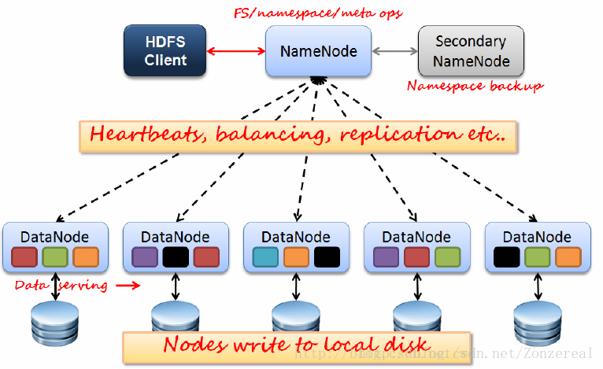
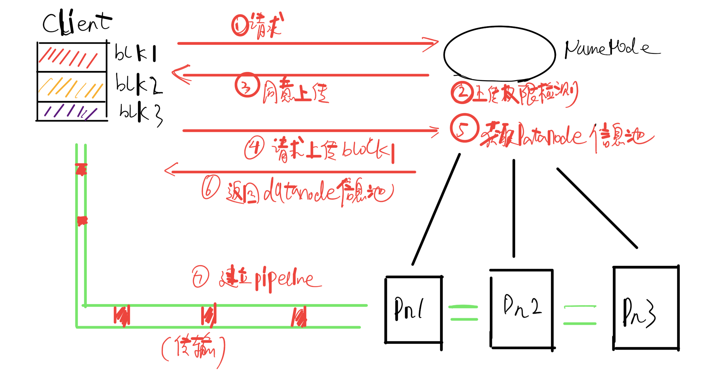
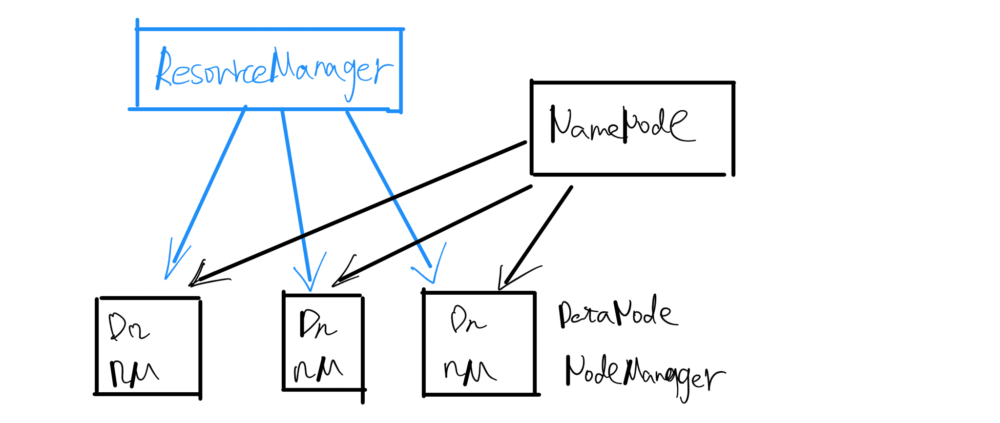
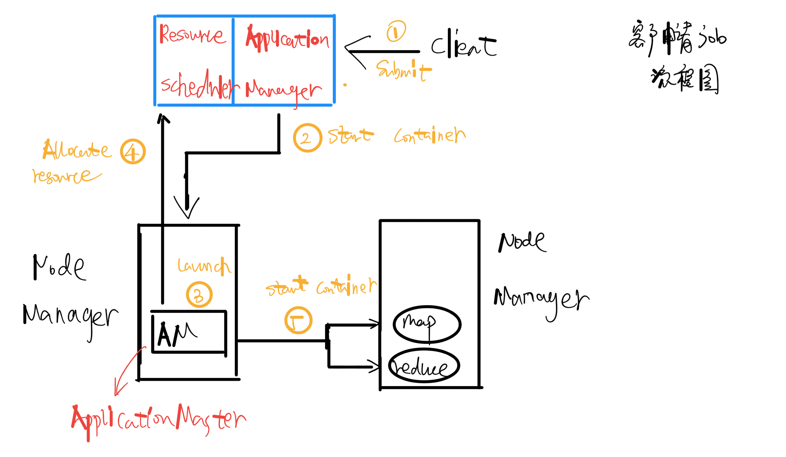
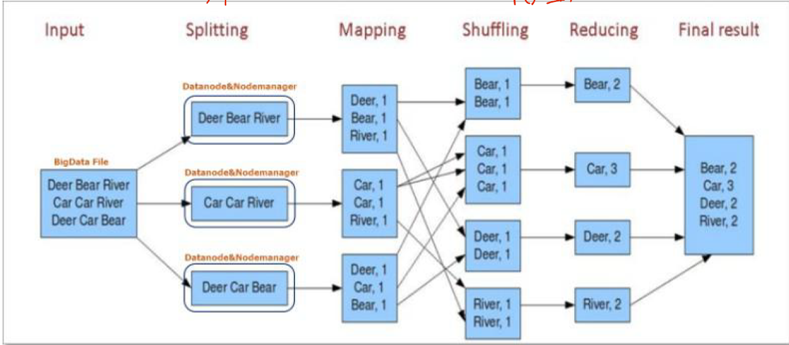

# Hadoop

[hadoop的安装教程](./resources/hadoop安装教程.pdf) 

hadoop是一个分布式的大数据框架，包含分布式存储HDFS、分布式计算MapReduce。

## HDFS

hdfs（hdoop distribute file system），hadoop分布式文件系统，设计之初就考虑到硬件上的不稳定性，**具备高度容错性，适合部署在廉价服务器上。**

**hdfs采用master/slave架构**，一个namenode，若干datanode构成一个hdfs集群。自然地，namenode是集群中的master，datanode充当slave。无论是namenode，还是datanode，每个节点都代表一台机器。



对上图中各结点的作用解释如下：

* namenode：集群的master，负责元数据的管理、客户端请求的接收等。

  所谓元数据，并非文件数据本身，而是一种间接性的数据，记录文件的各种属性，如大小、名字、权限、各个block在datanode上的映射关系等。注意，hdfs是分布式的文件存储系统，**一个文件在实际存储时，是会被切分成多个block（默认128M/block）分开存储在各个datanode上，同时每个datanode又进行足够数量（默认3）的冗余备份**。元数据就好比操作系统中的FAT文件系统里的索引表，文件实际存储于各个簇，由一张索引表记录这些簇的分布、前后关系等。

  尽管底层是以切片的形式存放数据，但hdfs对外提供的是一个统一的路径，用户在访问时不必关心文件在底层是怎么存放的，就和我们平时使用普通的操作系统是一样的。

* secondary namenode：辅助namenode管理元数据

  **namenode为了持久化元数据，会使用到两个东西：fsimage、edits.log**，前者是元数据的镜像文件，也就是备份文件，后者是操作日志文件。在namenode启动后，edits文件就会不断地以命令的形式记录元数据的更改历史，选择存储命令会加快存储速度，mysql在导出数据库时也有采用到这种策略。

  **fsimag在name运行时是不会发生更改的，它的更改时机是在namenode下次重启时**。namenode会将旧的fsimage和保存了历史操作记录的edits日志文件合并，以此生成最新的元数据镜像文件。但是，这会带来一个问题，**那就是当namenode长时间不关机，下次开机时，就会需要很长的合并时间。**

  secondary namenode就是辅助解决这个问题的。它会按照某些条件，如定时触发、日志文件达到一定大小等，从namenode拷贝fsimage、edit日志文件（同时清空他），然后自己进行合并，生成最新状态的fsimage节点并返回给namenode。这样子namenode下次开机时，就会减少工作量。

  正因如此，secondary namenode又被称为检查节点、辅助节点。

* datanode：集群的slave，负责数据的实际存储 ，会心跳性地向namenode报告。


[HDFS文件上传的过程](https://www.bilibili.com/video/BV1VE411P7CT?p=25)



1.  client向namenode发起请求 
2. namenode检查用户的上传权限
3. 符合条件，予以上传
4. 客户端对文件切片，开始上传第一个block
5. namenode检测datanode信息池
6. 返回可用的datanode列表
7. client与若干datanode之间建立管道pipeline，开始传输（事实上block会切成更小的packet64K）


HDFS文件下载的过程：

1. 客户端请求下载文件
2. nodename检查文件的下载权限
3. 权限检查通过后，将存储文件块的blocks列表返回给client
4. client对相应的datanode节点之间建立pipeline，开始传输
5. 对分散的block整合层一个完整文件，展示给用户 

## Yarn

yarn是hadoop2.0版本之后才出现的，作为一个中间件，负责资源调度，全程是yet another resouce manager，也就是**另一个资源调度器。**

在hadoop1.0时代，mapreduce作为计算框架的同时，担负了很多其余工作，如资源调度等，这种简单却庞大的设计，显然不利于其余框架的扩展。因此，在之后的版本中，将资源调度这部分工作解耦出来，单独开发，也就有了Yarn。 **Yarn的存在，使得hadoop框架对第三方计算框架更加友好，它们只要专注于计算性能地提升即可（如spark框架）。**

下图展示了hadoop框架的演进，可以看到2.x版本的计算框架不再是mapreduce一家独大。


Yarn本身的层级结构与HDFS相似，都是主从结构`ResourceManager-->NodeManaager`，两者虽然逻辑上独立，物理上却紧密联系。一个datanode（HDFS集群的从）同时也是nodemanager（Yarn集群的从）。 



上图中的ResourceManager就是集群的Master，它又由两部分组成：

* Application Manager，应用管理器，负责接收客户端的job请求。为应用分配第一个container容器，创建Application Master并监控。
* Resouce Scheduler，资源调度，使集群的每一个节点都能充分利用，不参与其他任何工作

这里提到两个概念，一个是container，一个是application master。

**container容器是对计算机资源的一种抽象**，包含cpu、内存等多维度资源，container于应用程序，类似进程控制块PCB于进程，程序只会在分配的container中运作。

**application master是**由application manager在nodemanager上创建的应用程序（一个java程序），相当于applicaiton manager**在nodemanger上的代理，负责监控用户的任务，向ResourceManager提交资源申请**。用户提交的每一个程序都会对应一个master。他们的监管关系，简单点说就是，`application manager==>监管application master==>监管用户的map、reduce任务` 。

下图展示了client申请job运行的基本流程 



1. client发起申请
2. application manager接收用户请求，向nodemanager发起命令，为程序分配第一个container
3. nodemanager在刚刚分配的container中创建application master。
4. application master会在应用运行过程中拆分成更多细小的任务（分布式计算“分而治之”的特点），这些子作业同样需要向resource manager申请资源
5. AM作为nodemanager上代理，资源申请得到同意后，就会联系另外一个nodemanager，进行资源分配，创建子作业。

## MapReduce

hadoop的核心组件之一，用于大数据处理的并行计算框架。其核心思想是“分而治之”，将一个复杂问题划分为规模较小的若干问题，逐个解决，最后汇总。

使用mapreduce框架计算时，每个工作任务可以分为两个阶段：

1. map阶段：分解任务为各个子任务，前提是子任务之间没有前后依赖关系 
2. reduce阶段：归纳，将各个子任务的结果合并

下图是一个关于词频统计的mapreduce示例，有助于理解mapreduce分而治之的思想。 

 

关于mapreduce的更多介绍，可以[参考视频](https://www.bilibili.com/video/BV13i4y147nh?p=1) 。

## hadoop常用命令

基本和linux命令一样

``` shell
hdfs dfs -ls dir_name #查看目录所有文件
hdfs dfs -mkdir dir_name #创建文件夹
hdfs dfs -touch file_name #创建文件
hdfs dfs -rmr dir 	#递归删除文件
hdfs dfs -put file dir #将本地文件file上传到hadoop的dir目录下
hdfs dfs -get h_file file #从hadoop中下载hfile到本地文件file

hadoop dfsadmin -safemode leave #关闭安全模式,安全模式下无法创建文件夹，启动hive等
```


开启、关闭hadoop集群：`start-all.sh`、`stop-all.sh` 。开启后，可以分别在master、slave上使用`jps`命令查看当前节点的进程，master上会有4个进程，slave上会有3个。

# Hive

hive，一个基于hadoop的数据仓库工具，提供了类似于sql的查询语言——HiveQL，使用上非常相似，可以将HiveQL语句转为相应的MapReduce任务执行，降低了直接使用MapReduce查询的复杂。

注意，必须先启动hadoop才能使用hive。

hive与hadoop，就好比mysql与磁盘，实际使用时，用户不需要知道数据真实存在哪里。

## 数据库

```shell
create database db_name; #建立数据库
use db_name; #进入数据库
show databases; #显示hive中所有数据库
```

创建的数据库默认会在HDFS的`/user/hive/warehouse/db_name`以文件夹的形式存在。

## 表

* 查看：`show tables`，显示当前数据库的所有表

* 查看表结构：`desc [formatted] tb_name`，formatted是格式化输出的

* 删除表：`drop table tb_name` 

* 建表：**所有的表都会以文件夹的形式**存放在相应的`db_name`数据库文件夹下，路径为`user/hive/warehouse/hive/db_name/tb_name` 

    ```shell
    #[]里的关键字表示可选，[]之间的顺序不可轻易调换，否则建表时会报错
    create [external] table tb_name(filed type,..) 
    [partitioned by(p_name type,..)] #分区表
    [row format delimited
    fields terminated by chr #各个字段值之间以chr符号分隔 
    collection items terminated by chr #数组元素之间的分隔符
    map keys terminated by chr #键值对之间的分隔符
    ] 
    
    ```

    **hive表中分为内部表、外部表，建表时以关键字`external`区分。**建表后，使用`desc tb_name`可以查看表的类型。

    **hive本身并不直接存储数据，而是存储元数据**。元数据的概念类似于hadoop中hdfs集群的namenode，是一种间接的文件信息，在hive中，就是表的字段、字段类型、数据路径等。而真实的数据，自然是存储在hadoop上HDFS文件系统中。下文分别称呼这两者为元数据、数据源。了解到这一点，有助于区分内外表。

    在逻辑上，**内表归hive管理，删除表的时候，会同时删除元数据、数据源**（也就是hadoop上warehouse的文件）。**外表归hadoop管理，删除表的时候，仅仅会删除元数据，不会删除数据源**，当下次再创建一张同名表时，使用`select * from tb_name`依旧能查看到数据。这里有一个[关于内外表删除数据时的试验](https://blog.csdn.net/qq_36743482/article/details/78393678 ) 。

    外表的使用场景如，公司的日志文件，很多部门可能都需要以此建表，当执行删除时，直接删除数据源是不妥当的。

    ***

    hive还存在一种表的类型，**叫做“分区表”**，可以按照给定的分区名字将表拆分成各个子表，**分区的名字和列名是不允许同名的。每个分区都会作为一个文件夹单独存在**，大数据的情况下，这种拆分整理相当于一种特殊的索引（按目录结构索引），可以加快查找速度。

    * 建立分区表：在建表时使用关键字`partitioned by(p_name type,..)`，当有多个分区时，就相当于多个维度切割，会按照分区的书写顺序，一级一级地往下创建分区文件夹，如`tb_name/p1/p2/file_name`  

      ```shell
      create table test(name String,sex Int) partitioned by(dt String,country String) #按照日期、国家分区
      
      load data local inpath '/home/hadoop/file1' into table test partition(dt='2001-01-01',country='GB');	#将数据灌入到指定的分区表中
      
      select * from test whereh country='JP'; #查询特定分区的数据
      desc test; 	#查看表的结构信息
      ```

    * 新增分区：`alter table tb_name add partition(p_name='var')` ，会在原来的表目录下新建分区文件夹`tb_name/p_name` 。增加分区维数要和一开始创建的分区维数保持一致

      ```shell
      alter table test add partition(dt='20200613',country='JP')
      ```

    * 删除分区：`alter table tb_name drop [if exists] partition(p_name='var')` 

      ```shell
      alter table test drop partition(dt='20200613')`
      ```

    * 修改分区：`alter table tb_name partition(p_name='var') rename to partition(p_name='var1')`，不能修改分区字段名，相当于修改分区值

      ```shell
      alter table test partition(dt='20200614') rename to partition(dt='20200615')
      ```

      

* 数据增加：由于hive处理大数据的特性，像mysql那样一条条增加数据并不常见，而是**批量地从已有文件中灌入数据**，命令为`load data [local] inpath '文件路径' [overwrite] into table tb_name`。**这当然会对数据文件格式有所要求**，在创建数据表的时候有关键字`row format delimited`，这便是对源文件的格式定义，其实这是一个序列化数据的过程。

  local关键字表示数据源是来自于本地的文件系统，否则默认为来自HDFS系统。当数据灌入表时，`warehouse`下相应的表文件夹一定会增加该数据源文件`warehouse/db_name/tb_name/file_name`。使用local关键字时，会将源文件复制到此，无local时，则是剪切操作（针对HDFS系统）。

  overwrite关键字，则表示数据在灌入时是覆盖操作而非追加操作。

* 修改表：

    ```shell
    alter table tb_name add columns(col_name type)
    alter table tb_name change col col1 type #将col重新定义为col1 
    alter table tb_name rename to new_tb_name #将表重命名，hive层会改变，但是hadoop的文件夹名字不会变，相当于只修改了映射关系 
    ```

    

    

    

