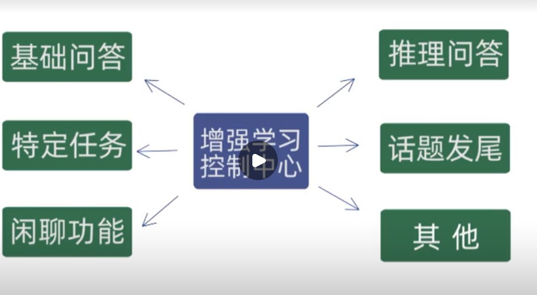

# 概述

准确性、召回性 

调包侠：对于精度、复杂问题束手无策

对现有领域进行简单介绍 了解整体应用和理论 。难以对任何一个领域进行系统地介绍 。浅尝撤止。

有限标注带来的算法提升非常有限 

nlp领域 

* 文本分类 
* 指代消解 
* 序列标注 
* 依存分析 
* 阅读理解 
* 等价性判断 

 

# 如何去学习

没有在纸面上写的技巧 讲深 ，在其他领域上通用的思路 

数据集的标注成本过高 ，大厂才玩得起 

预训练语言模型  标注数据集规模减少 就可以达到同样的效果 真正有能力提高模型准确率 

trick 没有那么容易 很多都是顺其自然地 

# 设计思路

* AI及NLP基础  学术上的 如何在知识爆炸的时代不被淘汰
* 深度学习框架及NLP 
* 表格化数据挖掘 结构化数据的处理 多模态学习 

# 人工智能 

 

gpu的价格算力成本下降 计算机视觉的技术突破 

 

人工智能常常以不同面目出现 吸引眼球  

现状：

1. 有一定进展，算法进步、硬件算力 
2. 难以落地

 

# 从实验到落地 

ai项目流程 

 

到底要不要做这个项目

1. 技术的成熟度 

    

 

1. 需求的可控程度 
2. 项目投入周期的成本 
3. 项目最终的交付流程 

 

效果优化 

 

# nlp基本任务及应用

2-5 

## 基础研究

transformer模型的改变  bert 预训练模型 

优化理论 

对抗训练 数据中有噪音 （字打错了） 深度学习的稳定性不好  请问市政府的职责是什么 （正府）。引入对抗样本来保证模型遇到比较特殊的情况的时候，不直接崩掉 。对抗样本难以收敛

数据增强

人工构造一些更多的数据 ，替换同义词。

半监督学习 

域迁移

元学习 

auto ml 

多任务学习 

集成学习 有一些缺点 模型稳定性 动态选择 

图网络 抽象语法树 

知识图谱 落地比较困难 三元组集合 两个实体之间的关系 

多模态学习 不同来源数据集 

机器推理 数据喂进去 神经网络抽取特征 

预训练语言模型 xlnet  长文本分类 

文本分类 落地困难 的研究方向 情绪分析 

序列标注 

中文NLP不同于英文分词的地方 分词 

关系提取 

依存分析 提取句子的语法结构  语法分析 

seq2seq  语法改错 T5模型 ：翻译（预训练语言模型鼻祖）

文本生成 落地很难 结合模板

semantic parsing ：转为sql语言 

文本推荐 zero-shot 

## 智能问答系统 

## 场景划分

系统由多个相关的组件构成 ，环环相扣。

问答系统的场景划分（模式切换）：

* 任务环节，特定任务，订票

* 闲聊环节

* 推理式问答，使用知识图谱，比方说姚明的爸爸的儿子是谁（依据关系）

一般会由一个增强学习控制中心联系这些模式。

 

## QA环节

QA环节，一问一答 

* 等价性：核心是问题的等价性判断，譬如“北京市市长是干什么的”、“北京市市长的职责是什么”。如果追求问题的深度等价性，会导致搜索问题库时比较耗时
* 纠错改写：删除无关词语（语气词废话词）、纠正错别字
* 召回模块：从问题库中选出若干个最相关的问题（召回），再判断问题的等价性，该过程也可能召回不相关问题 
* 分类：对问题分类，剔除一些不相关的类别。
* 关键词：关键词提取，比较关键词的重叠程度 

## 挑战

* 省略回复：北京的天气？明天呢
* 知识推理：关系跳转，姚明的爸爸的儿子的是谁
* 错别字
* 状态切换：任务状态/闲聊状态
  延续话题

## 问题分解

**基于语法树分解问题结构依次迭代** ，可以作为数据扩充。模型为 `A的B是什么` ，A父节点，B作为子树。

例如：市政府/是/干什么的？ 依次找语法树的子树等价模型，可以衍生出相关问题“市政府的职责是什么”、”市政府的职责是什么“。

## 文本校对系统

* 英文文本校对系统：Grammarly  ，NGramar 模型 ， n个词同时出现的词频
*  中文文本校对系统：因为需要分词，一旦错误，就会导致传统模型崩溃。它可能在错的地方分词错误，影响到正确的地方的分词

seq2seq 模型 ：错误句子进来 正确句子输出 **先查错再纠错** 

> born im china ，born im,im china 同时出现的词频 
>
> 检测到im 是错误词  再尝试纠错 m 和 n可能打错 

# 学习方法

1. **最短时间内达到初步掌握而非掌握透彻** ，查论文、查文档、查例子 
2. 创造性思维，短暂的灵光一现 
3. 动手去做 ，知识和能力是分开的，前者可以快速补充，而能力是需要实践的。
4. **真正的基础是数学、编程、英语**，看懂论文最重要的地方就是数学。随便一查就能查到的东西为什么要背下来
5. 通用的本质，思考的角度越多，解决问题的方法就越多
6. 搜索引擎（Google） 
7. 人们将如此多的时间花在走捷径上，以至于正常走远路的人反倒是首先到达终点 

 

# 深度学习框架

## 包括

* GPU基础的tensor运算 
* 构建网络后自动秋求解梯度的方法 
* 模型训练体系 ，简洁程度、运算效率。
* 模型推断体系 ，推算效率

## 选择准则

* 生态圈，足够多的开源项目 
* 易用性
* api是否稳定 
* 效率 

 

 

 

 

# 微服务

把一个服务拆成很多很小的模块 ，暴露接口，不改变输入、输出即可 

docker 轻量级的虚拟机 隔离系统环境 

# 深度学习简介和NLP试水

随机性改变数据拟合问题的本质 。我们观测到的信息或许不能完全决定它的结果，而那些未观测到的信息就当做了随机变量。譬如，身高和体重的关系。

神经网络的数学本质，复合函数 ，自动求梯度 

sgd adagrad  梯度爆炸（导数接近无穷） 梯度消失 （导数接近0）

损失函数：

* 连续函数：L2loss L1loss 
* 离散函数：交叉熵 

激活函数：

* softamax 门控函数 0-1 
* tanh  -1 1  
* relu

normalization 正则化 

dropout 剪枝 

## word Embedding 

独热编码将文字转为高维向量，存在两个问题：

1. 向量维数过高
2. 相关的词语向量的空间距离也可能很大 

 

embedding的思想：如果一个词的前后文是一样的，那么这两个词的语义相关性应该会更高一些。将词语映射成连续数组。传统的embedding方法有

1. skip-gram，根据连续的几个词来猜测词语 
2. cbow ：求平均，根据上下文 

 

直接去训练embedding 、在任务当中训练embedding+在这个上面加上其他模型 

我的训练不仅仅来自于这些有标注的数据，无标注数据训练方法 

## RNN 和LSTM 

 循环神经网络RNN ， 序列过长的话不太可能收敛 

$y_t=softmax(W_yh_t+B_y)$ ，$h_t=ActivationFunc(W_hh_{t-1}+W_xX_t+B_h)$  

LSTM（长短时记忆网络）双向LSTM 纵向梯度 横向时间轴梯度 

##  CNN 

卷积神经网络 

卷积：对应相乘求和 逐渐融合，high level 

池化层，更激进的降维操作 max polling ;average polling 

简介

文本应用 

局部特征提取器 

谷歌云 跑深度学习 

cuda GPU驱动 10.1  干掉默认系统 

docker 

pytorch tensor的基本运算 广播机子 einsum机制 

看开源代码三步走：
① 跑通作者的代码
② 理清整个代码的逻辑
③ 看细节，找问题

pytorch的深度神经网络运算

最终分类拿的是最终这一层 

nltk  英文分词 

三个步骤：

1. 预处理 分词 词嵌入 

数据集清理 

梯度累计不要超过2步 

seq_length

多个loss   

 

# 表格化数据挖掘

 

结构化数据：表格化数据 ，行列

非结构化数据：图片、文本、声音、视频 

遇到的问题：

* 高维稀疏矩阵
* 数据质量 

新的挖掘

 

数据挖掘竞赛 

 

新的流程 

 

 

## 半自动构建特征 

target mean coding  重点在于防止过拟合  

离散编码 categorical-encoder 多余一列 ordial encoding 

## 连续变量离散化

 

 

 

## entity embedding 

全连接层 

# 文本分类任务

 

上下文映射词向量一样 

skip-gram：给定一个词，预测周围词的概率 

cbow：

negative sampling：解决稀疏向量复杂度 同时出现、不同时出现的概率 

 

 

# ELmo BERT

迁移学习 避免重头训练

 

 

bert的任务

  

 

bert 增强 模型效果提升 

 

roberta

 

xlnet 

part of speech 

依存句法树

 

 