[toc]


# Numpy

## 介绍

`pip install numpy`安装（`np.__version__`）。

`NumPy`是一个功能强大的`Python`库，主要用于对多维数组执行计算。`NumPy`这个词来源于两个单词： `Numerical`和`Python`。`NumPy`提供了大量的库函数和操作，可以帮助程序员轻松地进行数值计算。在数据分析和机器学习领域被广泛使用。他有以下几个特点：

1. numpy内置了并行运算功能，当系统有多个核心时，做某种计算时，numpy会自动做并行计算。
2. Numpy底层使用C语言编写，内部解除了GIL（全局解释器锁），其对数组的操作速度不受Python解释器的限制，**效率远高于纯Python代码**。
3. 有一个强大的N维数组对象Array（一种类似于列表的东西）。

   

总而言之，他是一个非常高效的用于处理数值型运算的包。

## 教程

1. 官网：`https://docs.scipy.org/doc/numpy/user/quickstart.html`。
2. 中文文档：`https://www.numpy.org.cn/user_guide/quickstart_tutorial/index.html`

## 数组基本用法

`NumPy`提供一个**N维数组类型ndarray（n-dimension array）**，它描述了**相同类型**的“items”的集合，支持向量化运算。

`Numpy`中的数组的使用跟`Python`中的列表非常类似。他们之间的区别如下：

1. 一个列表中可以存储多种数据类型。比如`a = [1,'a']`是允许的，**而ndarray只能存储同种数据类型，这意味着不可以单独转换一个元素的类型**
3. `NumPy`使用c语言写的，底部解除了`GIL`，其对数组的操作速度不在受`python`解释器限制。

### 创建数组

1. 根据`Python`中的列表生成：

   ```python
   a1 = np.array([1,2,3,4])  # 不是ndarray
   ```
   
2. 使用`np.arange`生成，`np.arange`的用法类似于`Python`中的`range`：

   ```python
   a2 = np.arange(2,21,2)
   ```
   
3. 使用`np.random`生成随机数的数组：

   ```python
   a1 = np.random.random(2,2) # 2行2列
   a2 = np.random.randint(0,10,size=(3,3)) # 元素范围0-10 3行3列
   ```

4. 使用函数生成特殊的数组：

   ```python
   a1 = np.zeros((2,2)) #生成一个所有元素都是0的2行2列的数组
   a2 = np.ones((3,2)) #生成一个所有元素都是1的3行2列的数组
   a3 = np.full((2,2),8) #生成一个所有元素都是8的2行2列的数组
   a4 = np.eye(3) #生成一个3行3列的单位阵
   ```

### 轴方向

在二维的情况下，可以助记为：**axis=0为列方向，axis=1为行方向。助记为“列0（列宁）行1”。**

特例的函数有：

* `np.delete()` ，[查看](####删除缺失值)


当维数大于等于3维时，axis作如下理解。

简单来说， **最外面的括号代表着 axis=0，依次往里的括号对应的 axis 的计数就依次加 1**。


 **操作方式：如果指定轴进行相关的操作，那么他会使用轴下的每个直接子元素的第0个，第1个，第2个...分别进行相关的操作，简单理解，也就是看子元素是什么，然后对子元素相加。**


创建如下数组来验证理论 

```python
x = np.array([[0,1],[2,3]])
```

求`x`数组在`axis=0`和`axis=1`两种情况下的和：

```python
# axis=0 时的子元素 分别是 [0,1] [2,3] 两个行向量 ，相加
x.sum(axis=0) #  array([2, 4]
```

axis=1的情况下，子元素是（0,1）；（2,3），所以直接相加。


三维以上数组


按照axis=0的情况下，子元素是两个2维矩阵，对应行相加。


按照axis=1的情况下，子元素是矩阵的行，对应位置相加。 


### 常用属性

#### `ndarray.dtype`  

| 数据类型   | 描述                                                        | 唯一标识符 |
| ---------- | ----------------------------------------------------------- | ---------- |
| bool       | 用一个字节存储的布尔类型（True或False）                     | 'b'        |
| int8       | 一个字节大小，-128 至 127                                   | 'i1'       |
| int16      | 整数，16 位整数(-32768 ~ 32767)                             | 'i2'       |
| int32      | 整数，32 位整数(-2147483648 ~ 2147483647)                   | 'i4'       |
| int64      | 整数，64 位整数(-9223372036854775808 ~ 9223372036854775807) | 'i8'       |
| uint8      | 无符号整数，0 至 255                                        | 'u1'       |
| uint16     | 无符号整数，0 至 65535                                      | 'u2'       |
| uint32     | 无符号整数，0 至 2 ** 32 - 1                                | 'u4'       |
| uint64     | 无符号整数，0 至 2 ** 64 - 1                                | 'u8'       |
| float16    | 半精度浮点数：16位，正负号1位，指数5位，精度10位            | 'f2'       |
| float32    | 单精度浮点数：32位，正负号1位，指数8位，精度23位            | 'f4'       |
| float64    | 双精度浮点数：64位，正负号1位，指数11位，精度52位           | 'f8'       |
| complex64  | 复数，分别用两个32位浮点数表示实部和虚部                    | 'c8'       |
| complex128 | 复数，分别用两个64位浮点数表示实部和虚部                    | 'c16'      |
| object_    | python对象                                                  | 'O'        |
| string_    | 字符串                                                      | 'S'        |
| unicode_   | unicode类型                                                 | 'U'        |

**我们可以看到，`Numpy`中关于数值的类型比`Python`内置的多得多，这是因为`Numpy`为了能高效处理处理海量数据而设计的（依据数值的范围设置合适的类型来节省内存）**。

类型相关的操作如下：

1. 默认的数据类型：

   ```python
   import numpy as np
   a1 = np.array([1,2,3])
   print(a1.dtype) 
   # 如果是windows系统，默认是int32
   # 如果是mac或者linux系统，则根据系统来
   ```

2. 指定dtype

   ```python
   a1 = np.array([1,2,3],dtype=np.int64)
   ```
   
3. 修改dtype 

   ```python
   # 修改dtype
   a2 = a1.astype(np.int64) # astype不会修改数组本身，而是会将修改后的结果返回
   ```


#### `ndarray.size`

**获取数组中总的元素的个数，注意与shape区分**。比如有个二维数组：

```python
import numpy as np
a1 = np.array([[1,2,3],[4,5,6]])
print(a1.size) #打印的是6，因为总共有6个元素
```


#### `ndarray.ndim`

数组的维数。比如：

```python
a1 = np.array([1,2,3])
print(a1.ndim) # 维度为1
```


#### `ndarray.shape`

**数组的维度的元组**。比如以下代码：

```python
a1 = np.array([1,2,3])
print(a1.shape) # 输出(3,)，意思是一维数组，有3个数据

a2 = np.array([[1,2,3],[4,5,6]])
print(a2.shape) # 输出(2,3)，意思是二维度数组，2行3列
```


#### `ndarray.itemsize`

数组中每个元素占的大小，单位是字节。比如以下代码：

```python
a1 = np.array([1,2,3],dtype=np.int32)
print(a1.itemsize) # 打印4，因为每个字节是8位，32位/8=4个字节
```


## 索引切片

**总结：使用`[]`包裹索引。如果索引只有1个，那就是行索引；索引若不是离散索引，就不用`[]`括起来。 **

**对原数组索引也会返回一份视图。**

### 行列索引

1. 获取某行的数据： 

   ```python
   a1 = np.arange(0,24).reshape((4,6))
   print(a1[1]) #获取下标为1的行的数据
   ```
   
2. 连续获取某几行的数据：

   ```python
   # 1. 获取连续的几行的数据
   a1 = np.arange(0,24).reshape((4,6))
   print(a1[0:2]) #获取0行到1行的数据
   
   # 2. 获取不连续的几行的数据
   print(a1[[0,2,3]])
   
   # 3. 也可以使用负数进行索引
   print(a1[[-1,-2]])
   ```

3. 获取某行某列的数据：

   ```python
   a1 = np.arange(0,24).reshape((4,6))
   print(a1[1,1]) #获取1行1列的数据
   
   print(a1[0:2,0:2]) #获取0-1行的0-1列的数据 这是连续的 和下面的花式索引还是有区别的 
   print(a1[[1,2],[2,3]]) #获取(1,2)和(2,3)的两个数据，一一对应，这也叫花式索引
   ```

4. 获取某列的数据：

   ```python
   a1 = np.arange(0,24).reshape((4,6))
   print(a1[:,1]) #获取第1列的数据
   ```


### 布尔索引

布尔运算也是矢量的，比如以下代码：

```python
a1 = np.arange(0,24).reshape((4,6))
print(a1<10) #会返回一个新的数组，这个数组中的值全部都是bool类型
```

```
[[ True  True  True  True  True  True]
[ True  True  True  True False False]
[False False False False False False]
[False False False False False False]]
```

这样看上去没有什么用，假如我现在要实现一个需求，要将`a1`数组中所有小于10的数据全部都提取出来。那么可以使用以下方式实现：

```python
a1 = np.arange(0,24).reshape((4,6))
a2 = a1 < 10
print(a1[a2]) #这样就会在a1中把a2中为True的元素对应的位置的值提取出来
```

其中布尔运算可以有`!=`、`==`、`>`、`<`、`>=`、`<=`以及`&(与)`和`|(或)`。示例代码如下：

```python
a1 = np.arange(0,24).reshape((4,6))
a2 = a1[(a1 < 5) | (a1 > 10)]
print(a2)
```

也可是使用where函数

```python
np.where((a1 < 5) | (a1 > 10)) 
```

返回二元组，`(行,列 )` 

```
(array([0, 0, 0, 0, 0, 1, 2, 2, 2, 2, 2, 2, 3, 3, 3, 3, 3, 3], dtype=int64),
 array([0, 1, 2, 3, 4, 5, 0, 1, 2, 3, 4, 5, 0, 1, 2, 3, 4, 5], dtype=int64))
```


**布尔数组的函数**

| 函数名称 | 描述                     |
| :------- | :----------------------- |
| np.any   | 验证任何一个元素是否为真 |
| np.all   | 验证所有元素是否为真     |

将原数组转为布尔数组，配合any和all可以进行许多便捷的判断。

比如想看下数组中是不是所有元素都为0，那么可以通过以下代码来实现：

```python
np.all(a==0) 
# 或者是
(a==0).all()
```

比如我们想要看数组中是否有等于0的数，那么可以通过以下代码来实现：

```python
np.any(a==0)
# 或者是
(a==0).any()
```

比如判断两个数组是否完全相等

```python
(a == b).all()
```


### 值的替换

值替换的关键在于索引到正确位置。

```python
a1 = np.arange(0,24).reshape((4,6))

a1[3] = 0 #将第三行的所有值都替换成0
a1[a1 < 5] = 0 #将小于5的所有值全部都替换成0
```

还可以使用函数来实现：

```python
# where函数：
a1 = np.arange(0,24).reshape((4,6))
a2 = np.where(a1 < 10,1,0) # 把a1中所有小于10的数全部变成1，其余的变成0
```

### 索引和切片示例 

1. `np.arange(10)`数组中的奇数全部都替换成`-1`。

   ```python
   import numpy as np
   
   a=np.arange(10)
   a[a%2==1]=-1 # 布尔索引
   print(a)
   ```

2. 有一个`4`行`4`列的数组（比如：`np.random.randint(0,10,size=(4,4))`），请将其中对角线的数取出来形成一个一维数组。提示（使用`np.eye`）。

   ```python
   a=np.random.randint(0,10,size=(4,4))
   print(a)
   # 方法1 
   row,col=a.shape
   print(a[range(row),range(col)]) # 离散索引 
   
   # 方法2 
   print(a[np.eye(4,dtype="bool")]) # 单位阵
   ```

3. 有一个`4`行`4`列的数组，请取出其中`(0,0),(1,2),(3,2)`的点。

   ```python
   a=np.random.randint(0,10,size=(4,4))
   print(a)
   print(a[[0,1,3],[0,2,2]]) 
   ```

4. 有一个`4`行`4`列的数组，请取出其中`2-3`行（包括第3行）的所有数据。

   ```python
   a=np.random.randint(0,10,size=(4,4))
   print(a)
   print(a[0:3]) # 2-3行
   ```

5. 有一个`8`行`9`列的数组，请将其中1-5行（包含第5行）的第8列大于3的数全部都取出来。

   ```python
   a=np.random.randint(0,10,size=(8,9))
   b=a[0:5,8] # 先提取第8列 
   print(b[b>3])   
   ```
   
6. 将数组a的行和列全部逆向反转

   ```python
   a = np.arange(15).reshape(3,5)
   # 反转行
   a1 = a[::-1] #里面传一个数进去（没有出现逗号），代表的是只对行进行操作
   # 反转列
   a2 = a[:,::-1] #里面传两个数进去，第一个是所有的行，第二个就是针对所有的列，但是取值的方向是从后面到前面。
   ```

   

## 数组运算

### 广播机制

**如果两个数组的后缘维度（trailing dimension，即从末尾开始算起的维度）的轴长度相符或其中一方的长度为1，则认为他们是广播兼容的。广播会在缺失和（或）长度为1的维度上进行。**看以下案例分析：

1. `shape`为`(3,8,2)`的数组能和`(8,3)`的数组进行运算吗？
   分析：不能，因为按照广播原则，从后面往前面数，`(3,8,2)`和`(8,3)`中的`2`和`3`不相等，所以不能进行运算。
2. `shape`为`(3,8,2)`的数组能和`(8,1)`的数组进行运算吗？
   分析：能，因为按照广播原则，从后面往前面数，`(3,8,2)`和`(8,1)`中的`2`和`1`虽然不相等，但是因为有一方的长度为`1`，所以能参与运算。
3. `shape`为`(3,1,8)`的数组能和`(8,1)`的数组进行运算吗？
   分析：能，因为按照广播原则，从后面往前面数，`(3,1,4)`和`(8,1)`中的`4`和`1`虽然不相等且`1`和`8`不相等，但是因为这两项中有一方的长度为`1`，所以能参与运算。


数组与数的计算

`NumPy`中的数可以直接在数组上进行操作。示例代码如下：

```python
import numpy as np
a1 = np.random.random((3,4))
print(a1)
# 如果想要在a1数组上所有元素都乘以10，那么可以通过以下来实现
a2 = a1*10
print(a2)
# 也可以使用round让所有的元素只保留2位小数
a3 = a2.round(2)
```

以上例子是相乘，其实相加、相减、相除也都是类似的。


### 形状操作

可以通过一些函数，非常方便的操作数组的形状。

#### reshape和resize方法

两个方法都是用来修改数组形状的，但是有一些不同。

1. `reshape`是将数组转换成指定的形状，然后返回转换后的结果，**对于原数组的形状是不会发生改变的**。

   ```python
   a1 = np.random.randint(0,10,size=(3,4))
   a2 = a1.reshape((2,6)) # 返回新的视图
   ```

2. `resize`是将数组转换成指定的形状，**会直接修改数组本身。并不会返回任何值**。

   ```python
   a1 = np.random.randint(0,10,size=(3,4))
   a1.resize((2,6)) # a1本身发生了改变
   ```

#### flatten和ravel方法

两个方法都是将多维数组转换为一维数组，但是有以下不同：

1. `flatten`是将数组转换为一维数组后，**返回拷贝**，所以后续对这个返回值进行修改不会影响之前的数组。

2. `ravel`是将数组转换为一维数组后，将这个视图（可以理解为引用）返回回去，**所以后续对这个返回值进行修改会影响之前的数组。**
   比如以下代码：

   ```python
   x = np.array([[1, 2], [3, 4]])
   x.flatten()[1] = 100 #此时的x[0]的位置元素还是1
   x.ravel()[1] = 100 #此时x[0]的位置元素是100
   ```


#### 不同数组的组合

如果有多个数组想要组合在一起，也可以通过其中的一些函数来实现。

1. `np.vstack`：将数组按垂直方向进行叠加。数组的列数必须相同才能叠加。示例代码如下：

   ```python
   a1 = np.random.randint(0,10,size=(3,5))
   a2 = np.random.randint(0,10,size=(1,5))
   a3 = np.vstack([a1,a2])
   ```

2. `np.hstack`：将数组按水平方向进行叠加。数组的行必须相同才能叠加。示例代码如下：

   ```python
   a1 = np.random.randint(0,10,size=(3,2))
   a2 = np.random.randint(0,10,size=(3,1))
   a3 = np.hstack([a1,a2])
   ```

3. `np.concatenate([],axis)`：将两个数组进行叠加，如果`axis=0`，那么代表的是往垂直方向从上到下叠加，如果`axis=1`，那么代表的是往水平方向从左到右叠加，如果`axis=None`，那么会将两个数组组合成一个一维数组。示例代码如下：

   ```python
   a = np.array([[1, 2], [3, 4]])
   b = np.array([[5, 6]])
   np.concatenate((a, b), axis=0) # 上下堆砌
   # 结果：
   array([[1, 2],
       [3, 4],
       [5, 6]])
   
   np.concatenate((a, b.T), axis=1) # 左右堆叠
   # 结果：
   array([[1, 2, 5],
       [3, 4, 6]])
   
   np.concatenate((a, b), axis=None  合成一维数组
   # 结果：
   array([1, 2, 3, 4, 5, 6])
   ```

#### 数组的切割

通过`hsplit`和`vsplit`以及`array_split`可以将一个数组进行切割。

1. `hsplit`：使原数组水平分割（左右方向）。**用于指定分割成几列，可以使用数字来代表分成几部分，也可以使用数组来代表分割的地方（助记：在索引小的方向上（左）切一刀）。**示例代码如下：

   ```python
   a1 = np.arange(16.0).reshape(4, 4) # 4*4
   np.hsplit(a1,2) #在索引2的左边切一刀，[0,1] [2,3] 
   ```

   ```
   array([[ 0.,  1.],
        [ 4.,  5.],
        [ 8.,  9.],
        [12., 13.]]), array([[ 2.,  3.],
        [ 6.,  7.],
        [10., 11.],
        [14., 15.]])
   ```

   ```python
   np.hsplit(a1,[1,2]) #代表在下标为1的地方切一刀，下标为2的地方切一刀，分成三部分
   ```

   

2. `vsplit`：使数组垂直分割（上下方向）。用于指定分割成几行，可以使用数字来代表分成几部分，也可以使用数组来代表分割的地方（**助记：在索引小的方向上（上）切一刀**）。示例代码如下：

   ```python
   np.vsplit(x,2) #代表按照行总共分成2个数组
   ```

   ```
   [array([[0., 1., 2., 3.],
        [4., 5., 6., 7.]]), array([[ 8.,  9., 10., 11.],
        [12., 13., 14., 15.]])]
   ```

   ```python
   np.vsplit(x,(1,2)) #代表按照行进行划分，在下标为1的地方和下标为2的地方分割
   ```

   


#### 数组（矩阵）转置和轴对换

`numpy`中的数组其实就是线性代数中的矩阵。矩阵是可以进行转置的。`ndarray`有一个`T`属性，可以返回这个数组的转置的结果。示例代码如下：

```python
a1 = np.arange(0,24).reshape((4,6))
a2 = a1.T
```

另外还有一个方法叫做`transpose`，**这个方法返回的是一个View，也即修改返回值，会影响到原来数组。**示例代码如下：

```python
a1 = np.arange(0,24).reshape((4,6))
a2 = a1.transpose()
```

为什么要进行矩阵转置呢，有时候在做一些计算的时候需要用到。比如做矩阵的内积的时候。就必须将矩阵进行转置后再乘以之前的矩阵：

```python
a1 = np.arange(0,24).reshape((4,6))
a2 = a1.T
print(a1.dot(a2))
```

## 深拷贝和浅拷贝

### 不拷贝

如果只是简单的赋值，那么不会进行拷贝。示例代码如下：

```python
a = np.arange(12)
b = a #这种情况不会进行拷贝
print(b is a) #返回True，说明b和a是相同的
```

### View或者浅拷贝

有些情况，会进行变量的拷贝，但是他们所指向的内存空间（实际的物理地址）都是一样的，那么这种情况叫做浅拷贝，或者叫做`View(视图)`，可以理解为引用，同一处内存不同标签。比如以下代码：

```python
a = np.arange(12)
c = a.view()
print(c is a) #返回False，说明c和a是两个不同的变量 虚拟地址不同

c[0] = 100 # 对新视图进行赋值，a[0]也会改变
```

### 深拷贝

将之前数据完完整整的拷贝一份放到另外一块内存空间中，这样就是两个完全不同的值了。示例代码如下：

```python
a = np.arange(12)
d = a.copy()
print(d is a) #返回False，说明d和a是两个不同的变量

d[0] = 100 # a[0]不会变
```

像之前讲到的`flatten`和`ravel`就是这种情况，`ravel`返回的就是View，而`flatten`返回的就是深拷贝。

### 深浅拷贝总结

首先，明白一点，虚拟地址不同（python的`id()`函数），实际物理地址也可以相同。

**视图情况下，修改新视图的形状不会影响原视图（似乎刚好解释了为什么把新的引用叫做”视图“），但是值的修改会同步，可以认为视图将矩阵的形状和数值独立了。**在numpy中返回副本的情况似乎较少，或许是为了节约内存。


## 文件操作

### ndarray 与 csv

#### 文件保存

有时候我们有了一个数组，需要保存到文件中，那么可以使用`np.savetxt`来实现。相关的函数描述如下：

```python
np.savetxt(frame, array, fmt='%.18e', delimiter=None)
* frame : 文件、字符串或产生器，可以是.gz或.bz2的压缩文件
* array : 存入文件的数组
* fmt : 写入文件的格式，例如：%d %.2f %.18e
* delimiter : 分割字符串，默认是任何空格
```

以下是使用的例子：

```python
a = np.arange(100).reshape(5,20)
np.savetxt("a.csv",a,fmt="%d",delimiter=",") # np数组保存到文件
```

#### 读取文件

使用`np.loadtxt`来实现。相关的函数描述如下：

```python
np.loadtxt(frame, dtype=np.float, delimiter=None, unpack=False,encoding)
* frame：文件、字符串或产生器，可以是.gz或.bz2的压缩文件。
* dtype：数据类型，可选，默认为np.float
* delimiter：分割字符串，默认是任何空格。
* skiprows：跳过前面x行，比如说跳过第一行标题行
* usecols：读取指定的列，用元组组合。
* unpack：如果True，读取出来的数组是转置后的。
* encoding: 跟随系统
```

### npy 与 npz

参考链接：https://www.cnblogs.com/Lilu-1226/p/9768368.html 

**npy文件——Numpy专用的二进制格式 **

`np.load()`和`np.save()`是读写磁盘数组数据的两个重要函数。使用时，数组会以未压缩的原始二进制格式保存在扩展名为.npy的文件中。

```python
# 将数组以二进制格式保存到磁盘
arr=np.arange(5)
np.save('test',arr)
# 读取数组
print(np.load('test.npy'))
```


**npz文件——压缩文件**

使用np.savez()函数可以将多个数组保存到同一个文件中。
np.savez()函数的第一个参数是文件名，其后的参数都是需要保存的数组。**传递数组时可以使用关键字参数为数组命名**。np.savez()函数输出的是一个扩展名为.npz的压缩文件，**它包含多个与保存的数组对应的npy文件（由save()函数保存），文件名对应数组名**。
读取.npz文件时使用np.load()函数，**返回的是一个类似于字典的对象**。

```python
# 将多个数组保存到磁盘
a = np.arange(5)
b = np.arange(6)
c = np.arange(7)
np.savez('test', a, b, c_array=c)  # c_array是数组c的命名

# 读取数组
data = np.load('test.npz')  #类似于字典{‘arr_0’:a,’arr_1’:b,’c_array’:c}
print('arr_0 : ', data['arr_0'])
print('arr_1 : ', data['arr_1'])
print('c_array : ', data['c_array'])
```


### python csv模块

#### 读取csv文件

```python
import csv

with open('stock.csv','r') as fp:
    reader = csv.reader(fp)
    titles = next(reader)
    for x in reader:
        print(x)
```

这样操作，以后获取数据的时候，就要通过下表来获取数据。如果想要在获取数据的时候通过标题来获取。那么可以使用`DictReader`。示例代码如下：

```python
import csv

with open('stock.csv','r') as fp:
    reader = csv.DictReader(fp)
    for x in reader:
        print(x['turnoverVol'])
```

#### 写入数据到csv文件

写入数据到csv文件，需要创建一个`writer`对象，主要用到两个方法。一个是`writerow`，这个是写入一行。一个是`writerows`，这个是写入多行。示例代码如下：

```python
import csv

headers = ['name','age','classroom']
values = [
    ('zhiliao',18,'111'),
    ('wena',20,'222'),
    ('bbc',21,'111')
]
with open('test.csv','w',newline='') as fp:
    writer = csv.writer(fp)
    writer.writerow(headers)
    writer.writerows(values)
```

也可以使用字典的方式把数据写入进去。这时候就需要使用`DictWriter`了。示例代码如下：

```python
import csv

headers = ['name','age','classroom']
values = [
    {"name":'wenn',"age":20,"classroom":'222'},
    {"name":'abc',"age":30,"classroom":'333'}
]
with open('test.csv','w',newline='') as fp:
    writer = csv.DictWriter(fp,headers)
    writer.writerow({'name':'zhiliao',"age":18,"classroom":'111'})
    writer.writerows(values)
```


## NAN和INF值处理

首先我们要知道这两个英文单词代表的什么意思：

1. `NAN`：`Not A number`，不是一个数字的意思，**但是他是属于浮点类型的**
2. `INF`：`Infinity`，代表的是无穷大的意思，也是属于浮点类型。`np.inf`表示正无穷大，一般在出现除数为0的时候为无穷大。

### NAN一些特点

1. NAN和NAN不相等。**比如`np.NAN != np.NAN`这个条件是成立的，判断nan用函数`np.isnan(ndarray)`**
2. NAN和任何值做运算，结果都是NAN。

### NAN值处理思路

分为两种：

1. 删除缺失值，缺失值所在行、列对数据本身影响不大
2. 替代缺失值

#### 删除缺失值

有时候，我们想要将数组中的`NAN`删掉，那么我们可以换一种思路，就是只提取不为`NAN`的值。示例代码如下：

```python
# 1. 删除所有NAN的值，因为删除了值后数组将不知道该怎么变化，所以会被变成一维数组
data = np.random.randint(0,10,size=(3,5)).astype(np.float)
data[0,1] = np.nan
data = data[~np.isnan(data)] # 此时的data会没有nan，并且变成一个1维数组 ~表示取反 

# 2. 删除NAN所在的行
data = np.random.randint(0,10,size=(3,5)).astype(np.float)
data[[0,1],[1,2]] = np.NAN
lines = np.where(np.isnan(data))[0] # 获取哪些行有NAN
data1 = np.delete(data,lines,axis=0) # axis=0表示删除行
```

#### 替代缺失值

有些时候我们不想直接删掉，比如有一个成绩表，分别是数学和英语，但是因为某个人在某个科目上没有成绩，那么此时就会出现NAN的情况，这时候就不能直接删掉了，就可以使用某些值进行替代。假如有以下表格：

| 数学 | 英语 |
| ---- | ---- |
| 59   | 89   |
| 90   | 32   |
| 78   | 45   |
| 34   | NAN  |
| NAN  | 56   |
| 23   | 56   |

如果想要求每门成绩的总分，以及每门成绩的平均分，那么就可以采用某些值替代。比如求总分，那么就可以把NAN替换成0，如果想要求平均分，那么就可以把NAN替换成其他值的平均值。示例代码如下：

```python
scores=np.array([[59,89],
                [90,32],
                [78,45],
                [34,np.nan],
                [np.nan,56],
                [23,56]],dtype=np.float)

# 计算每个学生的总分 ，nan值用0代替
scores_c=scores.copy()
scores_c[scores_c!=scores_c]=0
scores_c.sum(axis=1) 

# 计算每门学科的均分 nan值用非空值的均分替换 这种方式等价于计算非空值的均分 
scores_c1=scores.copy() # 副本拷贝 
# 对每一列迭代得到均值
for x in range(scores_c1.shape[1]):
    col_score=scores_c1[:,x] # 每一列数据 ，切片索引也是浅拷贝
    col_score[col_score!=col_score]=col_score[col_score==col_score].mean() # nan值替换为 均分 

print(scores_c1.mean(axis=0))  
```


## random模块

`np.random`为我们提供了许多获取随机数的函数。这里统一来学习一下。

### np.random.seed

用于指定随机数生成时所用算法开始的整数值，如果使用相同的`seed()`值，则每次生成的随即数都相同，如果不设置这个值，则系统根据时间来自己选择这个值，此时每次生成的随机数因时间差异而不同。一般没有特殊要求不用设置以下代码：

```python
np.random.seed(1)
print(np.random.rand()) # 打印0.417022004702574
print(np.random.rand()) # 打印其他的值，因为随机数种子只对下一次随机数的产生会有影响。
```

### np.random.rand

生成一个值为`[0,1)`之间的数组，形状由参数指定，如果没有参数，那么将返回一个随机值。示例代码如下：

```python
data1 = np.random.rand(2,3,4) # 参数表示维度，生成2块3行4列的数组，值从0-1之间
data2 = np.random.rand() #生成一个0-1之间的随机数
```

### np.random.randn

生成均值(μ)为0，标准差（σ）为1的标准正态分布的值。示例代码如下：

```python
data = np.random.randn(2,3) #生成一个2行3列的数组，数组中的值都满足标准正太分布
```

### np.random.randint

生成指定范围内的随机数，并且可以通过`size`参数指定维度。示例代码如下：

```python
data1 = np.random.randint(10,size=(3,5)) #生成值在0-10之间，3行5列的数组
data2 = np.random.randint(1,20,size=(3,6)) #生成值在1-20之间，3行6列的数组
```

### np.random.choice

从一个列表或者数组中，随机进行采样。或者是从指定的区间中进行采样，采样个数可以通过参数指定：

```python
data = [4,65,6,3,5,73,23,5,6]
result1 = np.random.choice(data,size=(2,3)) # 从data中随机采样，生成2行3列的数组
result2 = np.random.choice(data,3) # 从data中随机采样3个数据形成一个一维数组
result3 = np.random.choice(10,3) # 从0-10之间随机取3个值
```

### np.random.shuffle

把原来数组的元素的位置打乱。示例代码如下：

```python
a = np.arange(10)
np.random.shuffle(a) #将a的元素的位置都会进行随机更换
```

### 更多

更多的random模块的文档，请参考`Numpy`的官方文档：https://docs.scipy.org/doc/numpy/reference/routines.random.html


## 通用函数

### 一元函数

| 函数                                              | 描述                                                         |
| ------------------------------------------------- | ------------------------------------------------------------ |
| np.abs                                            | 绝对值                                                       |
| np.sqrt                                           | 开根                                                         |
| np.square                                         | 平方                                                         |
| np.exp                                            | 计算指数(e^x)                                                |
| np.log，np.log10，np.log2，np.log1p               | 求以e为底，以10为低，以2为低，以(1+x)为底的对数              |
| np.sign                                           | 将数组中的值标签化，大于0的变成1，等于0的变成0，小于0的变成-1 |
| np.ceil                                           | 朝着无穷大的方向取整，比如5.1会变成6，-6.3会变成-6           |
| np.floor                                          | 朝着负无穷大方向取证，比如5.1会变成5，-6.3会变成-7           |
| np.rint，np.round                                 | 返回四舍五入后的值                                           |
| np.modf                                           | 将整数和小数分隔开来形成两个数组                             |
| np.isnan                                          | 判断是否是nan                                                |
| np.isinf                                          | 判断是否是inf                                                |
| np.cos，np.cosh，np.sin，np.sinh，np.tan，np.tanh | 三角函数                                                     |
| np.arccos，np.arcsin，np.arctan                   | 反三角函数                                                   |


示例：找到数组中离某个元素最近的值

```python
np.random.seed(100)
Z = np.random.uniform(0,1,10)
z = 0.5
m = Z[np.abs(Z - z).argmin()]
print(m)
```

### 二元函数

| 函数                                                  | 描述                             |              |
| ----------------------------------------------------- | -------------------------------- | ------------ |
| np.add                                                | 加法运算（即1+1=2），相当于+     |              |
| np.subtract                                           | 减法运算（即3-2=1），相当于-     |              |
| np.negative                                           | 负数运算（即-2），相当于加个负号 |              |
| np.multiply                                           | 乘法运算（即2*3=6），相当于*     |              |
| np.divide                                             | 除法运算（即3/2=1.5），相当于/   |              |
| np.floor_divide                                       | 取整运算，相当于//               |              |
| np.mod                                                | 取余运算，相当于%                |              |
| greater,greater_equal,less,less_equal,equal,not_equal | >,>=,<,<=,=,!=的函数表达式       |              |
| logical_and                                           | &的函数表达式                    |              |
| logical_or                                            | \                                | 的函数表达式 |

### 聚合函数

| 函数名称  | NAN安全版本  | 描述             |
| --------- | ------------ | ---------------- |
| np.sum    | np.nansum    | 计算元素的和     |
| np.prod   | np.nanprod   | 计算元素的积     |
| np.mean   | np.nanmean   | 计算元素的平均值 |
| np.std    | np.nanstd    | 计算元素的标准差 |
| np.var    | np.nanvar    | 计算元素的方差   |
| np.min    | np.nanmin    | 计算元素的最小值 |
| np.max    | np.nanmax    | 计算元素的最大值 |
| np.argmin | np.nanargmin | 找出最小值的索引 |
| np.argmax | np.nanargmax | 找出最大值的索引 |
| np.median | np.nanmedian | 计算元素的中位数 |

使用`np.sum`或者是`a.sum`即可实现。并且在使用的时候，可以指定具体哪个轴。同样`Python`中也内置了`sum`函数，但是Python内置的`sum`函数执行效率没有`np.sum`那么高，可以通过以下代码测试了解到：

```python
a = np.random.rand(1000000)
%timeit sum(a) #使用Python内置的sum函数求总和，看下所花费的时间
%timeit np.sum(a) #使用Numpy的sum函数求和，看下所花费的时间
```


### 排序

1. `np.sort`：指定轴进行排序。默认是使用数组的最后一个轴进行排序。

   ```python
    a = np.random.randint(0,10,size=(3,5))
    b = np.sort(a) #按照行进行排序，因为最后一个轴是1，那么就是将最里面的元素进行排序。
    c = np.sort(a,axis=0) #按照列进行排序，因为指定了axis=0
   ```

   还有`ndarray.sort()`，这个方法会直接影响到原来的数组（原地修改），而不是返回一个新的排序后的数组。

2. `np.argsort`：返回排序后的下标值。示例代码如下：

   ```python
    np.argsort(a) #默认也是使用最后的一个轴来进行排序。
   ```

3. 降序排序：`np.sort`默认会采用升序排序。如果我们想采用降序排序。那么可以采用以下方案来实现：

   ```python
    # 1. 使用负号
    -np.sort(-a)
   
    # 2. 使用sort和argsort以及take
    indexes = np.argsort(-a) #排序后的结果就是降序的
    np.take(a,indexes) #从a中根据下标提取相应的元素
   ```

### 其他函数补充

`np.apply_along_axis`：沿着某个轴执行指定的函数。示例代码如下：

```python
# axis 表示轴 arr是目标数组 
# 求数组a按行求均值，并且要去掉最大值和最小值。
# apply函数会依据所传函数的返回值构建一个新的array
np.apply_along_axis(lambda x:x[(x != x.max()) & (x != x.min())].mean(),axis=1,arr=a)
```


`np.linspace`：用来将指定区间内的值平均分成多少份。示例代码如下：

```python
 # 将0-1分成12分，生成一个数组
 np.linspace(0,1,12)
```


`np.unique`：返回数组中的唯一值。

```python
 # 返回数组a中的唯一值，并且会返回每个唯一值出现的次数。
 np.unique(a,return_counts=True)
```


### 更多

https://docs.scipy.org/doc/numpy/reference/index.html


# pandas

numpy 可以帮我们分析数值型数据，但这不够，很多时候，我们的数据还有时间序列、字符串序列等。这就需要`pandas`来为我们处理。

Pandas是一个强大的分析结构化数据的工具集，基于NumPy构建，提供了**高级数据结构**和**数据操作工具**，它是使Python成为强大而高效的数据分析环境的重要因素之一。

- 一个强大的分析和操作大型结构化数据集所需的工具集
- 基础是NumPy，提供了高性能矩阵的运算
- 提供了大量能够快速便捷地处理数据的函数和方法
- 应用于数据挖掘，数据分析
- 提供数据清洗功能


使用`pip install pandas`安装pandas库。

官方教程：https://pandas.pydata.org/docs/user_guide/index.html#user-guide 


## Index

pandas对象从结构上看，可以看做 “索引+数据” 

示例代码：

```python
ser_obj.index # se对象的index

df_obj.index # 行索引
df_obj.columns # 列索引
```


**索引对象在创建以后不可单独修改，但是可以通过重新赋值的方式修改索引**

示例代码：

```python
# 索引对象不可变
df_obj2.index[0] = 2
```

运行结果：

```python
---------------------------------------------------------------------------
TypeError: Index does not support mutable operatios
```

**reindex** 

`reindex` ，**在原来index的基础上重排索引顺序，如果出现了新的index，数据会出现nan，原地修改**

```python
# reindex
df=pd.DataFrame(np.arange(10).reshape(2,5))
print() # 修改列索引
```

```
   0  1  2  3  4
0  0  1  2  3  4
1  5  6  7  8  9
```

```python
df.reindex([0,10]) # 重排索引 [0,10]
```

```
      0    1    2    3    4
0   0.0  1.0  2.0  3.0  4.0
10  NaN  NaN  NaN  NaN  NaN
```

```python
df.reindex(columns=list('abcde')) # 重新赋值索引
```

```python
    a   b   c   d   e
0 NaN NaN NaN NaN NaN
1 NaN NaN NaN NaN NaN
```

**reset_indx**

重设索引（从0开始）。增删数据后，可以使用。

```python
# drop 表示丢弃原索引
df.reset_index(drop=True,inplace=False)
```

**set_index**

设置某列为索引

```python
# drop 是否丢弃用作索引的列；append 是否附加到现有索引 
df.set_index('col',drop=True,append=False,inplace)
```

**rename**

返回副本，重命名索引，可以是原索引中不存在的

```python
df.rename(['beijing','hangzhou'])   # 列表
df.rename(index=str.title,columns = str.upper) # 函数
df.rename(columns={0:'count'}) # 字典
```


## Series

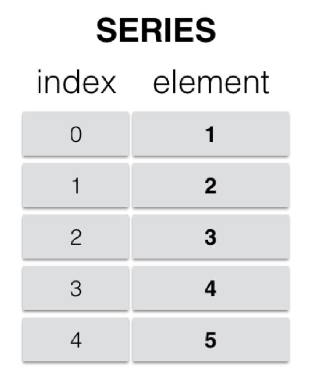

### 创建series

#### list 

这里的list代指那些可以迭代的对象，如tuple、range等。

```python
pd.Series(range(10,15))  #默认索引
pd.Series(range(10,15),index=list('abcde'))   #指定索引
```

#### dict

通过dict创建示例，dict的键值对将被理解成`index value`的形式。 

```python
#通过字典创建series
dic={'A':1,'B':2,'C':3}
```

```
A    1
B    2
C    3
dtype: int64
```

### 行索引

`ser_obj[‘label’]` ，标签索引。 `ser_obj[pos]` ，序号索引。

示例代码：

```python
# 行索引
ser_obj['b'] # 用label索引
ser_obj[2] # 用index 索引 从0开始
```

### 切片索引

序号索引，`ser_obj[start:end]`，不包含终止索引 。

标签索引，`ser_obj[‘label1’: ’label3’]`，**包含终止索引**。

示例代码：

```python
# 切片索引
print(ser_obj[1:3]) # index pos 1 2 
print(ser_obj['b':'d']) # index label b c d
```

```
b    1
c    2
dtype: int64

b    1
c    2
d    3
dtype: int64
```

### 不连续索引

`ser_obj[[‘label1’, ...]]` ，**用`[]`包裹多个标签和索引**  

示例代码：

```python
# 不连续索引
print(ser_obj[[0, 2, 4]])
print(ser_obj[['a', 'e']])
```

运行结果：

```
a    0
c    2
e    4e    4

dtype: int64

a    0
e    4
dtype: int64
```

### 布尔索引

示例代码：

```python
ser_bool = ser_obj > 2 # 布尔series 
print(ser_obj[ser_obj > 2])# 布尔索引
```


## DataFrame

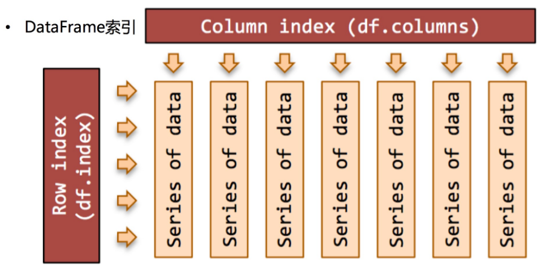

### 查看

`df.info()`，查看df的信息，列名，类型，非空数据

```
<class 'pandas.core.frame.DataFrame'>
Int64Index: 848066 entries, 11655665 to 7810824
Data columns (total 15 columns):
 #   Column               Non-Null Count   Dtype  
---  ------               --------------   -----  
 0   date                 848066 non-null  object 
 1   game_size            848066 non-null  int64 
```


`df.head(n)`，查看前n条数据 


### 创建

#### ndarray

```python
pd.DataFrame(np.arange(6).reshape(2,3)) # 2行3列 
```

#### dict

通过dict构建，**字典的键值对作为一列（series）**。

```python
dic={'A':range(3),'B':1,'C':list('jhk')} #三种不同数据类型的键值对
print(pd.DataFrame(dic))

'''A B C被当做了列字段名
   A  B  C
0  0  1  j
1  1  1  h
2  2  1  k
'''
```

#### list

通过list构建，**列表的一个字典元素作为一行。** 

```python
ls=[{'A':0,'B':1,'C':2},{'A':10,'C':12}] #在第2个列表中，没有'B'键值对
print(pd.DataFrame(ls))

''' 
第2行的 B显示为NaN
    A    B   C
0   0  1.0   2
1  10  NaN  12
'''
```

指定索引名

```python
# 指定index、columns关键字参数
df_obj = pd.DataFrame(np.random.randint(1,5,size=(5,4)), index=list('ABCDE'),columns=list('abcd'))
```

```
   a  b  c  d
A  3  2  2  2
B  4  4  3  2
C  4  4  2  3
D  3  1  2  3
E  3  2  2  1
```


#### 转字典

`df.to_dict(orient=['dict''records'])`，`dict`解析df为字典，`records`转列表。


### 列索引

`df_obj[‘label’]` ，**DataFrame在索引项只有1个元素的时候，作为列索引 ，和上面的numpy、series刚好相反，注意对比**。如果想要行索引，查看[高级索引](###高级索引)的loc、iloc 

```python
# 列索引 
df_obj['a'] # 返回Series类型
```

### 不连续索引

`df_obj[['label1','label2']]` ，如同之前一样，离散索引需要`[]`包裹。**返回副本**

```python
# 不连续索引
df_obj[['a','c']]
```

### 布尔索引

dataframe的布尔索引，**以index（行）一一匹配**。

```python
data[[False,True,False]] # 得到第2行  data[[xx,...]] 看上去像是列索引 

# 多个条件组合
a[(a>10)|(a<15)]
```


常用函数：

* `df.any(axis=0)`，按axis方向检查df布尔值。`df.all(axis=0)`同理。
* `se.isin(list)`，检查该列元素是否爱指定列表中

### 增删改

#### 增加

增加的关键是在索引。行索引使用`loc`（**iloc越界索引会报错**，不能用于新增），列索引可以使用`[]`。

**增加行**

df.loc、df.iloc原地增加

```python
# i存在则覆盖 不存在就增加
df.loc[i] = [1,2,3]
```

append 返回一个副本

```python
df_stu.append({"数学":100},ignore_index=True)
df_stu.append(pd.Series({"数学":100},name='小毛'))
```

**增加列**

`df['label']，`直接赋值即可

```python
df['a']=[3,4] # 增加a列 
```

#### 删除

`df.drop('col_index',columns,indexs,axis=0,inplace=False)` ：**axis为轴方向，1删除列，0删除行（和numpy的delete操作axis方向颠倒一样）**。inplace=False默认返回副本 ，True 为原地修改 

```python
df.drop('a',axis=1,inplace=True) # 删除a列 ，原地删除
df.drop([0,1,2],axis=0) # 删除012行索引 
```

#### 修改

修改数据，**可以单个位置修改、成块修改**。

```python
df.iloc[0,0]=1 # 单独修改
df.iloc[0]=pd.Series() # 一行修改
df[['game_size','match_id']]=df1 # df批量替换 
```


修改类型，`se.astype()`，支持传入字典。

```python
# 一列
df['game_size'].astype(np.int8)

#  转换多列 
df.astype(
{
    "game_size":np.int8,
    "match_id":np.str_,
    "match_mode":np.str_,
})
```


## 高级索引

Pandas的高级索引有3种。

**loc、iloc返回的是副本，不是视图。**

###  loc 标签索引

DataFrame 直接切片为行切片`df[s:e]`，但也可以通过loc来做切片。**loc是基于标签名的索引，也就是我们自定义的索引名，可以是整数。loc索引左闭右闭**


```python
# series同理 
ser_obj.loc['a':'c'] # 使用loc


# DataFrame同理 
df_obj.loc['A':'C'] # 行切片
df_obj.loc['A':'C','b':'d'] # 行列切片
```


### iloc 位置索引

基于索引编号（从0开始），iloc索引左闭右开。

```python
# Series
ser_obj.iloc[1:3]
ser_obj[1:3] # 等效 

# DataFrame
df_obj.iloc[0:2, 0] 
```


## 对齐运算

对齐运算，**指的是两个大小不一的dataframe（或series）进行算术运算时，会发生位置对齐**——两个矩阵会在`[0,0]`位置贴齐，没有对齐的位置会被填充为NaN。

series的对齐运算示例：

```python
s1=pd.Series(range(2,4)) #[2,3]
s2=pd.Series(range(2,6)) #[2,3,4,5]
print(s1+s2)

'''运行结果
0    4.0
1    6.0
2    NaN
3    NaN
dtype: float64
'''
```


如果想在运算时解决发生的Nan问题，就不要直接使用运算符+-，转而使用对象方法`.add(op_num2,fill_value)`并指定关键字fill_value。那些没有对齐的位置，**就会使用fill_value来参与运算**。当然，`sub`同理。

```python
df1=pd.DataFrame(np.ones((2,2))) #2*2的矩阵，每个位置都是1
df2=pd.DataFrame(np.ones((2,3))) #2*3的矩阵，每个位置都是1
print(df1.add(df2,fill_value=0))

'''运算结果 原来的第3列使用1参与了运算 
     0    1    2
0  2.0  2.0  1.0
1  2.0  2.0  1.0
'''
```


**算术方法表**

| 方法                | 描述         |
| :------------------ | :----------- |
| add，radd           | 加法（+）    |
| sub，rsub           | 减法（-）    |
| div，rdiv           | 除法（/）    |
| floordiv，rfllordiv | 整除（//）   |
| mul，rmul           | 乘法（*）    |
| pow，rpow           | 幂次方（**） |


## NAN值处理

#### 判断缺失数据

`df.isnull()`：判断df是否存在Nan，会被标记为布尔矩阵

#### 丢弃缺失数据

`df.dropna(axis,subset)`：按照axis方向，抛弃含有nan的行或列。subset，指定参与规则的列，是一个集合，如`subset=['key1',key2]`表示该两列中，有为空的就删除，其余列不参与。默认是所有列

#### 填充缺失数据

`df.fillna(num)`：将df中的nan值填充为num  

## 函数应用

### 数学统计

数学统计，如mean、max、min等。

pd的统计函数会使列矢量转为标量，从而更改dataframe结构。以sum求和为例，最后结果是series，以原来的列字段作为索引。示例如下

```python
df=pd.DataFrame({'key1':range(4),'key2':range(6,10)})
```

```markdown
   key1  key2
0     0     6
1     1     7
2     2     8
3     3     9
```

```python
df.sum()
```

```
key1     6
key2    30
dtype: int64 <class 'pandas.core.series.Series'>
```


* `se.value_counts()`，计算该列的出现次数，返回se 

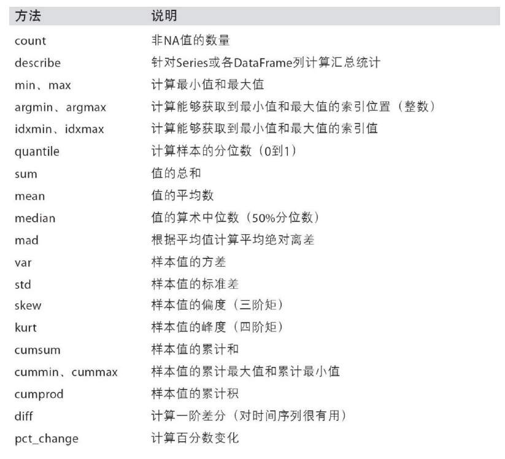 

### 字符串矢量化

`se.str`，提供类似python的str的接口，自动排除nan值，且部分函数支持正则语法。要求Series类型为str。

参考：**http://www.360doc.com/content/19/0101/21/41651190_805901547.shtml **


```python
df['price'].str.replace(r"[$,]","",regex=True) # 正则语法 替换美元中的$, 
```


### apply & map

直接使用Numpy的函数 ，作用到所有元素上 

```python
# Numpy ufunc 函数
df = pd.DataFrame(np.random.randn(5,4) - 1)
np.abs(df) # 绝对值 
```


####  map

`se.map(func)`：对series的每个元素应用函数func

```python
# 使用map对食物分类 
df['food'].map(lambda x:x.lower()) # 传入函数
df['food'].map({'apple':'fruit','brocolin':'vegatable'}) # 传入字典
```


#### apply

`df.apply(func,axis=0)`，以行或列（axis=0）为单位，应用函数变换，函数的输入参数就是一行（列）数据

```python
#dataframe函数应用
df=pd.DataFrame(np.ones((2,2))) #2*2的矩阵，每个位置都是1
print(df.apply(lambda x:x+10))	#每列元素+10
'''
      0     1
0  11.0  11.0
1  11.0  11.0
'''
```

#### applymap

`df.applaymap(func)`：以每个元素为单位，应用函数变换，对于df接口没有直接提供的功能，可以考虑这个函数

```python
df=pd.DataFrame(np.ones((2,2))) #2*2的矩阵，每个位置都是1
print(df.applymap(lambda x:2*x+1)) #一个线性函数
'''
     0    1
0  3.0  3.0
1  3.0  3.0
'''
```


### 替换

`df.replace`  ，替换df里的指定值。

```python
# data 是series
data.replace(-999,np.nan) # 一对一
data.replace([-999,-1000],np.nan)  # 多对一
data.replace([-999,-1000],[np.nan,0]) # 一对一
data.replace({-999:np.nan,-1000:0}) # 一对一
```

### 去重

* `df.duplicated()`，返回一个bool值的Series，true表示该行有重复
* `df.drop_duplicates('col_name',inplace=True)`，过滤重复行，默认行元素全部相同才算重复，也可以指定列名，仅针对该列元素判定是否重复
* `se.unique()`，返回numpy.ndarray类型，对series的数据列去重 

### 分块

类似直方图，对数据分区间。

`pandas.cut(x, bins, right=True, labels=None, retbins,include_lowest=False)`

* x：被切分的1维类数组
* bins：被切割的区间，整型或者列表
* right：默认为True，表示是否包含区间右部
* labels：给分割后的bins打标签
* include_lowest：默认为False，表示是否包含区间左部
* `retbins`：bool型的参数，表示是否将分割后的bins返回

返回一个`pandas.Categorical`类型的值，元组


```python
ages = np.array([1,5,10,40,36,12,58,62,77,89,100,18,20,25,30,32]) # 年龄数据
t=pd.cut(ages, [0,5,20,30,50,100], 
         labels=[u"婴儿",u"青年",u"中年",u"壮年",u"老年"],
         retbins=True) 
```

```
(['婴儿', '婴儿', '青年', '壮年', '壮年', ..., '青年', '青年', '中年', '中年', '壮年']
 Length: 16
 Categories (5, object): ['婴儿' < '青年' < '中年' < '壮年' < '老年'],
 array([  0,   5,  20,  30,  50, 100]))
```

支持调用series接口。

```python
t.value_counts()  # 统计类别
```

```
婴儿    2
青年    4
中年    2
壮年    3
老年    5
dtype: int64
```

### 排序

**索引排序**

`df.sort_index(axis=0,ascending=True)`，按索引进行联动排序

```python
#重新按照索引排序 
df=pd.DataFrame(np.ones((3,3)),columns=[3,2,1],index=[1,2,0])
```

```
初始df，行列索引都是乱序
     3    2    1
1  1.0  1.0  1.0
2  1.0  1.0  1.0
0  1.0  1.0  1.0
```

```python
df.sort_index()	#默认对0轴方向，也就是行索引排序
```

```
排序后，行索引变动，列索引不变
     3    2    1
0  1.0  1.0  1.0
1  1.0  1.0  1.0
2  1.0  1.0  1.0
```


**列排序**

`df.sort_values(by='col_name',ascending=True)`，**按照该列的值，进行联动排序**


### 连接

`pd.merge(df1,df2,on='co_name',left_on,right_on,left_index,right_index,how='inner')`，用于连接两个dataframe，df大小可以不一样。其各参数意义如下：

* on、left_on、right_on：**指定共同外键**，类似于铰链的作用，连接两个df。当两个df之间存在同名列时，用on指定即可。否则，就要分别指定`left_on='left_colname'`和`right_on=right_colname`，来表示左表和右表各自分别以这两列为共同外键。
* left_index、right_index：指定左表行索引、右表行索引作为各自的共同外键参与运算 ，布尔值，`left_index=True`。也就是说，不再从数据列中指定，而是指定索引。
* **连接方式取决于参数how**：
  * 默认是`inner`，类似sql的`inner join`。当为交集运算时，默认会取两个df的第一个同名列作为运算对象（如果没有会报错），也可以使用`on`显式指定。
  * `outer`：两个df的并集
  * `left`、`right`：左右连接，也就是集合运算的`A-B`、`A+B`，类似mysql

下面是merge的原理示意图

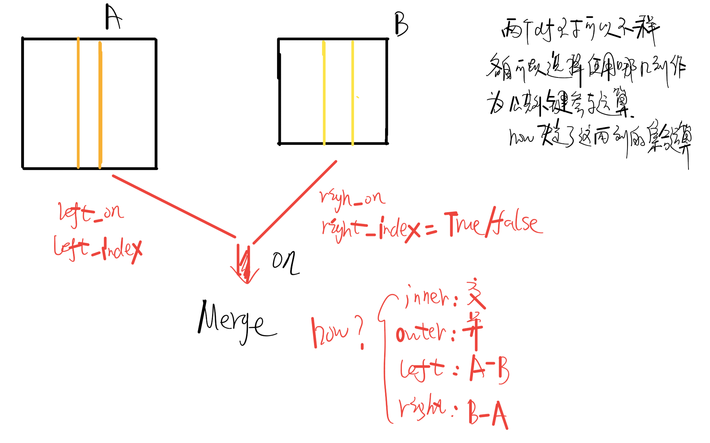

关于merge的示例 和 说明

```python
#merge transform等函数的使用 
df=pd.DataFrame({'key1':range(10,16),'key2':range(0,6),'key3':['a','b','c']*2,'key4':['one','two']*3})
```

```
	 key1  key2 key3 key4
0    10     0    a  one
1    11     1    b  two
2    12     2    c  one
3    13     3    a  two
4    14     4    b  one
5    15     5    c  two 
```

```python
df_sum=df.groupby('key3').sum().add_prefix('sum_') # 

'''
       sum_key1  sum_key2
key3                    
a           23         3
b           25         5
c           27         7 
'''


df_sumnp=df.groupby('key3').sum() 
''' 
       key1  key2
key3            
a       23     3
b       25     5
c       27     7
'''
```

```python
pd.merge(df,df_sumnp,on='key1',how='outer')
'''
两个表取key1作为共同外键，两个表都存在key2，_x、_y后缀是自己添加的，并集运算
   key1  key2_x key3 key4  key2_y
0    10     0.0    a  one     NaN
1    11     1.0    b  two     NaN
2    12     2.0    c  one     NaN
3    13     3.0    a  two     NaN
4    14     4.0    b  one     NaN
5    15     5.0    c  two     NaN
6    23     NaN  NaN  NaN     3.0
7    25     NaN  NaN  NaN     5.0
8    27     NaN  NaN  NaN     7.0
'''
```

```python
print(pd.merge(df,df_sumnp,on='key1')) #交集，为空 

'''
取两个表的key1作为公共外键，由于key1部分没有任何重叠，交集自然为空
Empty DataFrame
Columns: [key1, key2_x, key3, key4, key2_y]
Index: []
'''
```

### 合并

`np.concatenate` 

```python
# axis=1，行方向连接，默认=0 arr1、arr2两个矩阵
np.concatenate([arr1, arr2], axis=1)
```


`pd.concat([df1,df2],axis=1,join='inner')`，join参数表示连接方式（内连接、外连接）。

## 时间序列

### 生成时间序列

`pd.date_range(start,end,periods=None,freq='D')`：start、end都是字符串形式的时间，会返回时间序列。freq表示步长，默认为day，其余步长见下图。periods表示划分成多少段，默认为None。periods和freq参数不可同时设置。

```python
#periods参数 
#20200-06-01 2020-06-02 划分为4段 
dates=pd.date_range('20200601','20200602',periods=4)
print('type:',type(dates),'\ndates:\n',dates)
```

```
type: <class 'pandas.core.indexes.datetimes.DatetimeIndex'> 
dates:
 DatetimeIndex(['2020-06-01 00:00:00', '2020-06-01 08:00:00',
               '2020-06-01 16:00:00', '2020-06-02 00:00:00'],
              dtype='datetime64[ns]', freq=None)
```


```python
# freq参数 
# 2020-06-01 2020-09-01 步长为1 
dates=pd.date_range('20200601','20200901',freq='M')
print('type:',type(dates),'\ndates:\n',dates)
```

```
type: <class 'pandas.core.indexes.datetimes.DatetimeIndex'> 
dates:
 DatetimeIndex(['2020-06-30', '2020-07-31', '2020-08-31'], dtype='datetime64[ns]', freq='M')
```


 

### 重采样

重采样：指的是将时间序列从一个频率转化为另一个频率进行处理的过程，将高频率数据转化为低频率数据为降采样，低频率转化为高频率为升采样。 

```python
t = pd.DataFrame(np.random.uniform(10,50,(100,1)),index=pd.date_range('20170101',periods=100))
```

```
                    0
2017-01-01  34.279848
2017-01-02  14.741524
2017-01-03  38.740647
2017-01-04  10.234684
……
2017-04-09  40.445157
2017-04-10  43.519838

[100 rows x 1 columns]
```

降采样 

```python
#降采样
t.resample('M') # Month
# t.resample('10D').count() # 10天一次
```

```
                    0
2017-01-31  29.481998
2017-02-28  30.425717
2017-03-31  26.900657
2017-04-30  33.633342
```

升采样

```python
frame.resample('D').asfreq()  # 转换成高频 ,缺失数据为Nan
frame.resample('D').ffill()  # 缺失数据填充为第一个采样点 
```


### 字符串与时间序列

`pd.to_datetime(series,format='')`：解析字符串时间序列为datetime类型。[官网API介绍](https://pandas.pydata.org/docs/reference/api/pandas.to_datetime.html?highlight=to_datetime#pandas.to_datetime) 

```python
#to_datetime
se=pd.Series(['2020年6月1号','2020年6月2号'])
se_date=pd.to_datetime(se,format='%Y年%m月%d号') #展示format参数的作用
```

```
0   2020-06-01
1   2020-06-02
dtype: datetime64[ns]	#注意看这里的类型
```


## 层级索引

层级索引，**就是将原来的单级索引变为多级索引，结构上有点类似于横向的树形菜单**。

### 选取

Series创建多级索引示例

```python
# 多级索引按照从左到右的顺序进行贴合。
se=pd.Series(range(6),index=[['a','b','c']*2,list(range(1,7))])

'''abc一级索引 123...二级索引 
a  1    0
b  2    1
c  3    2
a  4    3
b  5    4
c  6    5
dtype: int64
'''             
```

多层索**引的形式也发生变化，分为外层索引、内层索引**，一次索引一层。

```python
se['a'] #外层索引

'''
得到a索引的所有数
1    0
4    3
dtype: int64
'''
```

```python
se[:,2] #内层索引

'''
得到内层索引为2的数 
b    1
dtype: int64
'''
```


### 交换

关于多层索引的其他常用接口：

* `se.swaplevel()`：交换层级顺序，会返回一个新的series

* `se.unstack(0)`：将含有多级索引的se转为dataframe，参数0未指定时，以一级索引为行索引，二级索引为列索引，进行变换，缺失值为nan。指定参数0，则索引对应顺序颠倒，相当于前者的转置。

  series

  ```
  a  1    0
  b  2    1
  c  3    2
  a  4    3
  b  5    4
  c  6    5
  dtype: int64
  ```

  ```python
  print(se.unstack(0)) # 一级索引为行索引，二级索引为列索引
  ```

  ```
       a    b    c
  1  0.0  NaN  NaN
  2  NaN  1.0  NaN
  3  NaN  NaN  2.0
  4  3.0  NaN  NaN
  5  NaN  4.0  NaN
  6  NaN  NaN  5.0
  ```

  ```python
  print(se.unstack()) # 一级索引为列索引，二级索引为行索引
  ```

  ```
       1    2    3    4    5    6
  a  0.0  NaN  NaN  3.0  NaN  NaN
  b  NaN  1.0  NaN  NaN  4.0  NaN
  c  NaN  NaN  2.0  NaN  NaN  5.0
  ```

* `df.stack()`：上面的逆操作，无0参数，将dataframe转为series 。行列索引分别对应一级二级索引


## 分组与聚合

### 分组

分组与聚合示意图

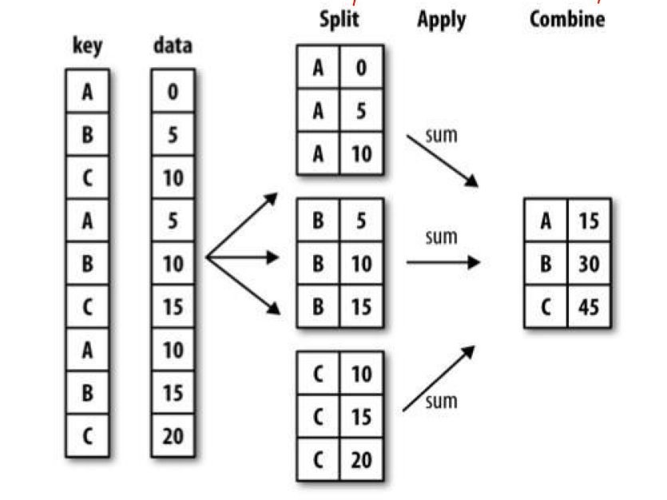 


pandas使用接口`.groupby()`来对dataframe（或series）进行分组，**该接口会返回一个groupby中间对象**（DataFrameGroupBy object），作为后续聚合函数的过渡。


为了便于示例，先创建一个dataframe作为数据源

```python
df=pd.DataFrame({'key1':range(10,16),'key2':['a','b','c']*2,'key3':['one','two']*3})
print(df)
'''
   key1 key2 key3
0    10    a  one
1    11    b  two
2    12    c  one
3    13    a  two
4    14    b  one
5    15    c  two
'''
```


分组方法：

* `df.groupby('col_name')`：按照其中一列分组，与`df.groupby(df['col_name'])`这种写法等价 。

  ```python
  df.groupby('key2').size() # 按照key2分组，并统计元素个数
  ```

  ```
  key2
  a    2
  b    2
  c    2
  dtype: int64
  ```

* `df.groupby(['col1',...])`：多列分组 

  ```python
  df.groupby(['key2','key3']).size() # 按照key23分组，并统计元素个数
  ```

  ```
  key2  key3
  a     one     1
        two     1
  b     one     1
        two     1
  c     one     1
        two     1
  dtype: int64
  ```

  

* `df.groupby(df.dtypes,axis=1)`，`df.dtypes`返回一个series，这个写法的意思就是按照类型对列分组（在1轴方向上拨动数据）

  ```python
  df.groupby(df.dtypes,axis=1).size() #按类分组测试
  ```
  
  ```
  int64     1
  object    2
  dtype: int64
  ```

  

**分组groupby对象支持迭代**，借此查看每组数据和组名。

```python
#分组迭代
for gp_name,gp_data in gp_key2: # 按照abc分组
    print('gp_name:',gp_name)
    print('gp_data:\n')
    print(gp_data)
    print('='*30)
    
'''
gp_name: a
gp_data:

   key1 key2 key3
0    10    a  one
3    13    a  two
==============================
gp_name: b
gp_data:

   key1 key2 key3
1    11    b  two
4    14    b  one
==============================
gp_name: c
gp_data:

   key1 key2 key3
2    12    c  one
5    15    c  two
==============================
'''
```

### 聚合

分组对象支持聚合。聚合后的df，以分组值作为行索引（可以看小节开始的图）。

```
gp_key2分组 

gp_name: a
gp_data:

   key1 key2 key3
0    10    a  one
3    13    a  two
==============================
gp_name: b
gp_data:

   key1 key2 key3
1    11    b  two
4    14    b  one
==============================
gp_name: c
gp_data:

   key1 key2 key3
2    12    c  one
5    15    c  two
==============================
'''
```

聚合操作示例

```python
#聚合操作示例 
gp_key2.sum() # gp_key2 的分组键为 a b c，相当于对每一组分别进行统计
```

```
      key1
key2      
a       23
b       25
c       27
```

除了系统提供的聚合函数外**，也可以自定义聚合函数**，放在`.agg(func)`方法里，func函数的第一个参数是分组df。

```python
gp_key2.agg(lambda gpdf:gpdf.max()-gpdf.min())	#分组里的最大值-最小值
```

```
		key1
key2      
a        3
b        3
c        3
```

**如果想同时使用多个聚合函数**，类似`select name,count(),sum from tb`这种sql的执行效果，可以这么做`.agg(['func1','func2'])`，列表里是每个函数同名的字符串。

```python
gp_key2.agg(['mean','max'])
```

```
      key1    
      mean max
key2          
a     11.5  13
b     12.5  14
c     13.5  15
```

如果想额外地为每个字段应用不同的聚合函数，就在`agg()`函数中传入字典，如下所示

```python
gp_key2.agg({'key1':['max','min'],'key3':'count'})
```

```
     key1      key3
      max min count
key2               
a      13  10     2
b      14  11     2
c      15  12     2
```


## 数据读取与存储  

### 文件


csv文件读取示例代码

```python
data = pd.read_csv('d:/test_data/food_rank.csv',encoding='utf8')
data = pd.read_csv('d:/test_data/food_rank.csv',usecols=['name'])  #指定读取的列名

#如果文件路径有中文，则需要知道参数engine='python'
data = pd.read_csv('d:/数据/food_rank.csv',engine='python',encoding='utf8')
```

保存df为csv

```python
# header=1 保留标题 index=1 保留行索引 
df.to_csv('path',header=1,index=1)
```


### 数据库

所需模块

- pandas
- sqlalchemy
- pymysql

```python
# 导入必要模块
import pandas as pd
from sqlalchemy import create_engine

#初始化数据库连接
#用户名root 密码   端口 3306  数据库 db2
engine = create_engine('mysql+pymysql://root:@localhost:3306/db2')
#查询语句
sql = '''
    select * from class;
'''
#两个参数   sql语句  数据库连接
df = pd.read_sql(sql,engine)
df
```

写入 

```python
#新建
df = pd.DataFrame({'id':[1,2,3,4],'num':[34,56,78,90]})
df = pd.read_csv('ex1.csv')
# #写入到数据库
df.to_sql('df2',engine,index=False)
print("ok")
```


# matplotlib

官方api文档：https://matplotlib.org/search.html 


## 折线图

```python
#折线图示例

import matplotlib.pyplot as plt #约定俗成

month=list(range(1,13))  #月份,作为x轴数据
companyA=[1,2,3,4,5,6,7,8,9,10,11,12] #y轴数据
companyB=[x+3 for x in companyA] 

#设置XY轴标签
plt.xlabel('Month')
plt.ylabel('Sales')
plt.title('Sales of CompanyA & CompanyB')  #图的名称


#plot被调用，图像数据已经存入后台，但不会显示图片
plt.plot(month,companyA,label='companyA') #label参数只有在legend被调用时才会显示，曲线图例
plt.plot(month,companyB,label='companyB')   

#显示图例
plt.legend()

#显示图像，弹出对话框
plt.show()
```

**`plot`可以在`show()`之前被多次调用，就会形成一张图里画多条曲线的效果。**

2

## 柱状图

`plt.bar()` :

1. `x`：x轴数据。
2. `height`：y轴数据。
3. `width`：条形图的宽度。
4. `bottom`：`y`轴的基线，默认是0 。**绘制堆叠条形图时会用到。**
5. `align`：对齐方式，默认是`center`，也就是跟指定的`x`坐标居中对齐，还有为`edge`，靠边对齐，具体靠右边还是靠左边，看`width`的正负。
6. `color`：条形图的颜色

横向条形图：`plt.barh()`，参数同理 ，bottom改成left。


```python
#柱状图示例
import matplotlib.pyplot as plt

#第一组xy数据
x=['companyA','companyB','companyC']
y=[2,4,6]
#第2组xy数据
x1=['companyD','companyE','companyF']
y1=[1,2,3]

#开始画图
plt.xlabel('company')
plt.ylabel('sales')
plt.title('sales of company')

plt.bar(x,y,label='ABC')
plt.bar(x1,y1,label='DEF')

plt.legend()
plt.show()
```

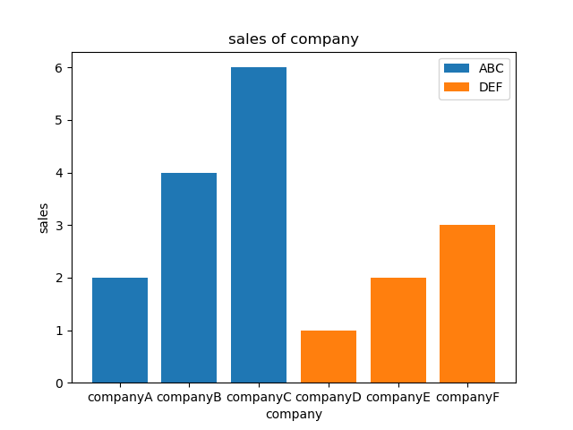 


分组柱状图 （用sns绘制更方便）

```python
movies = {
    "流浪地球":[2.01,4.59,7.99,11.83,16],
    "飞驰人生":[3.19,5.08,6.73,8.10,9.35],
    "疯狂的外星人":[4.07,6.92,9.30,11.29,13.03],
    "新喜剧之王":[2.72,3.79,4.45,4.83,5.11],
    "廉政风云":[0.56,0.74,0.83,0.88,0.92],
    "神探蒲松龄":[0.66,0.95,1.10,1.17,1.23],
    "小猪佩奇过大年":[0.58,0.81,0.94,1.01,1.07],
    "熊出没·原始时代":[1.13,1.96,2.73,3.42,4.05]
}

# 图形设置
plt.figure(figsize=(20,8))
width = 0.75
bin_width = width/5  # 每个条形图的宽度
movie_pd = pd.DataFrame(movies)
ind = np.arange(0,len(movies)) # 分组 

for index in movie_pd.index: 
    day_tickets = movie_pd.iloc[index]  # 行数据 
    xs = ind+bin_width  # 偏移x  每一分组都向右偏移一个宽度距离 
    plt.bar(xs,day_tickets,
            width=bin_width,
            label="第%d天"%(index+1))
    # 条形图的x坐标是每个柱子的中间点，如果需要微调文字坐标可以据此计算 
    for ticket,x in zip(day_tickets,xs): # 添加注释 ticket=y x条形图柱状
        plt.annotate(ticket,xy=(x,ticket),xytext=(x-0.1,ticket+0.1))


plt.legend(prop=font) # 中文图例 
plt.ylabel("单位：亿",fontproperties=font)
plt.title("春节前5天电影票房记录",fontproperties=font)
# 设置x轴的坐标
plt.xticks(ind,movie_pd.columns,fontproperties=font)
plt.grid(True)
plt.show()
```


堆叠条形图

```python
# 堆叠条形图
plt.figure(figsize=(20,15))
left=np.array([0.0]*data.shape[0])  # 累加左边缘
for col in range(data.shape[1]):
    plt.barh(data.index,data.iloc[:,col],left=left) # 按列画
    left+=data.iloc[:,col]
plt.legend(labels=data.index) # 图例
```


## 直方图

直方图是**数值数据分布**的图形表示，是一种条形图。

`plt.hist()`：

1. `x`：分组数据
2. `bins`：数字或者序列（数组/列表等）。如果是数字，代表的是要分成多少组。如果是序列，那么就会按照序列中指定的值进行分组。比如`[1,2,3,4]`，那么分组的时候会按照三个区间分成3组，分别是`[1,2)/[2,3)/[3,4]`。
3. `range`：元组或者None，如果为元组，那么指定`x`划分区间的最大值和最小值。如果`bins`是一个序列，那么`range`没有有没有设置没有任何影响。
4. `density`：默认是`False`，如果等于`True`，那么将会使用频率分布直方图。每个条形表示的不是个数，而是`频率/组距`（落在各组样本数据的个数称为频数，频数除以样本总个数为频率）。

返回：

1. `n`：数组。每个区间内值出现的个数，如果`density=True`，那么这个将返回的是`频率/组距`。
2. `bins`：数组，x区间坐标。
3. `patches`：数组。每根条的对象，类型是`matplotlib.patches.Rectangle`

```python
#直方图示例
import matplotlib.pyplot as plt

hz_age=[1,2,3,4,11,12,12,13,14,15,17,30,44,55,66,33,2,100] #年龄数据
bins=range(min(hz_age),max(hz_age)+10,10)   #按照步长为10划分

# rwidth表示柱状和空白的间隔
# edgecolor='k' 柱状图相邻时边缘线颜色
plt.hist(hz_age,bins,rwidth=0.8,edgecolor='k')  

plt.xlabel('age of hangzhou')
plt.ylabel('number')
plt.title('age population of hangzhou')

plt.show()
```

 

```python
durations = [131,  98, 125, 131, 124, 139, 131, 117, 128, 108, 135, 138, 131, 102, 107, 114, 119, 128, 121, 142, 127, 130, 124, 101, 110, 116, 117, 110, 128, 128, 115,  99, 136, 126, 134,  95, 138, 117, 111,78, 132, 124, 113, 150, 110, 117,  86,  95, 144, 105, 126, 130,126, 130, 126, 116, 123, 106, 112, 138, 123,  86, 101,  99, 136,123, 117, 119, 105, 137, 123, 128, 125, 104, 109, 134, 125, 127,105, 120, 107, 129, 116, 108, 132, 103, 136, 118, 102, 120, 114,105, 115, 132, 145, 119, 121, 112, 139, 125, 138, 109, 132, 134,156, 106, 117, 127, 144, 139, 139, 119, 140,  83, 110, 102,123,107, 143, 115, 136, 118, 139, 123, 112, 118, 125, 109, 119, 133,112, 114, 122, 109, 106, 123, 116, 131, 127, 115, 118, 112, 135,115, 146, 137, 116, 103, 144,  83, 123, 111, 110, 111, 100, 154,136, 100, 118, 119, 133, 134, 106, 129, 126, 110, 111, 109, 141,120, 117, 106, 149, 122, 122, 110, 118, 127, 121, 114, 125, 126,114, 140, 103, 130, 141, 117, 106, 114, 121, 114, 133, 137,  92,121, 112, 146,  97, 137, 105,  98, 117, 112,  81,  97, 139, 113,134, 106, 144, 110, 137, 137, 111, 104, 117, 100, 111, 101, 110,105, 129, 137, 112, 120, 113, 133, 112,  83,  94, 146, 133, 101,131, 116, 111,  84, 137, 115, 122, 106, 144, 109, 123, 116, 111,111, 133, 150]

plt.figure(figsize=(15,5))
nums,bins,patches = plt.hist(durations,bins=20,edgecolor='k') # 数据分成20份
plt.xticks(bins,bins) # x轴刻度

for bin,num in zip(bins,nums): 
    plt.annotate(num,xy=(bin,num),xytext=(bin+1.5,num+0.5)) # 添加注释
plt.show()
```

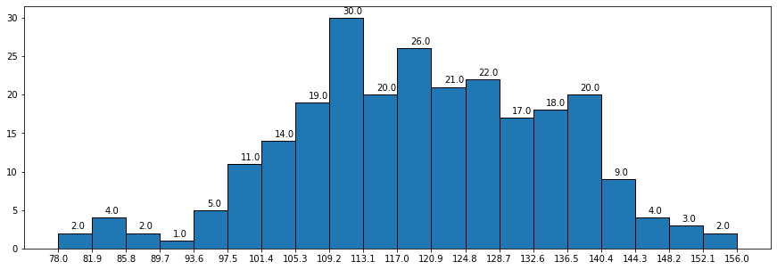

## 散点图

```python
#散点图示例
import matplotlib.pyplot as plt

x=list(range(13))
y=[i**2 for i in range(13)]

#marker表示点的形状
plt.scatter(x,y,marker='*')

plt.xlabel('x')
plt.ylabel('y')
plt.title('example of scatter')

plt.show()
```

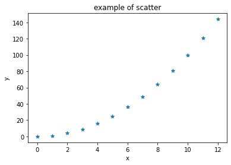 


## 饼图

`plt.pie`，其中的参数如下：

1. `x`：饼图的比例序列。
2. `labels`：饼图上每个分块的名称文字。
3. `explode`：设置某几个分块是否要分离饼图。
4. `autopct`：设置比例文字的展示方式。比如保留几个小数等。
5. `shadow`：是否显示阴影。
6. `textprops`：文本的属性（颜色，大小等）。

返回

1. `patches`：饼图上每个分块的对象。
2. `texts`：分块的名字文本对象。
3. `autotexts`：分块的比例文字对象

```python
#饼图示例
import matplotlib.pyplot as plt

sales=[2,3,4,5] #饼的数据
companys=list('ABCD') #饼的名字
colors=list('cmyg') #饼的颜色

# startangle表示开始画饼图的角度
# autopct表示显示饼图百分比,后面跟字符串的格式化
# explode表示每块饼突出的程度
plt.pie(sales,labels=companys,colors=colors,
            startangle=90,
            autopct='%.1f%%', 
            explode=(0.2,0,0,0))

plt.show()
```

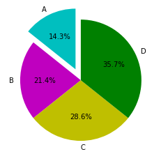


```python
import matplotlib.pyplot as plt
import numpy as np
import pandas as pd
from matplotlib import font_manager

browsers = {
    "Chrome": 0.6098,
    "Internet Explorer": 0.1218,
    "FireFox": 0.1147,
    "Edge": 0.0415,
    "Safari": 0.0372,
    "其他浏览器": 0.075
}
font = font_manager.FontProperties(fname=r"C:\\Windows\\Fonts\\msyh.ttc",size=12)

patches,texts,autotexts = plt.pie(browsers.values(),explode=(0.05,0,0,0,0,0),
                                  labels=browsers.keys(),
                                  textprops={"fontproperties":font},autopct="%.2f%%",shadow=True)

for index,autotext in enumerate(autotexts): # 设置文本大小
    autotext.set_color("w")
    if index == 3 or index == 4:
        autotext.set_size(10)
plt.show()
```


## 雷达图

在`matplotlib.pyplot`中，可以通过`plt.polar`来绘制雷达图，这个方法的参数跟`plt.plot`非常的类似，只不过是`x`轴的坐标点应该为弧度（2*PI=360°）。示例代码如下：

```python
properties = ['输出','KDA','发育','团战','生存','输出']
values = [40,91,44,90,95,40] # 重复第一个，使曲线闭合 

theta = np.linspace(0,np.pi*2,6) # 角度
plt.polar(theta,values)

plt.xticks(theta,properties,fontproperties=font) # 刻度
plt.fill(theta,values) # 填充颜色
```


## 堆栈图 

```python
#堆栈图示例
import matplotlib.pyplot as plt
import random as r

#公司数据
month=range(50) 
companyA=range(0,50)
companyB=range(51,101)


#默认情况下stackplot没有图例
#用折线图的图例间接代替
#传入数据为空表示不用画线，只需要颜色和标签
plt.plot([],[],color='r',label='A')
plt.plot([],[],color='k',label='B')


plt.stackplot(month,companyA,companyB,colors=list('rk'))
plt.xlabel('month')
plt.ylabel('sales of companys')
plt.title('example of stackplot')
plt.legend()
plt.show()
```

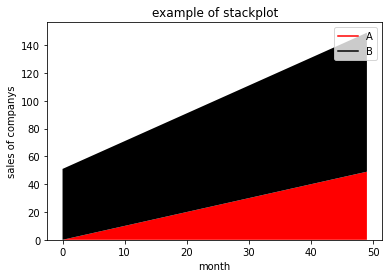 

图像依次堆叠


## 箱线图 

在`matplotlib`中有`plt.boxplot`来绘制箱线图，这个方法的相关参数如下：

1. `x`：需要绘制的箱线图的数据。
2. `notch`：是否展示置信区间，默认是`False`。如果设置为`True`，那么就会在盒子上展示一个缺口。
3. `sym`：代表异常点的符号表示，默认是小圆点。
4. `vert`：是否是垂直的，默认是`True`，如果设置为`False`那么将水平方向展示。
5. `whis`：上下限的系数，默认是`1.5`，也就是上限是`Q3+1.5IQR`，可以改成其他的。也可以为一个序列，如果是序列，那么序列中的两个值分别代表的就是下限和上限的值，而不是再需要通过`IQR`来计算。
6. `positions`：设置每个盒子的位置。
7. `widths`：设置每个盒子的宽度。
8. `labels`：每个盒子的`label`。
9. `meanline`和`showmeans`：如果这两个都为`True`，那么将会绘制平均值的的线条

```python
data = np.random.rand(100)*100
# 添加两个异常值
data = np.append(data,np.array([-100,100]))
plt.boxplot(data,meanline=True,showmeans=True)
```


## 热力图

绘制矩阵 matshow 及 刻度文字显示 

导入

```python
import numpy as np
import matplotlib
from matplotlib import pyplot as plt
import matplotlib.ticker as ticker # 刻度模块 
import matplotlib.pyplot as plt
# 设置字体为仿宋
plt.rcParams['font.sans-serif'] = ['FangSong']
# 设置字体大小为20
plt.rcParams['font.size'] = 20
```

生成随机矩阵 

```python
mat = np.random.rand(3,3)
```

画图

```python
# 画图 
fig = plt.figure()
ax = fig.add_subplot(1,1,1) # 1*1 获取第1幅图片
# matshow 返回对象  AxesImage
cax=ax.matshow(mat,cmap='Blues')
fig.colorbar(cax) # 渐变条显示  


# 如果不添加刻度的话 就会默认显示012 这样的数字索引 
# ticklabels 用于显示文字 添加一开始的空字符串 
# ''空字符 会在原点显示 其余字符会在每个矩阵的中间位置显示 
# 也就是说 如果矩阵有n列 除了n个 文字刻度 显示之外 还要在它的头前面加一个 '' 总计n+1 
# y轴同理 
xticklabels=['']+list('我爱你')
yticklabels=['']+'i love you'.split(' ')
ax.set_xticklabels(xticklabels)  # 设置x轴刻度标签
ax.set_yticklabels(yticklabels)

# majorlocator 是用于调整刻度间距的 
# MultipleLocator 表示固定间隔1
ax.xaxis.set_major_locator(ticker.MultipleLocator(1))
ax.yaxis.set_major_locator(ticker.MultipleLocator(1))
```


每个刻度的位置 显示如下 。可以看到，图片左上角的坐标是`(0,-1)`，所以要额外添加一个`['']`   


最终效果图


## 图像设置

### 曲线形状

设置曲线的颜色、形状、粗细（可以官网搜索pyplot接口）

```python
plt.plot(x,y,color='red',alpha=0.5,linestyle=':',markrer='o',linewidth=3) 
```

曲线形状  linestyle ，点形状 marker

|      |            |      |           |
| :--- | :--------- | :--- | :-------- |
| 字符 | 类型       | 字符 | 类型      |
| '-'  | 实线       | '--' | 虚线      |
| '-.' | 虚点线     | ':'  | 点线      |
| '.'  | 点         | ','  | 像素点    |
| 'o'  | 圆点       | 'v'  | 下三角点  |
| '^'  | 上三角点   | '<'  | 左三角点  |
| '>'  | 右三角点   | '1'  | 下三叉点  |
| '2'  | 上三叉点   | '3'  | 左三叉点  |
| '4'  | 右三叉点   | 's'  | 正方点    |
| 'p'  | 五角点     | '*'  | 星形点    |
| 'h'  | 六边形点1  | 'H'  | 六边形点2 |
| '+'  | 加号点     | 'x'  | 乘号点    |
| 'D'  | 实心菱形点 | 'd'  | 瘦菱形点  |
| '_'  | 横线点     |      |           |

曲线颜色 color

```python
# 支持颜色名称（缩写）、十六进制、rgb、rgba
plt.plot([1,2,3,4,5],[1,2,3,4,5],'r') #将颜色线条设置成红色
plt.plot([1,2,3,4,5],[1,2,3,4,5],color='red') #将颜色设置成红色
plt.plot([1,2,3,4,5],[1,2,3,4,5],color='#000000') #将颜色设置成纯黑色
plt.plot([1,2,3,4,5],[1,2,3,4,5],color=(0,0,0,0)) #将颜色设置成纯黑色
```


`plot`方法会返回一个装有`Line2D`对象的列表，**比如`lines=plt.plot(x1,y1,x2,y2)`因为绘制了两根线条，因此`lines`中会有两个`2D`对象**，拿到这个`Line2D`对象后就可以通过`set_属性名`设置线条的样式了

```python
lines = plt.plot(x,y)
line = lines[0] # 第一条曲线

line.set_aa(False) #关掉反锯齿
line.set_alpha(0.5) #设置0.5的透明度
```

### 图片样式

设置图形大小，`plt.figure(num=None, figsize=None, dpi=None, facecolor=None, edgecolor=None, frameon=True)`，其中`num`是图的编号，**`figsize`的单位是英寸，`dpi`是每英寸的像素点**，与figsize组合可以计算图片总的像素大小。`facecolor`是图片背景颜色，`edgecolor`是边框颜色，`frameon`代表是否绘制画板。

```python
plt.figure(figsize=(20,8),dpi=80)  
plt.grid() # 显示网格
```

保存图片到本地，注意他们的调用顺序

```python
# save要放在绘制plot的下面
# plt.show()会释放figure资源，如果在show之后保存图片将只能保存空图片

plt.plot(x,y)	# 传入x和y, 通过plot画图
plt.savefig('./day20200529.svg')  #保存为矢量图
```

### 刻度样式

设置x轴、y轴的刻度，尽管matplotlib会自动地刻画x轴、y轴，但也许效果不是我们想要的。通过`plt.xticks()`接口来自定义轴刻度，格式为：`数据 刻度名 其余参数`

```python
from matplotlib import pyplot as plt 
import random
x = range(12) # x轴的位置
y = [random.randint(20,37) for i in x] 

# x轴刻度标签
x_ticks_label = ["{}:00".format(i) for i in x] 
plt.xticks(x,x_ticks_label,rotation=45) #数据 刻度名称 其他参数
# y轴刻度标签同理
y_ticks_label = ["{}℃".format(i) for i in range(min(y),max(y)+1)]
plt.yticks(range(min(y),max(y)+1),y_ticks_label) #注意看第一个参数

# 绘 图
plt.plot(x,y) 
plt.show()
```

上述代码，x轴格式化每个数字为`dd:00`的格式，并旋转90度，y轴格式化为`d:℃`的格式，图形如下


坐标轴需要显示中文信息，设置参数`fontproperties` 

首先查看本机支持的中文字体：windows下，查看`C:\Windows\Fonts`路径；linux下，使用命令`fc-list :lang=zh`查看。然后按照如下设置字体路径即可使用

```python
from matplotlib import font_manager
my_font = font_manager.FontProperties(fname='C:\Windows\Fonts\STSONG.ttf',size=18) 

plt.xlabel('时间',rotation=45,fontproperties = my_font)
plt.ylabel("次数",fontproperties=my_font)

# 设置标题
plt.title('每分钟跳动次数',color='red',fontproperties=my_font)

plt.show()
```

### 设置注释文本

有时候需要在图形中的某个点标记或者注释一下。那么我们可以使用`plt.annotate(text,xy,xytext,arrowprops={})`来实现，其中`text`是注释的文本，`xy`是需要注释的点的坐标，`xytext`是注释文本的坐标，`arrowprops`是箭头的样式属性。示例代码如下：

```python
ax = plt.subplot(111)

x = np.arange(0.0, 5.0, 0.01)
y = np.cos(2*np.pi*t)
line, = plt.plot(x, y,linewidth=2)

plt.annotate('local max', xy=(2, 1), xytext=(3, 1.5)             
arrowprops=dict(facecolor='black',shrink=0.05),
)

plt.ylim(-2, 2)
plt.show()
```

### 子图划分

`fig.add_subplot`，在画板上添加子图，**返回axes对象**。

```python
# 通过figure对象新增子图
import numpy as np
import matplotlib.pyplot as plt 
x = np.arange(1,100)

fig=plt.figure(figsize=(20,10),dpi=80)  #设置图片大小

ax1=fig.add_subplot(2,2,1) #2*2=4张子图，序号从1开始
ax1.plot(x, x)

ax3=fig.add_subplot(2,2,2)  # 第2张子图
ax3.plot(x, x**2,color='red')

ax4=fig.add_subplot(2,2,4)  # 第4张子图
ax4.plot(x, np.log(x)) 

plt.show()
```

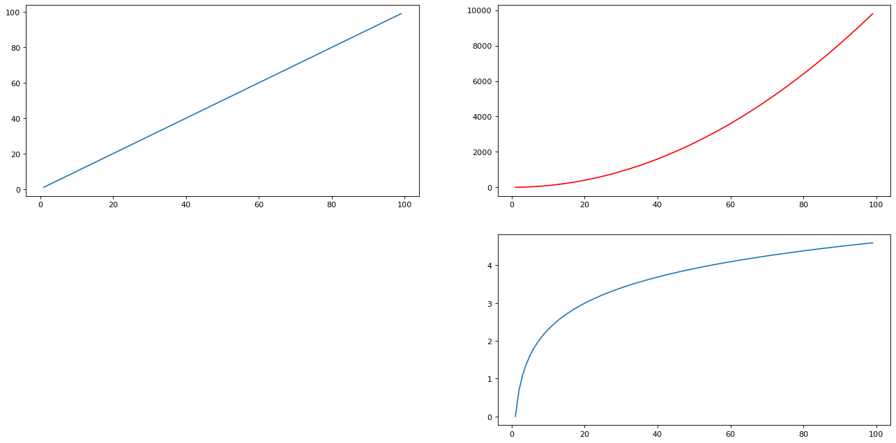 

`plt.subplots`  

```python
# sharex=True,sharey=True 共享xy轴 
# figsize 设置子图大小
# 同时返回figure对象 axes数组 
figure,axes = plt.subplots(2,2,sharex=True,sharey=True,figsize=(20,15)) # 2*2 的图 
# 多列情况下是二维索引 
axes[0,0].plot(np.sin(np.arange(10)),c='r') # 1行1列 
axes[0,1].plot(np.cos(np.arange(10)),c='b')
axes[1,0].plot(np.tan(np.arange(10)),c='y')
axes[1,1].plot(np.arange(10),c='g')
```

如果多个**子图重叠**，使用`plt.tight_layout()`自动调整布局。

 

实现复杂布局 ，采用`GridSpec`对象

```python
fig = plt.figure()
# 创建3行3列的GridSpec对象 类似html表格 
gs = fig.add_gridspec(3,3)
ax1 = fig.add_subplot(gs[0,0:3]) 
ax1.set_title("[0,0:3]")


ax2 = fig.add_subplot(gs[1,0:2]) 
ax2.set_title("[1,0:2]")

ax3 = fig.add_subplot(gs[1:3,2])
ax3.set_title("[1:3,2]")

ax4 = fig.add_subplot(gs[2,0])
ax4.set_title("[2,0]")

ax5 = fig.add_subplot(gs[2,1])
ax5.set_title("[2,1]")
plt.tight_layout()
```


### 双y轴 

```python
fig = plt.figure()
ax1 = fig.add_subplot(211)
ax1.bar(np.arange(0,10,2),np.random.rand(5))
ax1.set_yticks(np.arange(0,1,0.25))

ax2 = ax1.twinx() #克隆一个共享x轴的axes对象
ax2.plot(np.random.randn(10),c="b")
plt.show()
```

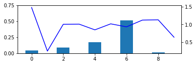

 


## 绘图元素

元素罗列：

1. `Figure`：**图形绘制的画板**，所有的图都是绘制在`Figure`上面。
2. `Axes`：每个图都是`Axes`对象。一个`Figure`上可以有多个`Axes`对象。
3. `Axis`：`x`轴、`y`轴的对象。
4. `Tick`：`x`轴和`y`轴上的刻度对象。每一个刻度都是一个`Tick`对象。
5. `TickLabel`：刻度标签，文字显示
6. `AxisLabel`：`x`轴和`y`轴的标签。
7. `Legend`：图例对象。
8. `Title`：`Axes`图的标题对象。
9. `Line2D`：绘制在`Axes`上的线条对象，比如折线图等。
10. `Reactangle`：绘制在`Axes`上的矩形对象，比如条形图等。
11. `Marker`：标记点，比如绘制散点图上的每个点就是这个对象。
12. `Artist`：只要是绘制在`Figure`上的元素（包括Figure），都是`Artist`的子类

### Figure容器

```python
fig=plt.figure() # 返回fig对象
fig.set_size_inches((20,20)) # 设置大小
#fig.set_figwidth(20)  # 设定宽高
#fig.set_figheight(20) 
ax1 = fig.add_subplot(211) # 添加Axes对象
ax2 = fig.add_axes([0.1, 0.1, 0.7, 0.3]) # 添加Axes对象

for ax in fig.axes:  # 遍历当前的axes对象
    ax.grid(True) # 设置打开网格
```


`fig.gca()`获取当前axes对象，`fig.sca()`设置当前axes对象。


### Axes容器

**`Axes`容器是用来创建具体的图形的，之前我们学的使用`plt.xx`绘制各种图形（比如条形图，直方图，散点图等）都是对`Axes`的封装**。比如`plt.plot`对应的是`axes.plot`，比如`plt.hist`对应的是`axes.hist`。针对图的所有操作，都可以在`Axes`上找到对应的`API`。

另外后面要讲到的`Axis`容器，是轴的对象，也是绑定在`Axes`上面。
**Axes的类定义介绍：**https://matplotlib.org/api/axes_api.html#matplotlib.axes.Axes

```python
fig = plt.figure()  
axes = fig.add_subplot(111)  
axes.plot(np.random.randn(10))  # 绘图

axes.set_xlim(-2,12) # # 设置x轴的最大值和最小值
axes.set_xlabel("x coordate") # 设置x轴标签
axes.set_xticklabels(range(4),rotation=90) # 设置x轴刻度 text文字 可以不是数字 
axes.text(0,0,'(0,0)') #x y text 
```


### Axis容器

`Axis`代表的是`x`轴或者`y`轴的对象，包含`Tick`（刻度）对象，`TickLabel`刻度文本对象，以及`AxisLabel`坐标轴文本对象

设置刻度格式

```python
import matplotlib.ticker as ticker
fig = plt.figure()
axes = fig.add_subplot(111)
axes.plot(np.random.randn(10))
axes.set_xlabel("x coordate")

# 创建格式化对象
formatter = ticker.FormatStrFormatter('%.2f')
# 设置格式化对象
axes.yaxis.set_major_formatter(formatter) # yaxis 是y轴对象
```


刻度位置和样式设置 

`set_major_locator`  传入一个Locator对象，用于调整刻度位置 。 

常用的Locator 对象：

* AutoLocator, 默认值，自动对刻度线的位置进行设置
* MaxNLocator, 根据提供的刻度线的最大个数，自动设置
* IndexLocator, 根据起始位置和间隔来设置刻度线 
* **MultipleLocator, 根据指定的间隔来设置刻度线**
* FixedLocator, 根据提供的列表元素来设置刻度线
* NullLocator,不显示刻度线

```python
plt.plot(x, np.sin(x), label='sin')
ax = plt.gca() # 获取当前axes对象
ax.xaxis.set_major_locator(ticker.MultipleLocator(1.5)) # 固定间隔1.5 
plt.show()
```


## matplotlib配置

### 修改默认的配置

修改默认的配置可以通过`matplotlib.rcParams`来设置，比如修改字体，修改线条大小和宽度等。

```python
import matplotlib.pyplot as plt
# 设置字体为仿宋
plt.rcParams['font.sans-serif'] = ['FangSong']
# 设置字体大小为20
plt.rcParams['font.size'] = 20
# 设置线条宽度
plt.rcParams['lines.linewidth'] = 2
# 设置线条颜色
plt.rcParams['axes.prop_cycle'] = plt.cycler('color', ['r', 'y'])
```

支持显示的中文字体

| 字体名   | 英文名称    |
| -------- | ----------- |
| 黑体     | SimHei      |
| 仿宋     | FangSong    |
| 楷体     | KaiTi       |
| 宋体     | SimSun      |
| 隶书     | LiSu        |
| 幼圆     | YouYuan     |
| 华文细黑 | STXihei     |
| 华文楷体 | STKaiti     |
| 华文宋体 | STSong      |
| 华文中宋 | STZhongsong |
| 华文仿宋 | STFangsong  |
| 方正舒体 | FZShuTi     |
| 方正姚体 | FZYaoti     |
| 华文彩云 | STCaiyun    |
| 华文琥珀 | STHupo      |
| 华文隶书 | STLiti      |
| 华文行楷 | STXingkai   |
| 华文新魏 | STXinwei    |

`Mac`和`Linux`支持的字体可能会不同，如果不行，可以使用`matplotlib.font_manager`来指定具体的字体。

### 自定义配置文件

保存配置信息到文件中，文件的命名规则为`[名称].mplstyle`，然后把这个文件放到`matplotlib.get_configdir()/stylelib`的目录中，在写代码的时候根据名称加载这个配置文件。

```python
# 可配置项 地址：
# https://raw.githubusercontent.com/matplotlib/matplotlib/master/matplotlibrc.template
#font.family:  sans-serif
#font.style:   normal
#font.variant: normal
#font.weight:  normal
#font.stretch: normal
#font.size:    10.0
```

```python
plt.style.use("名称") # 加载配置
```

# seaborn

seaborn是**基于matplot的可视化库**，更加简单强大。`pip install seaborn`安装。

## 关系绘图

### 散点图

`replot(x,y,data,kind='scatter',hue,col,row,col_wrap)` ，rel是relation的缩写。

**当data是DataFrame格式数据，x、y是列名**，**kind是图形样式，默认散点图**。

**当data为None时，x、y是xy轴数据。**

散点图绘制示例 

```python
import seaborn as sns
import pandas as pd
tips = pd.read_csv('dataset/tips.csv') # DataFrame
sns.relplot(x="total_bill",y="tip",data=tips)
```

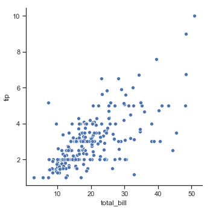


hue、col、row等参数取值为df列名，会按照该列值分组。

```python
sns.relplot(x="total_bill",y="tip",hue="day",data=tips) # 按照day列数据分组 颜色区分
sns.relplot(x="total_bill",y="tip",hue="day",col="time",data=tips) # 按照col列分组 分列 
# col_wrap=2 用于指定一行摆放几列 美观
sns.relplot(x="total_bill",y="tip",hue="day",col="time",row="sex",data=tips) # 分行
```

hue示例，按照day列取值，以不同颜色区分 

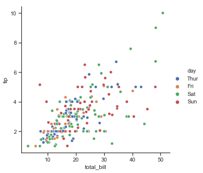

### 折线图

`relplot`通过设置`kind="line"`可以绘制折线图，可以在自动在两组数据中进行计算绘图。示例代码如下：

```python
fmri = sns.load_dataset("fmri")
sns.relplot(x="timepoint",y="signal",kind="line",data=fmri)
```

虚线表示置信区间，实线是点（如果x对应多个y，会自动取均值）。

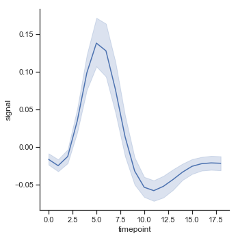

## 分类绘图

`catploy()`，`cat`是`category`的简写。

### 散点图

`catplot(kind="strip")`，默认的。`catplot(kind="swarm")`，会自动安排点的间隙，形如蜂群（swarm）

```python
sns.catplot(x="day",y="total_bill",kind="swarm",data=tips,hue="sex")
```

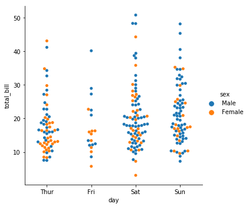

### 箱线图

`catplot(kind="box")`  

示例 

```python
athletes = pd.read_csv("athlete_events.csv")
countries = {
    'CHN':'中国',
    'JPN':"日本",
    'KOR':'韩国',
    'USA':"美国",
    'CAN':"加拿大",
    'BRA':"巴西",
    'GBR':"英国",
    'FRA':"法国",
    'ITA':"意大利",
    'ETH':"埃塞俄比亚",
    'KEN':"肯尼亚",
    'NIG':"尼日利亚",
}
plt.rcParams['font.sans-serif'] = ['FangSong']
need_athletes = athletes[athletes['NOC'].isin(list(countries.keys()))] # 取所需数据 

g = sns.catplot(x="NOC",y="Height",data=need_athletes,kind="box",hue="Sex")
g.fig.set_size_inches(20,5)
g.set_xticklabels(list(countries.values()))
```

### 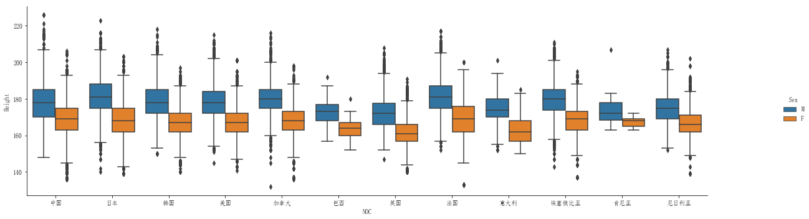条形图

```python
sns.catplot(x="day",y="total_bill",data=tips,kind="bar")
```

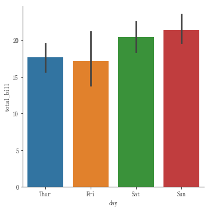


```python
# 自定义统计函数，统计出每个性别下获救的人数
sns.barplot(x="sex",y="survived",data=titanic,estimator=lambda values:sum(values))
```

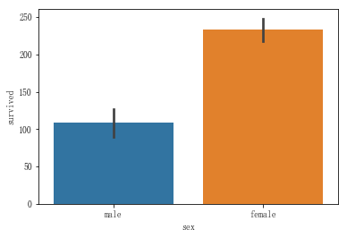


**设置`kind="count"`时，可以自动计算，实现统计效果。**

```python
# 统计 titanic 中sex各个值出现的个数
sns.catplot(x="sex",data=titanic,kind="count")
```

它等同于

```python
data=titani['sex']c.value_counts()
sns.catplot(x=data.index,y=data.values,kind="bar")
```

但是原生的count可以借助`hue`参数实现分组统计，更加强大。


## 分布绘图

### 直方图

`sns.distplot` ，直方图适合绘制单一变量分布。

```python
sns.set(color_codes=True)
titanic = sns.load_dataset("titanic")
titanic = titanic[~np.isnan(titanic['age'])]

sns.distplot(titanic['age'])
```

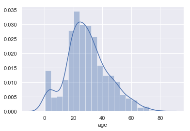


其余参数如下：

* kde=False ，是否要显示`kde`核密度曲线，如果显示`kde`曲线，那么`y`轴表示的就是概率，而不是数量。
* bins，代表这个直方图显示的数量


### 多变量分布

多变量分布图采用的函数是`jointplot`。

#### 散点图

```python
tips = sns.load_dataset("tips")
# kind 参数用来显示 是否显示回归曲线、核密度曲线
g = sns.jointplot(x="total_bill", y="tip", data=tips,kind='reg')
```

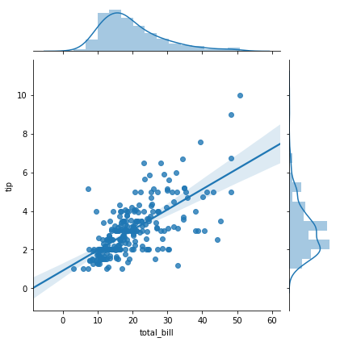

#### 六边形图

```python
sns.jointplot(x="Height",y="Weight",data=china_athletes,kind="hex",gridsize=20)
```

默认情况，在`x`轴的区间内，可以展示100个六边形，通过`gridsize`设置六边形个数，个数越少，单个六边形就越大。

六边形颜色越深，表示落在这个区域的点越多。

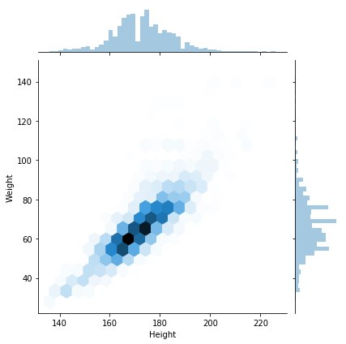


## 线性回归绘图

```python
sns.lmplot(x="total_bill",y="tip",data=tips)
```

更多请参考文档：
`https://seaborn.pydata.org/tutorial/regression.html` 

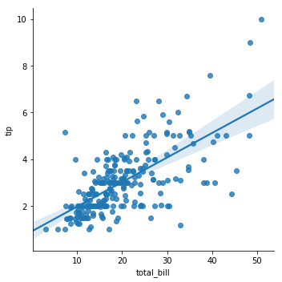

## FacetGrid结构图 

seaborn底层使用了`FacetGrid`对象来绘图，基本使用：

```python
tips = sns.load_dataset("tips")
g = sns.FacetGrid(tips) # 创建facet对象，用DataFrame初始化
g.map(plt.scatter,"total_bill","tip") # 绘图函数 +数据源
```

`g.map(func,col_x,col_y)` 第一个参数是绘图函数，后续参数是数据源。

### Axes对象

凡是函数名中已经明确显示了这个图的类型，这种图都是使用`Axes`绘图的。比如`sns.scatterplot`、`sns.lineplot`、`sns.barplot`等。**`Axes`绘图可以直接使用之前`matplotlib`的一些方式设置图的元素**。Axes对象和FacetGrid对象不一样。

示例代码如下：

```python
bj_temps = [29,27,23,22]
bj_hours = ["20时","23时","2时","5时"]
plt.figure(figsize=(5,2)) # 对axes对象生效 
axes = sns.lineplot(range(0,4),bj_temps,marker="o") # 返回axes

axes.set_xticks(range(0,4))  # x轴刻度
axes.set_xticklabels(bj_hours) # x轴刻度名称
```

### 分图绘制

```python
fig,axes_arr = plt.subplots(3,1,figsize=(20,15))
# 以下都是借助ax对象
sns.barplot(x="Region",y="UnitPrice",data=house_mean,ax=axes_arr[0])
sns.boxplot(x="Region",y="UnitPrice",data=lianjia,ax=axes_arr[1])
sns.swarmplot(x="Region",y="UnitPrice",data=lianjia,ax=axes_arr[2])
```

### 图形设置

如果要对图形进行设置，在创建对象的时候传入参数。

```python
g = sns.FacetGrid(tips,col="day",col_wrap=2) # 按day分列 
g = sns.FacetGrid(tips,col="day",hue="time") # 按time分色 
```

图形大小设置

```python
plt.figure(figsize=(10,10)) # 整个画板大小设置
# height 是每个子图大小 aspect是宽高比
g = sns.FacetGrid(tips,col="day",row="time",height=10,aspect=2)
```


### 图例设置

```python
new_labels = ['午餐','晚餐']
g3.add_legend(title="时间")
# 自定义部分可以关闭
for t,l in zip(g3._legend.texts,new_labels):
    t.set_text(l) # t是图例文字对象
```


### 设置坐标轴

1. `g.set_axis_labels(x_var,y_var)`：一次性设置`x`和`y`的坐标的标题。
2. `g.set_xlabels(label)`：设置`x`轴的标题。
3. `g.set_ylabels(label)`：设置`y`轴的标题。
4. `g.set(xticks,yticks)`：设置`x`和`y`轴的刻度。
5. `g.set_xticklabels(labels)`：设置`x`轴的刻度文字。
6. `g.set_yticklabels(labels)`：设置`y`轴的刻度文字

### g.set

`g.set`方法可以对`FacetGrid`下的每个子图`Axes`设置属性。

```python
# 一次设置x坐标刻度 刻度名称
g.set(xticks=range(0,60,10),xticklabels=['$0','$10','$20','$30','$40','$50'])
```


### g.fig

通过`g.fig`，可以获取到当前的`Figure`对象。然后通过`Figure`对象再可以设置其他的属性，比如`dip`等。

```python
g.fig.set_size_inches(20,5) # 设置图形大小 
```


## 样式设置

`sns.set_style`

```python
sns.set_style("white") # 设置白色背板
```


`sns.set(context='notebook', style='darkgrid', palette='deep', font='sans-serif', font_scale=1, color_codes=True, rc=None)` ，除了`style`以外，还可以设置调色板，字体，字体大小，颜色等，也可以设置其他的`matplotlib.rcParams`可以接收的参数。示例代码如下

```python
sns.set(rc={"lines.linewidth":4})
fmri = sns.load_dataset("fmri")
sns.lineplot(x="timepoint",y="signal",data=fmri)
```


# pyecharts

链式调用必须用() 包裹 


[Echarts](https://echarts.apache.org/zh/index.html)是一个由百度开源的数据可视化，凭借着良好的交互性，精巧的图表设计，得到了众多开发者的认可。`Echarts`是用`JS`来写的，而我们使用`pyecharts`则可以使用`Python`来调用里面的`API`。

安装：`pip install pyecharts`

官方文档：https://pyecharts.org/#/zh-cn/intro 


## 快速开始

条形图创建

```python
from pyecharts.charts import Bar  # 所有的图表都在 pyecharts.charts 中

bar = Bar()
bar.add_xaxis(["衬衫", "羊毛衫", "雪纺衫", "裤子", "高跟鞋", "袜子"]) # x 标题
bar.add_yaxis("商家A", [5, 20, 36, 10, 75, 90]) # y标题 数据
bar.render_notebook() # 渲染
```

支持链式调用，等效写法。用`()`包裹，解决缩进问题

```python
bar = (
    Bar()
    .add_xaxis(["衬衫", "羊毛衫", "雪纺衫", "裤子", "高跟鞋", "袜子"])
    .add_yaxis("商家A", [5, 20, 36, 10, 75, 90])
)
bar.render_notebook()
```

## 配置

**使用 options 配置项，在 pyecharts 中，一切皆 Options。**

```python
from pyecharts import options as opts #opts下包含了很多可配置类 
```


一个图标的可配置部分


* 标题：TitleOpts
* 图例：LegendOpts
* 工具箱：ToolboxOpts 
* 标签：LabelOpts，柱形图上的文字
* 提示框：TooltipOpts ，鼠标悬停图表时出现的提示文字
* 视觉映射：VisualMap
* 缩放：DataZoomOPts 


配置方法：https://pyecharts.org/#/zh-cn/global_options


## 条形图

横向条形图

```python
c = (
    Bar()
    .add_xaxis(Faker.choose())
    .add_yaxis("商家A", Faker.values())
    .add_yaxis("商家B", Faker.values())
    .reversal_axis()
    .set_series_opts(label_opts=opts.LabelOpts(position="right")) # 标签显示在右边
    .set_global_opts(title_opts=opts.TitleOpts(title="Bar-翻转 XY 轴"))
)
```

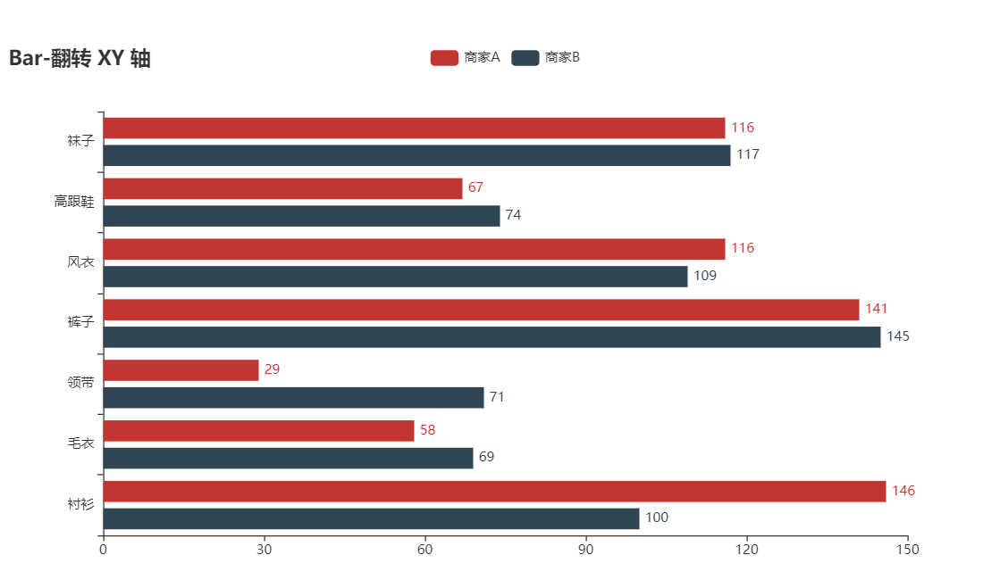


堆叠条形图

```python
c = (
    Bar()
    .add_xaxis(Faker.choose())
    .add_yaxis("商家A", Faker.values(), stack="stack1")
    .add_yaxis("商家B", Faker.values(), stack="stack1")
    .set_series_opts(label_opts=opts.LabelOpts(is_show=False))
    .set_global_opts(title_opts=opts.TitleOpts(title="Bar-堆叠数据（全部）"))
)
```

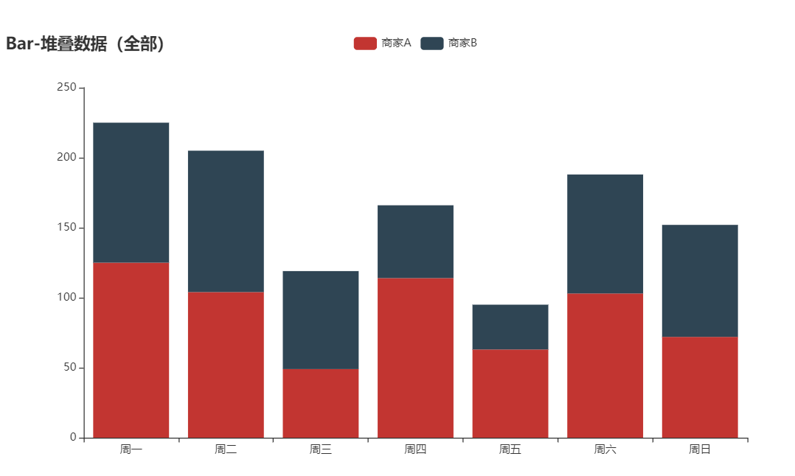


条形图间距

```python
c = (
    Bar()
    .add_xaxis(Faker.choose())
    .add_yaxis("商家A", Faker.values(), category_gap="80%") # 单一数据
    .set_global_opts(title_opts=opts.TitleOpts(title="Bar-单系列柱间距离"))
)
```

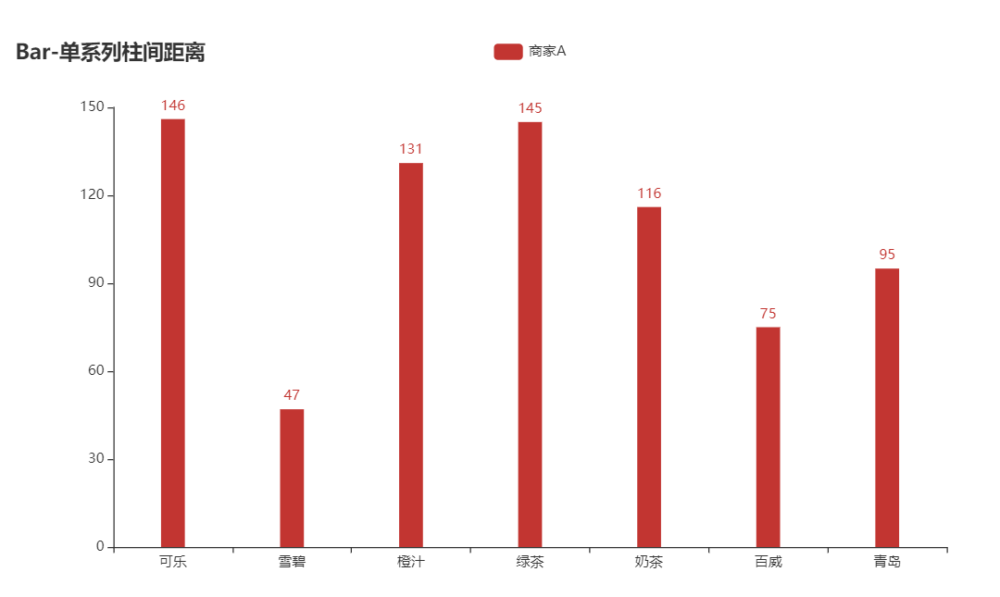

```python
c = (
    Bar()
    .add_xaxis(Faker.choose())
    .add_yaxis("商家A", Faker.values(), gap="0%") # 多组数据
    .add_yaxis("商家B", Faker.values(), gap="0%")
    .set_global_opts(
        title_opts=opts.TitleOpts(title="Bar-不同系列柱间距离"),
    )
)
```

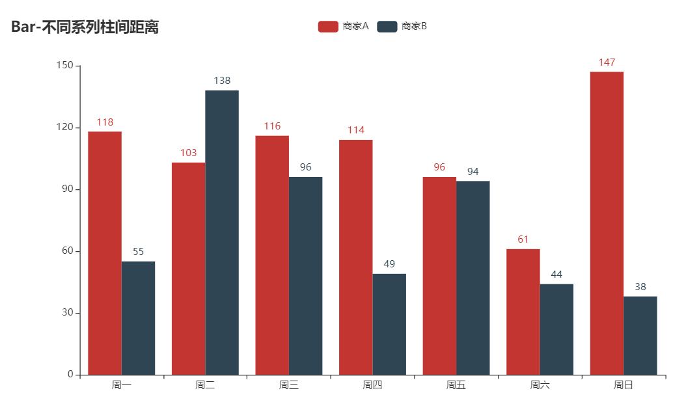


网格条形图

```python
c = (
        Bar()
        .add_xaxis(Faker.choose())
        .add_yaxis("商家A", Faker.values())
        .set_global_opts(
            title_opts=opts.TitleOpts(title="Scatter-显示分割线"),
            xaxis_opts=opts.AxisOpts(splitline_opts=opts.SplitLineOpts(is_show=True)), 
            yaxis_opts=opts.AxisOpts(splitline_opts=opts.SplitLineOpts(is_show=True)),
        )
    )
c.render_notebook()
```

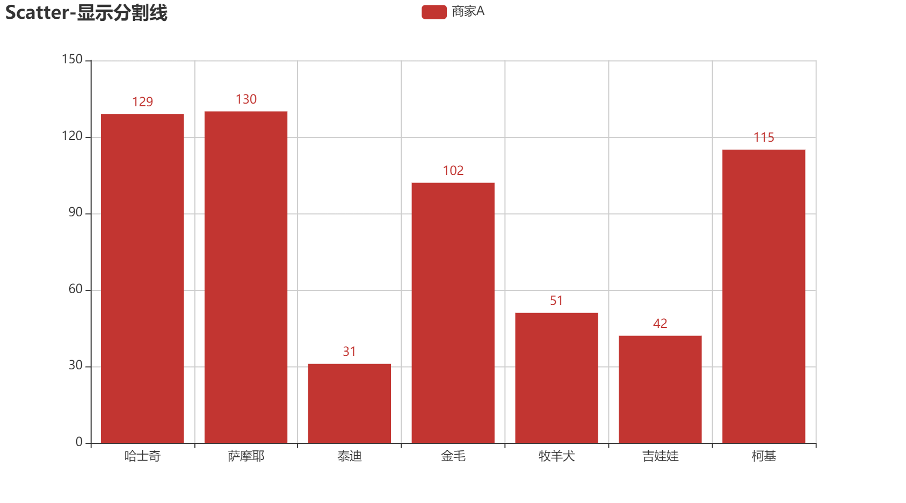


## 散点图

```python
from pyecharts.charts import Scatter
c = (
    Scatter()
    .add_xaxis(Faker.choose())
    .add_yaxis("商家A", Faker.values())
    .set_global_opts(title_opts=opts.TitleOpts(title="Scatter-基本示例"))
)
c.render_notebook()
```


多维散点图 

```python
c = (
    Scatter()
    .add_xaxis(Faker.choose())
    .add_yaxis(
        "商家A",
        [(y,w) for y,w in zip(Faker.values(), Faker.choose())], # y代表高度 w代表点大小
        label_opts=opts.LabelOpts(
            formatter=JsCode(
                "function(params){return params.value[1] +' : '+ params.value[2];}"
            )
        ),
    )
    .set_global_opts(
        title_opts=opts.TitleOpts(title="Scatter-多维度数据"),
        tooltip_opts=opts.TooltipOpts(
            formatter=JsCode(
                "function (params) {return params.name + ' : ' + params.value[2];}"
            )
        ),
        visualmap_opts=opts.VisualMapOpts(
            type_="color", max_=150, min_=20, dimension=1
        ),
    )
)
c.render_notebook()
```


## 地理图

中国地图

```python
from pyecharts.charts import Map
c = (
    Map()
    .add("商家A", [list(z) for z in zip(Faker.provinces, Faker.values())], "china")
    .set_global_opts(
        title_opts=opts.TitleOpts(title="Map-VisualMap（连续型）"),
        visualmap_opts=opts.VisualMapOpts(max_=200),
    )
)
c.render_notebook()
```


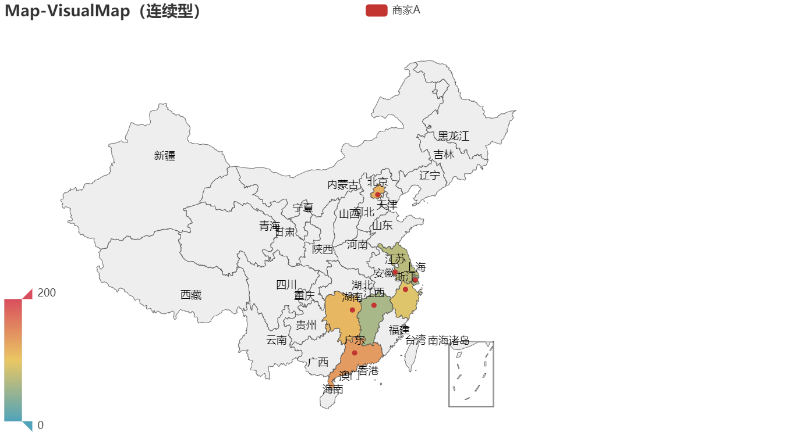


Faker类属性

```python
provinces = ["广东", "北京", "上海", "江西", "湖南", "浙江", "江苏"]
guangdong_city = ["汕头市", "汕尾市", "揭阳市", "阳江市", "肇庆市", "广州市", "惠州市"]
country = [
    "China",
    "Canada",
    "Brazil",
    "Russia",
    "United States",
    "Africa",
    "Germany",
]
```


局部地图

```python
Map()
.add("商家A", [list(z) for z in zip(Faker.guangdong_city, Faker.values())], "广东")
```

世界地图

```python
Map()
.add("商家A", [list(z) for z in zip(Faker.country, Faker.values())], "world")
```