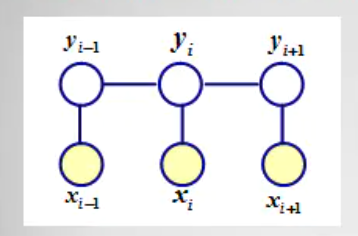
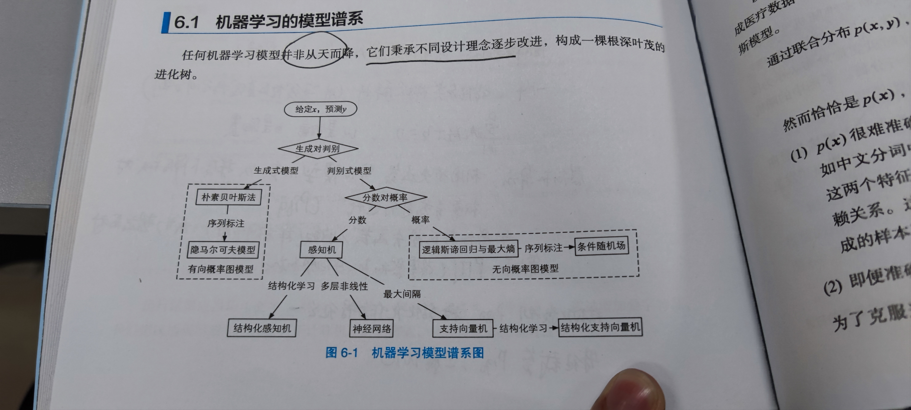

## 概述

自然语言处理层次  


1. 文本形式输入
2. 分词，各种按需标注
3. 信息抽取、句法分析（词语标注词性之后分析语法）、文本分类
4. 语义分析：侧重语义，词义消歧、语义分析 


语料库，分词然后按照需要人工标注不同。（词性标注、命名实体标注、句法分析标注）


自然语言处理工程师历程 ：

* 算法工程师
  * 词典分词
* 机器学习工程师
  * 二元语法
  * 隐马尔可夫HMM
  * 感知机 Perceptron Algorithm 
  * CRF 条件随机场 
* 自然语言处理工程师
  * 词性标注
  * 命名实体识别
  * 信息抽取
  * 文本聚类
  * 文本分类 
  * 句法分析
  * 深度学习


## 词典分词

预定义词典，存在各种词汇。

常见分词算法：

* 正向最长匹配分词、逆向最长匹配分词、双向最长匹配分词
* 字典树： 叶节点作为一个词语的结束标记，从根开始遍历，寻找一条路径。


## 二元语法与中文分词 

语言模型：对语言的数学抽象 。


马尔科夫链简化了语言模型$p(w_t|w_0...w_{t-1})$，原始的语言模型存在缺点:

* 数据稀疏，$p=\frac{count(w_0...w_t)}{count(w_0...w_{t-1})}$ ，很多句子在语料库根本不会出现。
* 计算量大，当序列变长的时候，每个分子分母计算都非常耗时 

假设每个事件的概率仅取决于前面n个状态，n=1时为二元语法 ，常见的为1元、2元、3元。

在2元语法下，$p(w)=\Pi_{t=1}^{k+1}p(w_t|w_{t-1})$  ，**二元接续的重复程度要高于整个句子的重复程度，**这可以缓解部分数据稀疏问题（当n变大时，这个问题会再次凸显）。

用“平滑策略”来解决数据稀疏的问题，也就是用低阶n元语法来平滑高阶n元语法。以2元语法为例：

$p(w_t|w_{t-1})=\lambda p_{ML}(w_t|w_{t-1})+(1-\lambda)p(w_t)$ ，即使前一项概率为0，也能得到后面一项的概率支撑。lambda为常数平滑因子。


n元语法分词步骤：

1. 给定语料库 统计n元词 词频
2. 给定句子，构建词网
3. 利用维特比算法（也是一种路径算法），计算得到起点sos到终点eos的最长路径（最大可能）。


## 隐马尔科夫模型与序列标注

### 序列标注

词典分词的不足：OOV ，袋外词语难以召回

解决思路：将词语的颗粒度降为字符。分词转为序列标注问题。常见的标注方法为`BEMS`，词语首尾BE、词中Middle、单字词S 。

例如

```
参 观 了 北 京 天 安 门
B  E  S B  E  B M  E
```

序列标注要也可以应用在命名实体（现实存在的实体，人名、地名、机构名）。复杂的命名实体多是由短单位组合成长单位，可以将标注对象从字符扩大为词语，并附着属性标签。例如

```
参观 了 北京 天安门
O    O B-地名 E-地名
```

### 隐马尔可夫

隐马尔可夫模型HMM：两个时序序列联合分布的概率模型

* 观测序列x 隐态序列y（可以理解为字符的词性）。隐态序列y是马尔科夫链
* 状态转移概率矩阵：从$y_t$到$y_{t+1}$的`N*N`矩阵，N是状态总和。
* 发射概率矩阵：从$y_t$到$x_{t}$的`N*M`矩阵，N是状态总和，M是x总和。



隐马尔科夫模型最具实际意义的问题当属序列标注，它也是一个基础模型。


### 维特比算法 

列出问题的概率公式，考虑将其最大化。 

第一部分是初始概率，第二部分是状态转移概率，第三部分是发射概率。

$p(x,y)=p(y)p(x|y)=p(y_1)\Pi_{t=2}^{T}p(y_t|y_{t-1})\Pi_{t=1}^{T}p(x_t|y_{t})$

概率搜索的维特比算法：将每个状态作为有向图中的一个节点，节点间的距离由转移概率决定，节点本身的花费由发射概率决定。


## 感知机分类与序列标注

HMM 假设人们说的话仅仅取决于一个隐藏的状态序列`BEMS`，这个假设不符合语言规律。换言之，**HMM捕捉不到更多的语言特征**。

线性模型（**多层感知机**，就是深度学习的LinearModel）可以提取到更多的特征 $\hat y=\sum w_kx_k+b$，**一系列用来提取特征的函数（最简单的就是将每个字编码成独热向量，然后拼接作为特征）以及相应的权重向量**（然后用损失函数反向更新迭代）。 他是传统机器学习方法中最简单最常用的分类模型，用一条线性的直线或高维平面将数据分割。一般而言，维度越高，数据越容易呈现线性可分性。

序列标注可以看做一个多分类问题。 

## 条件随机场与序列标注





NLP问题在机器学习中被归类为 分类 问题（序列标注）。

**根据建模的究竟是联合概率分布$p(x,y)$还是条件概率分布$p(y|x)$，派生出生成式模型与判别式模型。** 

常见的生成式模型$p(x,y)$：隐马尔可夫模型HMM、朴素贝叶斯模型、高斯混合模型GMM、LDA 

常见的判别式模型$p(y|x)$：线性回归、决策树、支持向量机SVM、k近邻、神经网络 


条件随机场（Condional Random Field，CRF）,给定输入随机变量x，求解条件概率$p(y|x)$的概率无向图。用于序列标注时，化为线性链（linear-chain）。

 相比于HMM，CRF能够提取的特征更加丰富，可以自由定义k个特征函数$f(x_t,y_{t-1},y_t)$ 用以提取特征，对每个特征函数赋予权重$w_k$，整个序列的分数$score(y_i|x)=\Pi_t^T {W*f(x_t,y_{t-1},y_t)}$ ，其中$W$是`k*1`的向量，在训练过程中会迭代更新。

在此基础上，遍历所有可能的标注序列y，对score进行归一化，$score=softmax(score)=\frac{e^{score}}{Z}$，$Z=\sum_{y_i}score(y_i|x)$ 

条件随机场、特征函数通俗理解： https://zhuanlan.zhihu.com/p/104562658 


条件随机场与感知机比较：

摘录自《自然语言处理入门》P210

感知机与条件随机场相同点：

* 特征函数相同
* 权重向量相同
* 打分函数相同
* 预测算法相同


**他们最大的不同点在于训练算法**，这是两者准确率差异的唯一原因：

感知机属于在线学习，每次参数更新只使用一个训练实例（`x_i`与`y_hat_i`）。**条件随机场则定义在整个数据集之上，每次参数更新都是全盘考虑。**


在机器学习中，若权重向量的范数太大，意味着模型对自己的判断太过自信，会导致模型过拟合，**丧失泛化能力。常用的手段是正则化——让对数似然函数减去范数**，对那些范数较大的模型施加惩罚。$e=e-\frac{w}{2\sigma^2}$，$\sigma$作为惩罚项控制惩罚力度。

## 词性标注

词性（Part Of Speech）指的是单词的语法分类，一般可以转为如下格式

单词之间以制表符分隔，`单词/词性`

```
张明明/名词 的/动词 希望/动词 是/动词 希望/动词 上学/动词
```


单词的数量无穷，而词性有限。借助词性可以猜测OOV的用法（结合`BEMS`标签），而不是将所有的OOV标记为`UNK`，混为一谈。

```
商 B 名词
品 E 名词
和 S 连词
服 B 名词
务 E 连词 
```


## 命名实体识别

命名实体： 描述实体的词汇，比如人名、地名、机构名等，在不同领域各取所需。

**命名实体识别就是在文本中捕获到命名实体，统计为主（语料库标记），规则为辅（比较规则的实体，人名、网址、商品编号等）。** 颗粒度比较大的情况下，命名实体识别可以通过 分词+词性标注 解决。


## 信息抽取

信息抽取指的是从非结构化的文本中抽取结构化信息的技术，命名实体识别算是信息抽取。

### 新词提取

给定一段文本，随机取一个片段，如何判断这个片段是否是一个词语：**互信息、信息熵**

左右信息熵：**$H(x)=-\sum_x p(x)log{p(x)}$**，衡量片段的左右搭配是否丰富，如果是，那么该片段很有可能就是一个词语

互信息：$I(X,Y)=\sum_{x,y} p(x,y)log{\frac{p(x,y)}{p(x)p(y)}}$，衡量片段内部的搭配是否固定 。互信息越大，两个随机变量的关联就越密切。

统计一个语料库，可以计算某个片段的上述两项指标。例如

> 两只 蝴蝶 飞呀飞
>
> 这些 蝴蝶 飞走了 

“蝴蝶”的左右组合有`{只，些，飞}`，“蝴蝶”两个字的互信息统计整个语料库分别计算“蝴”、“蝶”的字频，同样可以计算。

### 关键词提取

关键词的定义标准不一，很难用有监督学习训练。这里介绍几个无监督学习。

#### 词频统计

关键词通常在文章中反复出现。

词频统计的流程一般是

分词、停用词低频词过滤、按词频取前n个。

#### TF-IDF

词频-倒排文档索引。词频统计的缺陷：出现频次高的不一定是关键词，也有可能是领域的共性词语。

$TF-IDF=\frac{TF(t,d)}{DF(t)}=TF(t,d)*IDF(t)$ ，t代表单词term，d代表文档document。

公式的含义也就是：一个词的重要程度与它在文章中的频次成正比，与文档包含该词的频次成反比。 

#### TextRank

TextRank是PageRank在文本上的应用。

pagerank是一种网页排序算法，它的工作原理是将网页看做有向图，网页视作节点，节点之间的链接视作有向边。每个节点的权重都是1，以迭代方式更新，迭代权重更新表达式：

$S(V_i)=(1-d)+d*\sum _{V_j\in In(V_i)}\frac{S(v_j)}{|Out(v_j)|}$ 

$V_i$是节点，d是0-1之间的常数因子，$In(V_i)$表示节点的入边节点集合，$Out(v_j)$表示节点的出边节点集合。

上述公式表示，一个网站给别的网站做的链接越多，每天外链的权重就越低$\frac{1}{Out}$ ，与每条外链本身的权重成正比$S(v_j)$ 。物以类聚，与垃圾网站交换的往往也是垃圾网站。pagerank捕捉到的刚好是这一点。


### 短语提取 关键句提取

短语提取：广发用在搜索引擎的自动推荐，被分割成多个关键词。、

关键句提取算法：

* BM25：TF-IDF的变种
* TextRank：将一个句子视作待查询句子，相邻句子视作待查询文档，就能得到他们的相似度。


## 文本聚类

将文本表示成向量，作为特征抽取，剩下的算法就与文档本身无关了。

文档的特征提取方式：

* 词袋模型： 文本由若干词语组成，`[w1,...,wn]`，**出现的词语统计词频**，最后得到`1*voc.nums`大小向量。这种方法简单，但是无词序，损失了部分语义。比方说，“人吃鱼”、“鱼吃人”会得到相同的向量表示。另外，**词频不是唯一指标，可以是tf-idf值，或者词向量本身。** 
* 词袋模型中词语的过滤：有些词语不适合作为特征，如英语的the、汉语的“的”
  * 停用词词典
  * 卡方特征（有监督 文本分类）：摘录自P309（卡方、期望、置信度）。卡方检验常用与检验两个事件的独立性。将词语的出现与类别的出现作为两个随机事件，类别独立性越高，越不适合作为特征。


聚类方法：

* k均值：随机选择k（超参数）个点作为初始质心，分类所有向量（距离平方和），然后重新计算质心。如此迭代。


然而，无监督算法无法学习人类的偏好对文档进行划分，也无法学习每个簇的意义（标签）。 

## 文本分类

相比于聚类，文本分类就是多了人工标注，属于有监督学习。


### 朴素贝叶斯

* 贝叶斯公式：$p(x,y)=p(y)p(x|y)=p(x)p(y|x)$ ，y作为标签，x作为特征。朴素贝叶斯的朴素两个字来源于，该算法认为特征之间彼此独立。
* 先验概率 p(y)、p(x|y)容易计算，只需要统计训练集的标签类别、某个标签下特征的概率即可。贝叶斯的最佳输出$y=argmax(\frac{p(X=x|y=c_k)p(Y=c_k)}{p(X=x)})$，由于分子和标签类别无关，实际上只要另分子最大即可 。 


### 支持向量机SVM

**SVM是一个二分类模型**，区别于感知机，在于找到一个更加稳定的分割超平面$w*x+b=0$。 


## 依存句法分析

语法分析：分析句子的语法结构并将其表示为树形结构 。

上下文无关文法（《编译原理》有讲过）：形式化地描述文法产生规则。终结符、非终结符、推导规则。

### 短语结构树

由开始符号推导出句子的结构树。


### 依存句法树

依存句法树不关注如何产生句子，而是句子之间词语之间的语法联系，并将其约束为树形结构。


修饰词、支配词：如果一个词语修饰了另外一个词，被修饰的词语称作“支配词”，修饰的词语称作“修饰词”。


依存句法分析：依存句法树可以看做是完全图的一个子图。如果为完全图中的每天边是否属于句法树打分，然后就可以利用Prim之类的算法找出最大生成树mst作为概率最大的依存句法树输出。


Arc-Eager系统


## 深度学习与自然语言处理

**通过海量无标注样本的无监督训练自动抽取事物特征**，然后在相对少量的标注样本上进行微调，神经网络展现出强大的迁移学习能力。 

### 传统机器学习的局限

#### 数据稀疏

将离散符号转为向量作为机器学习的输入，一般采用独热编码（one hot）。所谓的独热编码（常见的是按照词典序编码），就是在n维向量中，只有1个维度为1，其余为0，形如`[0,...1,0...]`，彼此正交。**这样的向量维度庞大，数据稀疏，而且，词义上相近的两个词语，在向量上可能完全不搭边。**

我们希望任意单词都能表示为具有合理相似的向量，那么OOV的问题就不复存在，**因为模型看到的这个向量，必定和训练集中的某个向量存在较高的相似度**，模型就能将其归为相似单词处理。**这种技术在深度学习中被称作“词嵌入”**。


这来源于一个矛盾，**一方面，高级的NLP任务需要复杂的特征。另一方面，特征模板越复杂**，数据就会越稀疏，例如，一个特定单词很常见，两个组合的单词频率就会大幅降低，三个单词的组合更是如此，那些出现概率极低的组合在统计学上没有任何作用。

另外，在某些特定领域，比如电商、医疗，特征模板的抽取需要人们具备一定的专业知识。

#### 误差传播

传统的机器学习在自然语言处理上是一种流水线的作业，分为很多环节，分词、词性标注、停用过滤词、特征筛选（例如卡方检验）、送入分类器分类。

**这种流水线作业会造成严重的误差传播，前一个环节如果出错，后面的环节就会将错就错**。比如，“质量不过关”，错误地被分成“质量 不过 关”。

### 神经网络（多层感知机）

**在深度学习中，特征模板抽取被多层感知机代替，这正是深度学习的精髓。** 

从最简单的1层感知机开始，$y=w^Tx$ ，通过**权重向量与特征向量的点积**的符号来判断正负。然后是n层的感知机，$y=W^TX$ ，它依然是一个线性模型。**这样的n个单层感知机被称作一个神经元，**它的输入是`n*1`的特征，输出是`n*1`的特征组合判断。

**深度学习的神经元往往被施加一个非线性的激活函数**，常见的是sigmoid($\sigma$)函数。所以，一个神经元的输入输出可以表示为$y^0=\sigma (W^TX^0)$ ，上标表示第几层。前一层的输出就是后一层的输入。**这种非线性的函数被施加多次，就可以模拟任何函数。**

简单地理解，**可以将神经网络看做一个多元的非线性函数`f(x1,x2,...)`，输入是特征向量，输出另一个特征向量h，**其中h的每一维都是原始特征的若干次组合重构（从矩阵乘法的角度考虑）。

#### 稠密向量

神经网络输出的新特征h的长度是可以控制的，可以将h设定的较短（稠密向量），**这样子就实现了从高维向量到低维向量的转变，低维向量在空间上会拉近很多，彼此的相似度就容易体现**。

#### 特征自动抽取

神经网络两层之间一般为全连接，不需要根据具体问题来调整连接方式。**网络会自动根据损失函数的梯度来确定隐藏层的权重矩阵，从而自动学习到事物的特征表示。**

#### 端到端的设计

神经网络层之间、网络之间采用的都是统一的向量”语言“，这就很适合多个网络的组合，形成一种端到端的设计。

深度学习兴起之后，传统机器学的每一个环节都可以被（使用同一个损失函数的）神经网络取代，并且在误差传播方面取得更好的效果。

### word2vec

词向量分析。 

#### CBOW

CBOW（continuous bag of words model）模型是一个词向量的**窗口模型**，**来源于语言学上一个思想：通过一个单词的上下文可以得到它的意思。** 

CBOW模型的处理步骤： 


