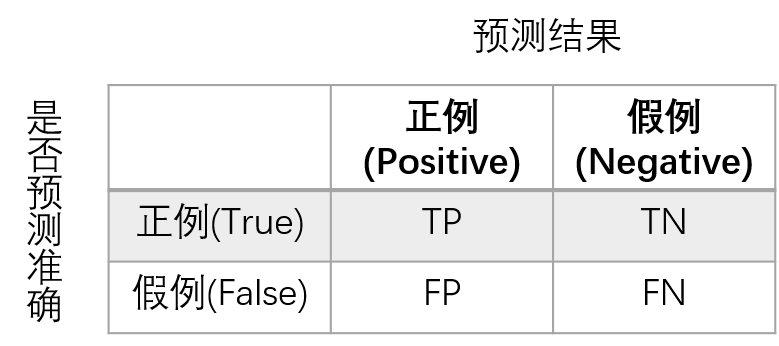
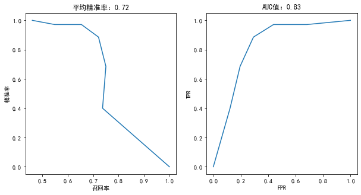
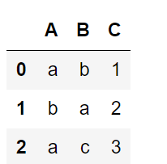
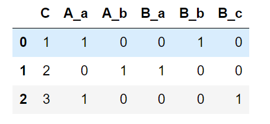
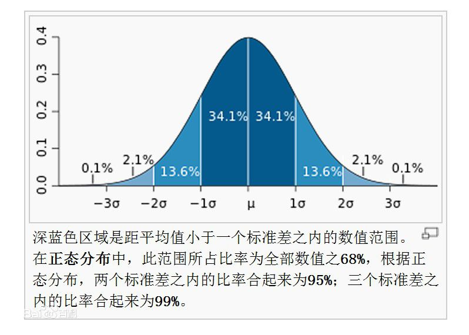
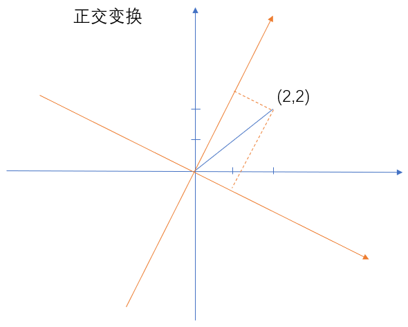
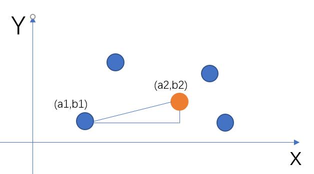
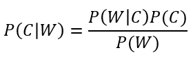
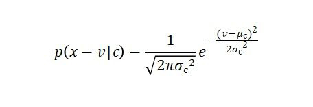
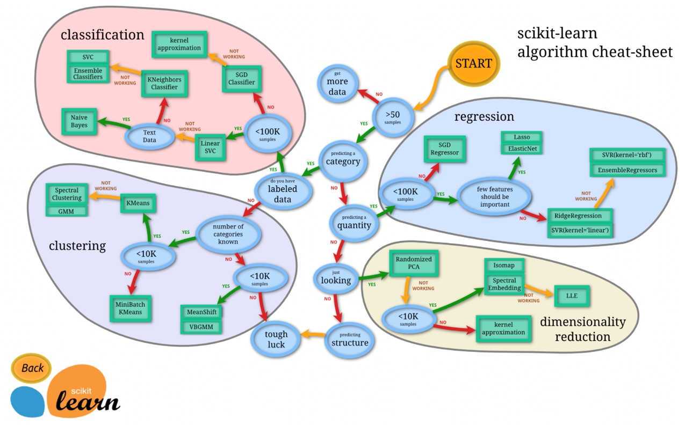

# 机器学习

## 流程

1. 数据清洗
2. 特称抽取
3. 数据集划分
4. 训练
5. 预测


## 过拟合 欠拟合

过拟合：训练集准确率高，测试集准确率低 

* 数据集少 ，模型泛化能力差
* 测试集存在噪音
* 模型复杂，参数过多，训练集相对少，不足以成熟地训练模型。 

欠拟合：训练集、测试集准确率都很低

* 特征过少，不足以表现事物特征 


## 验证集 测试集

验证集、测试集：训练集自动调整权重系数，验证集不参与训练，**用于手动调整模型超参数**。测试集用于评估模型泛化能力，建议使用一次（1.一般测试集数据比较大 2.如果测试集用来调整超参数，**那么你的模型事实上又可能在你的测试集上过拟合了，对于其他的测试集呢？泛化能力不得而知**）。 **验证集不是必须的，它的存在是为了独立出模型超参数调整和泛化能力评估两个步骤**。在跑测试集前，验证集相当于测试集，在训练误差、验证误差中权衡一组不错的超参数作为最后的模型，去跑测试集。


# Scikit-Learn

`scikit-learn`是基于`Python`语言的机器学习工具，建立在`NumPy`，`SciPy`和`matplotlib`上。

`Scikit-learn`内部实现了各种各样成熟的算法，容易安装和使用。另一方面，它不支持深度学习和强化学习，不支持图模型和序列预测，不支持`Python`之外的语言，不支持`PyPy`，也不支持`GPU`加速。

如果不考虑多层神经网络的相关应用，`Scikit-learn`的性能表现是非常不错的。究其原因，一方面是因为其内部算法的实现十分高效，另一方面或许可以归功于`Cython`编译器：通过`Cython`在`Scikit-learn`框架内部生成`C`语言代码的运行方式，`Scikit-learn`消除了大部分的性能瓶颈

`Scikit-learn`的基本功能主要被分为六大部分：`分类`，`回归`，`聚类`，`数据降维`，`模型选择`和`数据预处理（特征工程）`等。


安装：`pip install scikit-learn`

官方文档：https://scikit-learn.org/stable/user_guide.html 


## fit ,fit_transform

fit_transform是fit和transform的结合，**fit和transform没有任何关系，仅仅是数据处理的两个不同环节，fit_transform是一种便捷写法**。

fit相对于整个代码而言，为后续API服务。**fit之后，然后调用各种API方法**，transform只是其中一个API方法

* fit：求得训练集X的固有属性，如均值，方差，最大值，最小值
* transform：在fit的基础上，进行标准化，降维，归一化等操作


## 精确率和召回率

在二分类预测中



T表示预测正确，F表示预测错误。P表示预测阳，N表示预测阴。 **`正例样本=TP+FN`，**


1. 准确率：$A=\frac{TP+FN}{TP+TN+FP+FN}$，预测结果与实际一致的概率 
2. 精确率：$P=\frac{TP}{TP+FP}$，**所有正例预测中**样本为正例的比例（查得准）
3. 召回率：$R=\frac{TP}{TP+FN}$，**所有正例样本中**预测为正例的比例（查的全，**对正样本的区分能力**）。
4. 综合指标`F1`：$F1=\frac{2∗P∗R}{P+R}$，综合考虑P和R的指标


**精确率P和召回率R理论情况下都是越大越好，但是机器学习基于概率预测，这就做不到两者同时都很高**。假设正例概率阈值设的较大，则作出的正例预测往往都基于很大概率，所以查的准，但作出正例预测的次数就比较少（查的不全）。反之，概率阈值设的小，则做出的预测基本都是正例预测，查的比较全，但不一定准，出现实际是负样本而作出正例预测的情况。


**准确率A不足以评价一个模型的好坏，需要综合考虑PR指标。**例如，一个用于癌症检测的空盒子，对所有人都返回“健康”预测，100个人中如果有1个人有癌症，准确率也有99%，精确率为`P=99/100=99%`，召回率为`R=0/1=0%`


**多分类中准确率计算**

```python
>>> from sklearn.metrics import accuracy_score
>>> y_pred = [0, 2, 1, 3]
>>> y_true = [0, 1, 2, 3]
>>> accuracy_score(y_true, y_pred)
0.5
```

PR指标应用于多分类标签时，是逐类计算的。计算其中一种分类的指标时，其余分类看做负类，该类看做正类； 

* micro的计算方式是统计出所有分类的`TP;TN;FN;FP`再做计算，更偏向于整个数据集的表现。
* macro是 分别计算每个类的`P;R;F`，然后求平均。 ([参考](https://www.cnblogs.com/techengin/p/8962024.html))


**sklearn中A P R F1指标的单独计算**

```python
from sklearn.metrics import precision_score,recall_score,f1_score
from sklearn.neighbors import KNeighborsClassifier

# 1. K近邻
knn = KNeighborsClassifier(n_neighbors=5)
scores = cross_val_score(knn,features_temp,targets,cv=5)
print("准确率：",scores.mean())

knn.fit(X_train,y_train)

y_predict = knn.predict(X_test)
# 精准率
print("精准率：",precision_score(y_test,y_predict))
# 召回率
print("召回率：",recall_score(y_test,y_predict))
# F1-Score
print("F1得分：",f1_score(y_test,y_predict))
```


**精准率召回率曲线绘制**

关键是得到一组PR值。

 `sklearn.metrics.precision_recall_curve(y_true, probas_pred, pos_label=None)` :

* y_true：真实样本
* probas_pred：对正概率的预测概率
* pos_label：样本如果不是以0-1、-1-1区分，需要显式指定 

返回：三元组，p、r、概率阈值。**原理是移动一次概率阈值得到一对pr指标**。

```python
import numpy as np
from sklearn.metrics import precision_recall_curve
y_true = np.array([0, 0, 1, 1])
y_scores = np.array([0.1, 0.4, 0.35, 0.8]) # 正例预测概率 
# precision, recall 得到后就可以画图 
precision, recall, thresholds = precision_recall_curve(
    y_true, y_scores) 
```

```
>>> precision
array([0.66666667, 0.5       , 1.        , 1.        ])
>>> recall
array([1. , 0.5, 0.5, 0. ])
>>> thresholds
array([0.35, 0.4 , 0.8 ])
```

**在实际评估模型时，为了得到正例预测概率序列，使用`estimator.predict_proba(features)` ，返回概率序列。**

```python
print(knn.predict_proba(X_test)) 
'''
ndarray n_samples * n_classes(N,P)  
[[0.4 0.6]
 [0.2 0.8]
 [0.  1. ]
 [1.  0. ]
'''
```


## ROC AUC

ROC曲线理解：https://www.jianshu.com/p/2ca96fce7e81 

```python
from sklearn.metrics import precision_recall_curve,roc_curve,average_precision_score,auc 
def plotting(estimator,y_test):
	'''
	绘制 PR曲线 ROC曲线 
	'''
    fig,axes = plt.subplots(1,2,figsize=(10,5))
    y_predict_proba = estimator.predict_proba(X_test) # 概率序列
    # PR曲线
    precisions,recalls,thretholds = precision_recall_curve(y_test,y_predict_proba[:,1])
    axes[0].plot(precisions,recalls)
    axes[0].set_title("平均精准率：%.2f"%average_precision_score(y_test,y_predict_proba[:,1]))
    axes[0].set_xlabel("召回率")
    axes[0].set_ylabel("精准率")
	# ROC曲线
    fpr,tpr,thretholds = roc_curve(y_test,y_predict_proba[:,1])
    axes[1].plot(fpr,tpr)
    axes[1].set_title("AUC值：%.2f"%auc(fpr,tpr)) # AUC 面积 
    axes[1].set_xlabel("FPR")
    axes[1].set_ylabel("TPR")
```





# 特征工程

## 特征抽取

## onehot编码

`pandas.get_dummies` ，对离散型数据编码。

```python
s = pd.Series(list('abca'))
pd.get_dummies(s1)
```

每一行作为一个向量，每一列是一个维度分量。

```
   a  b  c
0  1  0  0
1  0  1  0
2  0  0  1
3  1  0  0
```

df数据

```python
df = pd.DataFrame({'A': ['a', 'b', 'a'], 'B': ['b', 'a', 'c'],
                   'C': [1, 2, 3]})
```



```python
pd.get_dummies(df)
# 提取每一列的值 C是整数变量 并未变化
```



### 字典特征抽取

**对字典的非数值型键值对进行one-hot编码**。

```python
from sklearn.feature_extraction import DictVectorizer
fruits = [{"fruit":"苹果","price":5},
          {"fruit":"橘子","price":5.9},
          {"fruit":"菠萝","price":9.9}]  # 列表类型
vect = DictVectorizer()
result = vect.fit_transform(fruits)  # 返回sparse 矩阵
```

`result`返回的是一个`sparse`矩阵，是`scipy`库中的数据类型。`sparse`的特点是可以节省内存，因为他只会记录`result.toarray()`这个列表中哪些位置出现了非0的值，以及具体的值。

```
(0, 1)	1.0
(0, 3)	5.0
(1, 0)	1.0
(1, 3)	5.9
(2, 2)	1.0
(2, 3)	9.9
```

```python
print(result.toarray()) # 转换成ndarray类型查看 与saprse矩阵对比查看
```

每一行的格式：`ont-hot向量 标签`

```
[[0.  1.  0.  5. ] 
 [1.  0.  0.  5.9]
 [0.  0.  1.  9.9]]
```

打印特征名

```python
print(vect.get_feature_names())
# ['fruit=橘子', 'fruit=苹果', 'fruit=菠萝', 'price']
```


vec常用方法：

- `fit_transform(X)`：转化列表`X`。
- `inverse_transform`：将`numpy`数组或者`sparse`矩阵转换成列表。
- `get_feature_names()`：获取`fit_transform`后的数组中，每个位置代表的意义。
- `toarray()`：将`sparse`矩阵转换成多维数组


### 文本特征抽取

`sklearn.feature_extraction.text.CountVectorizer` ，以词为单位one-hot编码，且统计。


```python
from sklearn.feature_extraction.text import CountVectorizer
vect = CountVectorizer()
# 列表的每个元素 模拟 一篇文章 出现若干单词
result = vect.fit_transform(['life is short,i need python',
                             'life is long,i do not need python',
                             'life life life']) # 最后一句是为了对比
print(result.toarray())
print(vect.get_feature_names()) # 特征顺序 
```

```
[[0 1 1 0 1 0 1 1]
 [1 1 1 1 1 1 1 0]
 [0 0 3 0 0 0 0 0]]
['do', 'is', 'life', 'long', 'need', 'not', 'python', 'short']
```

第3句的life出现了3次。


CountVectorizer只支持空格分词，因此中文文档需要先使用要第三方库分词，再用空格连缀。

```python
import jieba
def countvect():
  word1 = "周密说，受到影响的应该说是某些特定领域的产品，不是全部的产品。"
  word2 = "装假固然不好，处处坦白，也不成，这要看是什么时候。和朋友谈心，不必留心，但和敌人对面，却必须刻刻防备，我们和朋友在一起，可以脱掉衣服，但上阵要穿甲。"
  word3 = "伟大的成绩和辛勤的劳动成正比例，有一分劳动就有一分收获，日积月累，从少到多，奇迹就可以创造出来。"

  punct = set(u''':!),.:;?]}¢'"、。〉》」』】〕〗〞︰︱︳﹐､﹒
﹔﹕﹖﹗﹚﹜﹞！），．：；？｜｝︴︶︸︺︼︾﹀﹂﹄﹏､～￠
々‖•·ˇˉ―--′’”([{£¥'"‵〈《「『【〔〖（［｛￡￥〝︵︷︹︻
︽︿﹁﹃﹙﹛﹝（｛“‘-—_…''') # 非常规符号
  filterpunt = lambda s: ''.join(filter(lambda x: x not in punct, s)) # 过滤

  con1 = " ".join(jieba.cut(filterpunt(word1))) # 连缀
  con2 = " ".join(jieba.cut(filterpunt(word2)))
  con3 = " ".join(jieba.cut(filterpunt(word3)))

  vect = CountVectorizer()
  result = vect.fit_transform([con1,con2,con3])
  print(result.toarray())
  print(vect.get_feature_names())
    
countvect() 
```

### tf-idf文本抽取

`tf-idf`（`tf(term frequency) idf(inverse document frequency)`）是一种用于信息检索与文本挖掘的常用加权技术。`tf-idf`是一种统计方法，用以评估一字词对于一个文件集的重要程度。**字词的重要性随着它在文件中出现的次数成正比增加，但同时会随着它在语料库中出现的频率成反比下降。** 

假如现在总共有1000个文档，“共享”这个词在500个文档中出现了，并且`A`文档中总共有800个词，“共享”出现了12次，那么`tf-idf`的值为：`(12/800)*lg(1000/500)`。 

```python
import jieba
from sklearn.feature_extraction.text import TfidfVectorizer
def tfidf():
    word1 = "共享单车确实烧钱，但这在中国创业圈里很常见，从打车到外卖都干过，雷布斯也语重心长，“创业还是要有烧不完的钱”，只不过共享单车烧得既没品味，也没技术含量，最后还引火烧身，几十亿美元落得这个结局，谁都没想到。"
    word2 = "在人工智能已经深入生活的今天，社会上不乏“人工智能威胁论”，担忧机器人会“反噬”人类。在这篇文章里，李开复博士讨论了人工智能技术未来发展所带来的几个更真切和亟待解决的问题：全球性的失业问题及可能产生的全球性经济失衡和贫富差距。"
    word3 = "从2009年到现在，鲨鱼投资者虽还在股海遨游，但胆子越来越小。折腾了N年，发现股票超出了我的认知范围，了解一家公司，难！股票行情，波动太大，小心脏受不了"
    
	punct = set(u''':!),.:;?]}¢'"、。〉》」』】〕〗〞︰︱︳﹐､﹒
﹔﹕﹖﹗﹚﹜﹞！），．：；？｜｝︴︶︸︺︼︾﹀﹂﹄﹏､～￠
々‖•·ˇˉ―--′’”([{£¥'"‵〈《「『【〔〖（［｛￡￥〝︵︷︹︻
︽︿﹁﹃﹙﹛﹝（｛“‘-—_…''') # 非常规符号
	filterpunt = lambda s: ''.join(filter(lambda x: x not in punct, s)) # 过滤

    
    tf = TfidfVectorizer() 
    con1 = " ".join(jieba.cut(filterpunt(word1)))
    con2 = " ".join(jieba.cut(filterpunt(word2)))
    con3 = " ".join(jieba.cut(filterpunt(word3)))
    result = tf.fit_transform([con1,con2,con3])
    print(result)
    print(tf.get_feature_names())

tfidf()
```

## 特征预处理

1. 数值型数据：
   - 归一化（将原始数据变换到[0,1]之间）
   - 标准化（把数据转化到均值为0，方差为1f范围内）
   - 缺失值（将缺失值处理成均值、中位数等）
2. 类别型数据：
   - 降维（将多指标转化为少数几个综合指标）
   - PCA（降维的一种）
3. 时间类型：
   - 时间的切分

### 标准化 

标准化公式：$x=\frac{x-\mu}{\sigma}$ 



scikit库有专门的标准化器

```python
from sklearn.preprocessing import StandardScaler 
def standard():
  data = [
    [180, 75, 25],
    [175, 80, 19],
    [159, 50, 40],
    [160, 60, 32]
  ]
  scaler = StandardScaler()
  result = scaler.fit_transform(data) # ndarray
  print(result) 
  print("="*10) 
  print(scaler.var_)
```

### 缺失值处理

缺失值一般有两种处理方式。第一种是直接进行删除，第二种是进行替换。除非缺失值占总数据集的比例非常少，才推荐使用删除的方式，否则建议使用“平均值”、“中位数”的方式进行替换。在`scikit-learn`中，有专门的缺失值处理方式，叫做`sklearn.preprocessing.Imputer`。示例代码如下：

```python
from sklearn.impute import SimpleImputer
def missing():
  im = SimpleImputer()
  data = im.fit_transform([
    [1,2],
    [np.NAN,4],
    [9,1]
  ])
  print(data)
```

### 数据降维

一个数据集中的特征可能会有以下问题：

1. 冗余：部分特征的相关度高，容易消耗计算性能。
2. 噪声：部分特征对预测结果有负影响。

#### 特征选择

特征选择：选择合适的特征作为训练特征

1. Filter（过滤式）：`VarianceThreshold`，删除所有低方差的特征。方差越小，说明数据越集中，对于整个结果影响并不大
2. Embedded（嵌入式）：正则化、决策树


过滤选择：过滤式的特征选择是

```python
from sklearn.feature_selection import VarianceThreshold
from sklearn.preprocessing import StandardScaler

data = [
  [0, 2, 0, 3],
  [0, 1, 4, 3],
  [0, 1, 1, 3]
]

var = VarianceThreshold(threshold=2)  # 方程<=2 的删除
result = var.fit_transform(data)
print(result)
```

只有第3个特征被保留

```
[[0]
 [4]
 [1]]
```


#### PCA主成分分析

主成分分析（`Principal Component Analysis，PCA`），是一种统计方法，**通过正交变换将一组可能存在相关性的变量转换为一组线性不相关的变量**，转换后的这组变量叫主成分。

很多情形，变量之间是有一定的相关关系的，**他们表达的信息有一定的重叠**。主成分分析做的事情，就是删去多余的（关系紧密）的变量，建立尽可能 少的新变量，**使得这些新变量是两两不相关的，且尽可能保持原有的信息**。


PCA的思想：朝着方差大的方向变化，蓝色是原有坐标(2,2)（假设这是一个二维特征列），黄色是变化后坐标，方差变大。




```python
from sklearn.decomposition import PCA

def pca_decomposition():
  pca = PCA(n_components=0.9)
  result = pca.fit_transform(
    [
      [4,2,76,9],
      [1,192,1,56],
      [34,5,20,90]
    ]
  )
  print(result)
```


# 分类

## `scikit-learn`数据集

`sklearn`内部提供了一些数据集，用于学习使用。

### 获取数据集

获取数据集的方式有两种，有`load_*`和`fetch_*`以下：

1. `sklearn.datasets.load_*()`：获取**小规模**的数据集，数据集已经随着`scikit-learn`安装而下载到本地了。
2. `sklearn.datasets.fetch_*(data_home=None)`：用于从远程获取**大规模**的数据集，函数的第一个参数是`data_home`，表示数据集下载的目录,默认是`~/scikit_learn_data/`。、

两种方式返回的结果都是`sklearn.utils.Bunch`（类字典对象，不是DataFrame），这种数据类型有以下方法和属性：

1. `data`：**特征数据**数组，是`[n_samples * n_features]`的二维`numpy.ndarray`数组。
2. `target`：**标签**数组，是`n_samples`的一维`numpy.ndarray`数组。
3. `DESCR`：数据描述。
4. `feature_names`：特征名，
5. `target_names`：标签名


#### **本地数据集**

数据集网址：https://scikit-learn.org/stable/modules/generated/sklearn.datasets.load_boston.html#sklearn.datasets.load_*

分类数据集：

1. `load_iris`：鸢尾花花瓣数据集。
2. `load_digits`：手写数字数据集。
3. `load_wine`：红酒数据集。
4. `load_breast_cancer`：乳腺癌数据集


回归数据集

1. `load_boston`：波士顿房价数据集。
2. `load_diabetes`：糖尿病数据集。
3. `load_linnerud`：体能训练数据集。


#### **远程数据集**

1. `fetch_olivetti_faces`：面孔数据集。
2. `fetch_20newsgroups`：20个新闻组数据集。
3. `fetch_lfw_people`：户外人脸识别数据集。
4. `fetch_lfw_pairs`：户外人脸对（同一个人两个图片）数据集。
5. `fetch_covtype`：美国一块30*30m的森林斑块土地，上面覆盖了不同类型的树木。
6. `fetch_rcv1`：路透社文集I (RCV1)。由路透社有限公司为研究目的提供的80多万篇手动分类的新闻专线报道的存档。
7. `fetch_california_housing`：加利福尼亚房子数据集


```python
from sklearn import datasets
b_data=datasets.load_boston()  # 本地数据 
n_data=datasets.fetch_20newsgroups() # 远程数据
```


### 数据集划分

划分数据集为训练集、测试集。使用`sklearn.model_selection.train_test_split`进行分割。

传入参数：

1. `x`：数据集的特征值。
2. `y`：数据集的目标值。
3. `test_size`：测试的数据的占比，用小数表示。

返回元组，`x_train,x_test,y_train,y_test`，分别表示训练特征数据、测试特征数据、训练标签数据、测试标签数据。

```python
x_train,x_test,y_train,y_test = train_test_split(x=li.data, # 特征数据
                                                 y=li.target, # 标签数据
                                                 test_size=0.25) # 分割集 
```


## K近邻算法

### 原理

取样本周边的k个最近点（基于欧式距离），如果它们中的大多数属于某一个类别，则该样本也属于这个类别。



`K`值不能取太少，也不能取太多。如果取太少，则容易受异常点的影响，如果取太多，则容易产生过拟合的现象，也会影响分类的准确性。因此要不断的调参数，来看下参数对最终结果的影响。


K近邻算法的优缺点

1. 优点：简单，易于理解，无需估计参数，训练时间为0。
2. 缺点：懒惰算法，对测试样本分类时的计算量大，内存开销大。`K`值要不断的调整来达到最优的效果。

基于以上优缺点，在小数据场景，几千~几万的数据量的时候，可以使用`K`近邻


### 实现

`sklearn.neighbors.KNeighborsClassifier(n_neighbors=5,algorithm='auto')`：

1. `n_neighbors`：`int`，可选（默认= 5），`k_neighbors`查询默认使用的邻居数。
2. `algorithm`：可选用于计算最近邻居的算法。
   - `ball_tree`：将会使用`BallTree`。
   - `kd_tree`：将使用`KDTree`。
   - `auto`：将尝试根据传递给fit方法的值来决定最合适的算法 (不同实现方式影响效率)


```python
# 预测酒分类 
wine_data=datasets.load_wine()
x,y=wine_data.data,wine_data.target

# 标准化 特征
scaler=StandardScaler()
x=scaler.fit_transform(x)

x_train,x_test,y_train,y_test=train_test_split(x,y,test_size=0.25) # 25%用于测试

# 训练分类
knn=KNeighborsClassifier()
knn.fit(x_train,y_train) 
y_predict=knn.predict(x_test)
#print(y_predict)
print('score:%.2f' % knn.score(x_test,y_test)) # 注意参数是 x_test 
```


## 朴素贝叶斯

基于贝叶斯公式$P(A|B)=\frac{P(AB)}{P(B)}=\frac{P(B|A)P(A)}{P(B)}$ ，由结果推原因（后验概率）。


文档分类例子中贝叶斯公式的使用



w表示关键词，c表示文章分类。$p(c|w)$表示关键词w下属于分类c的概率，$p(w|c)$表示文章分类c下出现关键词w的概率。

比如现在有以下表格：

| 特征   | 科技类 | 娱乐类 | 汇总 |
| ------ | ------ | ------ | ---- |
| 明星   | 9      | 51     | 60   |
| 影院   | 8      | 56     | 64   |
| 云计算 | 63     | 0      | 63   |
| 支付宝 | 20     | 15     | 35   |
| 汇总   | 100    | 121    | 221  |

假如现在有一篇文章包含“影院”、“支付宝”、“云计算”，要计算属于科技类和娱乐类的概率。计算方式如下：

``` 
P(科技|影院,支付宝,云计算)=P(影院,支付宝,云计算|科技)*P(科技)/P(影院,支付宝,云计算) 
= (8/100)*(20/100)*(63/100)*(100/221)/P

P(娱乐|影院,支付宝,云计算)=P(影院,支付宝,云计算|娱乐)*P(娱乐)/P(影院,支付宝,云计算)
= (8/121)*(15/121)*(0/121)*(121/221)/p

分母部分相同，比较分子即可，科技 的概率要高于 娱乐。该文章属于 科技 的可能性要高。

娱乐类下，出现支付宝的次数为0，是因为样本偏少
```

在实际计算时，为了防止大量0概率出现，使用拉普拉斯平滑系数。$𝑃(W│C)=(𝑁𝑖+𝛼)/(𝑁+𝛼𝑚)$

1. `𝑁𝑖`为该`W`词在`C`类别所有文档中出现的次数。
2. `N`为所属类别`C`下的文档所有词出现的次数和。
3. `𝛼`就是为指定的系数，一般为1。
4. `m`为训练文档中统计出的特征词个数。


```python
# 文章分类 贝叶斯
from sklearn.datasets import fetch_20newsgroups
from sklearn.naive_bayes import MultinomialNB # 多项式贝叶斯分类
from sklearn.feature_extraction.text import CountVectorizer # 词向量one-hot
from sklearn.model_selection import train_test_split

newsgroups = fetch_20newsgroups(data_home="./data") # data部分每一行是一篇文章 字符串序列
X_train,X_test,y_train,y_test = train_test_split(newsgroups.data,newsgroups.target,test_size=0.25)

# 将每篇文章转为向量 [word_is_shown ]*vocab_size  
tf = CountVectorizer()
X_train = tf.fit_transform(X_train)
X_test = tf.transform(X_test) # 在上一步已经fit过了

mnb = MultinomialNB()
mnb.fit(X_train,y_train)
mnb.score(X_test,y_test)
```


**针对不同的特征数据，我们有不同的朴素贝叶斯模型来进行分类**。原理都是朴素贝叶斯公式，只不过不同的模型，在计算概率的时候采用的方式不一样。

1. 如果特征是离散型数据，比如文本这些，那么推荐使用多项式模型来实现`sklearn.navie_bayes.MultinomialNB`

2. 如果特征是连续型数据，比如具体的数字，那么推荐使用高斯模型来实现`sklearn.navie_bayes.GaussianNB` 

   

3. 如果特征是连续型数据并且值只有`0`和`1`两种情况，那么推荐使用伯努利模型`sklearn.navie_bayes.BernoulliNB`


朴素贝叶斯发源于古典数学，有稳定的分类效率。由于使用了样本特性条件独立性，如果样本特性有关联的时候，会影响算法的效果

## 决策树

### 原理

决策树分支算法：

1. ID3：`ID3`算法采用**信息增益**来创建决策树。信息增益虽然效果不错，但是他是偏向选择分支多的属性，会导致过度拟合，因此一般不会采用此算法。 
2. C4.5：采用**信息增益比**来创建，对分支过多的情况进行惩罚，算法效率偏慢
3. CART：采用了**基尼(Gini)系数**来进行分类 

每次分支选择影响最大的特征。


预剪枝：

预剪枝就是**在决策树的建立过程中不断的调节**，可以调节的条件有：

1. 树的深度：如果在决策树建立过程中，发现深度超过指定的值，那么就不再分了。
2. 叶子节点个数：同上。
3. 叶子节点样本数：如果某个叶子节点的个数已经低于指定的值，那么就不会再分了。
4. 信息增益量/Gini系数：计算信息增益量或者Gini系数，如果小于指定的值，那么也不会再分了。

以上的参数，都需要在建模的过程中，不断的调节，来达到最优。

预剪枝可以有效的降低过拟合现象，显著的减少了训练时间开销。由于预剪枝是通过限制一些建树的条件来实现的，这种方式容易导致欠拟合


后剪枝：

后剪枝就是在决策树建立完成后再进行的，比较剪枝前后的损失，选择损失小的做法。

后剪枝通常比预剪枝保留更多的分支，欠拟合风险比预剪枝要小，但是因为后剪枝是在树建立完成后再自底向上对所有非叶子节点进行逐一考察，因此训练时间开销比预剪枝要大得多。

### 实现

在`sklearn`中，可以通过`sklearn.tree.DecisionTreeClassifier`来实现决策树，这个类有以下参数：

1. **criterion**：`gini`或者`entropy`的方式。
2. `splitter`：`best`或`random`。`best`是在所有特种中找最好的切分点，`random`是随机的找一些特征来进行切分（数据量大的时候用`random`）
3. **max_depth**：树的最大深度。当特征或者数据量比较小的时候可以不用管这个值。特征比较多的时候可以尝试限制一下。
4. **min_samples_split**：决策树中某个叶子节点的样本最小个数。如果数据量不大，不需要管这个值，如果样本量比较大，则推荐增大这个值。
5. `min_weight_fraction_leaf`：叶子节点所有样本权重和的最小值。如果小于这个值，则会和兄弟节点一起被剪枝，默认是0，也就是不考虑权重的问题。一般来说，如果我们有较多样本有缺失值，或者分类树样本的分布类别偏差很大，就会引入样本权重，这时我们就要注意这个值了。
6. **max_leaf_nodes**：最大的叶子节点的个数。默认是`None`，即不限制叶子节点的个数。如果设置了这个值，那么在决策树建立的过程中优化叶子节点的个数。如果特征不多，可以不考虑这个值，但是如果特征分多的话，可以加以限制。
7. `class_weight`：指定样本各特征的权重，主要是为了方式某些特征的样本过多导致偏向这些特征。默认是`balance`，也就是算法会自动的调节权重。
8. **min_impurity_decrease**：最小的不纯度（基尼系数、信息增益等）。如果小于这个数，那么就不会再往下生成叶子节点了。


```python
# 泰坦尼克 获救预测
from sklearn.tree import DecisionTreeClassifier  # 决策树
from sklearn.model_selection import train_test_split 
from sklearn.feature_extraction import DictVectorizer # 字典向量
import numpy as np

titanic = pd.read_csv("data/titanic.txt")
features = titanic[['pclass','age','sex']]
features['age'].fillna(features['age'].mean(),inplace=True)  # 填充缺失
targets = titanic['survived']

X_train,X_test,y_train,y_test = train_test_split(features,targets,test_size=0.25)

vect = DictVectorizer(sparse=False)  # 转换字典的键为one hot向量 
X_train = vect.fit_transform(X_train.to_dict(orient='records'))
X_test = vect.transform(X_test.to_dict(orient="records"))

tree = DecisionTreeClassifier()
tree.fit(X_train,y_train)
tree.score(X_test,y_test)
```


### 绘制决策树

在`sklearn`中，可以通过`sklearn.tree.export_graphviz`来将树结构导出为`.dot`文件，然后再到这个网站：`https://www.graphviz.org/download/`下载`graphviz`软件，这个软件可以将`.dot`文件转为`png`格式。`graphviz`安装完成后，记得把安装路径下的`bin`目录，添加到环境变量`PATH`中。然后再在cmd终端使用命令`dot -Tpng 生成的dot文件.dot -o tree.png`将`dot`文件转换为`png`文件。

其中`sklearn.tree.export_graphviz`函数有许多参数，我们了解下以下几个参数：

1. `decision_tree`：决策树，就是`DecisionTreeClassifier`的对象。
2. `out_file`：生成`.dot`文件的路径。
3. `feature_names`：特征名称，方便在生成树的时候能在节点看到特征名称。通过`get_feature_names`来获取，不能乱填。
4. `class_names`：分类的类名。如果设置了，他是按照`target`分类的数值从小到大进行排序，所以在指定具体名称的时候，应该根据排序的顺序来。

示例代码如下：

```python
export_graphviz(classifier,"tree.dot",feature_names=['age', '1st', '2nd', '3rd', 'female', 'male']
```


## 随机森林

集成算法包含（bagging/boosting/stacking）在机器学习中，随机森林是一个包含多个决策树的分类器，其输出的类别是由所有树输出的类别的众数决定。例如, 如果你训练了`5`个树, 其中有`4`个树的结果是`True`, 1个数的结果是`False`, 那么最终结果会是`True` 。

在前面的决策当中我们提到，一个标准的决策树会根据每维特征对预测结果的影响程度进行排序，进而决定不同的特征从上至下构建分裂节点的顺序，如此以来，所有在随机森林中的决策树都会受这一策略影响而构建的完全一致，从而丧失的多样性。**所以在随机森林分类器的构建过程中，每一棵决策树都会放弃这一固定的排序算法，转而随机选取特征。** 


学习算法

1. 用`N`来表示训练用例（样本）的个数，`M`表示特征数目。
2. 输入特征数目`m`，用于确定决策树节点分裂，其中`m`应远小于`M`。
3. 从`N`个训练用例（样本）中以有放回抽样的方式，取样`N`次，形成一个训练集（即`bootstrap`取样），并用未抽到的用例（样本）作预测，评估其误差。
4. **对于每一个节点，随机选择`m`个特征**，计算其最佳的分裂方式。


`sklearn`实现随机森林：

```
class sklearn.ensemble.RandomForestClassifier(n_estimators=10, criterion=’gini’,max_depth=None, bootstrap=True, random_state=None)
```

参数介绍：

1. `n_estimators`：`integer`，`optional（default = 10）`森林里的树木数量。
2. `criteria`：`string`，可选（default =“gini”）分割特征的测量方法。
3. `max_depth`：`integer`或`None`，可选（默认=无）树的最大深度 。
4. `bootstrap`：`boolean`，`optional（default = True）`是否在构建树时使用放回抽样。


获取特征重要性 `rnn.feature_importances_`，返回ndarray 

```python
# 获取随机森林训练过程中的特征重要性 并为其编写索引 
importances = pd.Series(data=knn.feature_importances_,
                        index=features_name).sort_values(ascending=False)
sns.barplot(y=importances.index,x=importances.values,orient='h')
```


# 回归



## 线性回归

正规方程的线性回归用的是`sklearn.linear_model.LinearRegression`，梯度下降用的是`sklearn.linear_model.SGDRegressor`。

在预测完成后，我们想要知道预测的好坏的指标，可以通过以下几种方式进行判别：

1. 均方误差：`sklearn.metrics.mean_squared_error(y_true, y_pred)`。（误差平方和的均值）。
2. 平均绝对误差：`sklearn.metrics.mean_absolute_error(y_true, y_pred)`（误差的平均）。

都是越小越好。


```python
# 用线性回归来预测波士顿房价。
from sklearn.datasets import load_boston
from sklearn.model_selection import train_test_split
from sklearn.preprocessing import StandardScaler
from sklearn.linear_model import LinearRegression,SGDRegressor  # 线性回归,SGD
from sklearn.metrics import mean_squared_error  # 均方误差

# 加载数据
boston = load_boston()
# 分割数据
feature_train,feature_test,target_train,target_test = train_test_split(boston.data,boston.target)

# 标准化数据
scaler_feature = StandardScaler()  # 标准化 特征
feature_train = scaler_feature.fit_transform(feature_train)
feature_test = scaler_feature.transform(feature_test)

scaler_target = StandardScaler() # 标准化标签
target_train = scaler_target.fit_transform(target_train.reshape(-1,1))
target_test = scaler_target.transform(target_test.reshape(-1,1))

# 线性回归(正规方程)
linear = LinearRegression()  
linear.fit(feature_train,target_train)
predict_target_test = scaler_target.inverse_transform(linear.predict(feature_test)) #拟标准 
# 计算下正规方程的效果
mean_squared_error(scaler_target.inverse_transform(target_test),predict_target_test)

# 线性回归（梯度下降）
sgd = SGDRegressor()
sgd.fit(feature_train,target_train)
predict_target_test = scaler_target.inverse_transform(sgd.predict(feature_test))
# 计算下梯度下降的效果
mean_squared_error(scaler_target.inverse_transform(target_test),predict_target_test)
```

## 岭回归

正则化出现的目标，就是为了防止过拟合的现象，公式如下：

$J(θ)=MSE(θ)+λ\frac12∑_i^nθ_i^2$ 

`λ`越大，说明惩罚力度是越大的。但是并不是越大越好，太大了，可能会导致模型处理拟合得不好，导致最终预测评分更低。

岭回归，就是加入了正则惩罚项的回归，可以用`sklearn.linear_model.Ridge`来实现：

```python
from sklearn.linear_model import Ridge
ridge = Ridge(alpha=1)  # lambda
ridge.fit(X_train,y_train)
y_predict = ridge.predict(X_test)
print("平均误差：",mean_absolute_error(y_test,y_predict))
print("均方误差：",mean_squared_error(y_test,y_predict))
```


## 逻辑回归

逻辑回归（Logistic Regression），简称LR。它的特点是能够是我们的特征输入集合转化为0和1这两类的概率。一般来说，回归不用在分类问题上，但逻辑回归却在二分类问题上表现很好。逻辑回归本质上是线性回归，只是在特征到结果的映射中加入了一层`Sigmod`函数映射，即先把特征线性求和，然后使用`Sigmoid`函数将最为假设函数来概率求解，再进行分类。


```python
# 癌症患者二分类 案例

import pandas as pd
import numpy as np
from sklearn.linear_model import LogisticRegression
from sklearn.model_selection import train_test_split
from sklearn.preprocessing import StandardScaler
from sklearn.metrics import classification_report  # 查看精确率 召回率

# 地址路径
names = ["Sample code number ","Clump Thickness","Uniformity of Cell Size","Uniformity of Cell Shape","Marginal Adhesion","Single Epithelial Cell Size","Bare Nuclei","Bland Chromatin","Mitoses","Class"]
breast = pd.read_csv("./data/breast-cancer-wisconsin.data",names=names)
breast = breast.replace(to_replace="?",value=np.nan)
breast = breast.dropna()

# 切分数据
x_train,x_test,y_train,y_test = train_test_split(breast[names[1:-1]],breast[names[-1]],test_size=0.25)

# 标准化数据
scaler = StandardScaler()
x_train = scaler.fit_transform(x_train)
x_test = scaler.transform(x_test)

# 逻辑回归
lg = LogisticRegression(C=1.0)
lg.fit(x_train,y_train)
y_predict = lg.predict(x_test)
print("准确率：",lg.score(x_test,y_test))
print("召回率：",classification_report(y_test,y_predict,labels=[2,4],target_names=['良性','恶性']))
```


# 交叉验证与网格搜索

## 交叉验证

`sklearn.cross_validation.cross_val_score` 

```python
def cross_val_score(estimator, X, y=None, groups=None, scoring=None, cv=None, n_jobs=1, verbose=0, fit_params=None, pre_dispatch='2*n_jobs')
  """
  :param estimator:模型估计器
  :param X:特征数据
  :param y:标签数据
  :param cv:int，使用默认的3折交叉验证，整数指定一个（分层）KFold中的折叠数
  :return :预估系数
  """
```

用交叉验证估计k近邻模型的准确率 

```python
from sklearn.model_selection import cross_val_score 
knn = KNeighborsClassifier(n_neighbors=5)
scores = cross_val_score(knn,features_temp,targets,cv=5) # 5折交叉验证 返回5组分数
print("准确率：",scores.mean())  # 均分 
```


一般我们的一个模型好坏，是可以通过调节“超参数”来进行改进的，但是一个“超参数”都可能有多种选择，具体哪种选择更好，我们可以使用网格搜索来实现。网格搜索会根据你提供的参数，分别进行匹配，以查找到最佳的参数组合。底层的代码，就用到了交叉验证。网格搜索可以用`sklearn.model_selection.GridSearchCV`来实现。

```python
knn = KNeighborsClassifier()
# 通过网格搜索,n_neighbors为参数列表
param = {"n_neighbors": [3, 5, 7]}
gs = GridSearchCV(knn, param_grid=param, cv=10)
# 建立模型
gs.fit(x_train,y_train)
# print(gs)
# 预测数据
print(gs.score(x_test,y_test))
```

