# 深度学习基础

## 线性回归 

* 线性回归预测连续变量 ，模型采用线性模型$WX+b$ ，权重矩阵、输入矩阵、偏差

* 损失函数：L2loss ，2范数平方损失 。 

* 优化算法：梯度下降  beta是批量大小用于求平均、eta是学习率表示在负梯度方向上的步长 、e是损失函数、theta是梯度变量[w1,...,wn,b] 

  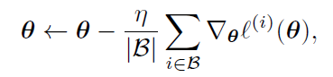

* 小批量迭代数据 batch、batch_size ，批量计算样本，提升效率，每次损失函数取平均损失 

* 模型训练流程：

  1. 数据集准备，打标签，训练集、测试集
  2. 损失函数、优化算法（梯度下降）确定
  3. 训练模型 
  
  

编程常见名词

```python
num_inputs = 2 # 特征数
num_examples = 1000 # 样本数 examples*inputs 输入矩阵 
data_iter(data_set,batch_size) # 迭代器，用于返回批量样本 
batch_size # 批量样本数
num_epoches # 训练周期 每一轮周期训练一个样本 
```


## softmax回归

* 离散值预测，输入是特征，**输出是多个值，表示在各个类别上的概率值**。在最后的输出层施加softmax运算$x=\frac{e^x}{\sum_i e^i}$，使每个值介于0-1之间，成为合法概率 

  

* 损失函数：交叉熵，用于评估两个概率分布的差异。真实类别建模成0-1向量。

  * 平方差函数对于离散值概率预测太严格了，因为我们只需要真实类的预测概率最大（argmax）即可。

    对于分类问题（与之对立的是标签问题），**公式可以进一步简化成 $H=-1*log\hat{y_j}$ ，j是对应标签不为0（也就是1）的那一项**。
  
    **在程序编写时**，`y=[6,2,……]`标签对应的是索引，比方说`y[0]=6`，`y_hat=[...]`应该是标签长为L的向量，然后取出第6索引，就是它的交叉熵，$-log\hat y[6]$ 
  
  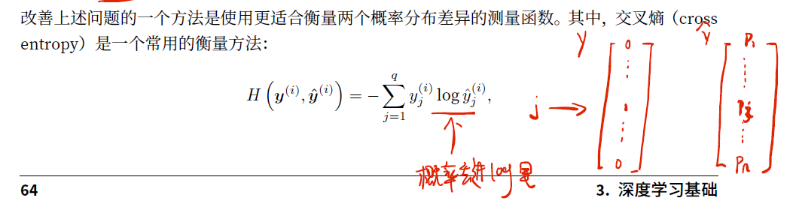
  
  

## 多层感知机

神经网络就是这么一个多层感知机。

* 输入层，隐藏层，输出层 。全连接层：该层用到了上一层的所有输出。

  每一个入边表示输入，圈里的h表示单个神经元的输出。

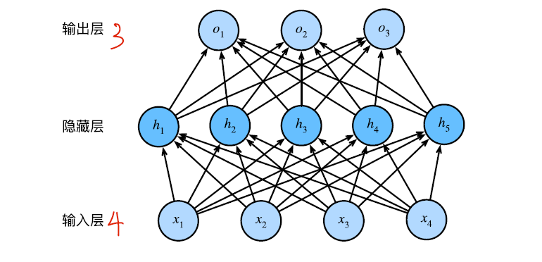 

* 激活函数：线性函数的组合仍然是线性函数。$H=\phi(WX+b)$。常用的激活函数：
  * relu=max(x,0)
  * sigmoid ，输出0-1，门控 
  * tanh，输出-1-1 

## 过拟合、欠拟合、验证集

* 过拟合：训练集上误差小，测试集上误差大。当训练集样本小（模型会对噪声拟合）容易发生

* 欠拟合：训练集、测试集误差大。当样本特征较少时，比如用一阶函数拟合三阶函数。

* 过拟合的解决办法： 适当增加训练误差，换取泛化误差的降低 

  * 增加训练集大小

  * 权重衰减法：对梯度变量迭代时，增加超参数$\lambda>0$ 作为惩罚像，用来抑制过大的权重参数。

    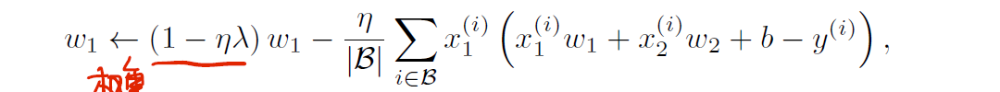

  * 丢弃法：仅在训练时（测试时保留），概率丢弃隐藏层的某一个神经元，每一层的丢弃概率独立。在多轮迭代时，每一个神经元都有可能被概率丢弃，这就导致参数迭代不会太依赖某一个神经元。 

    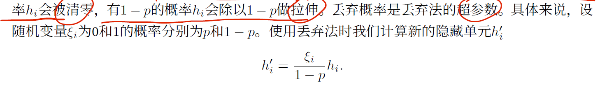

* k折交叉验证：对训练数据集划分成k份，每次取k-1份用于训练，剩下一份用于模型验证。k轮后对验证误差、训练误差取平均。验证数据集用于验证模型的好坏。

* 验证集、测试集：训练集自动调整权重系数，验证集不参与训练，**用于手动调整模型超参数**。测试集用于评估模型泛化能力，建议使用一次（1.一般测试集数据比较大 2.如果测试集用来调整超参数，**那么你的模型事实上又可能在你的测试集上过拟合了，对于其他的测试集呢？泛化能力不得而知**）。 **验证集不是必须的，它的存在是为了独立出模型超参数调整和泛化能力评估两个步骤**。在跑测试集前，验证集相当于测试集，在训练误差、验证误差中权衡一组不错的超参数作为最后的模型，去跑测试集。

## 正反向传播

* 正向传播：输入到输出的计算顺序，依次存储中间过程用到的中间变量。
* 反向传播：链式求导法则，依次计算存储中间变量的梯度。
* 模型训练过程中，初始化完成后，正反向传播交替进行。一轮的过程为：正向传播得到损失函数，反向传播对参数进行迭代。
* 梯度爆炸、衰减：类似于指数爆炸、衰减的原理，当神经网络层数比较多的时候发生 

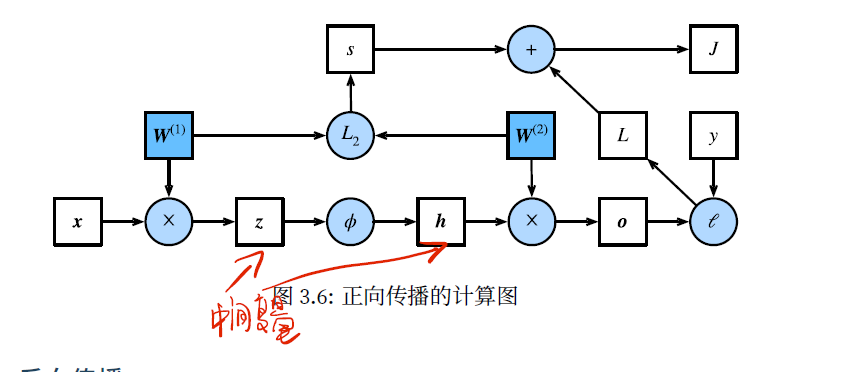

## 预处理数据集

* 连续变量标准化 $\frac{x-\mu}{\sigma}$ ，有些数值大，有些数值小。将离散字符串转换成独热编码 

# 深度学习计算

* 模型关注输入特征数：`examples*features` ，样本数可以自动推导。一般只要在输入层、输出层给输入输出维度即可。

* 一个简单模型类

  ```python
  class Mynet:
      def __init__(self):
          # 定义各个层
          super().__init__()
      def forward(self,x):
          # 定义正向传播的计算顺序以及python控制流 
          # x是输入
          return output 
  ```

* 每一层参数提取 parameters 。`net[0].params`得到一个参数字典，键为参数名，值为参数值。`net[0].weight`，等效形式，直接访问0层的weight参数。

  ```python
  Parameter dense0_weight (shape=(256, 20), dtype=float32 
  ```

* 参数延后初始化：在实际输入样本时，神经网络的权重参数才进行初始化。因为神经网络在定义的时候只需要特征数，缺失另外一个维度。延后初始化的主要好处是让模型构造更加简单。例如，我们⽆须⼈⼯推测每个层的输⼊个数。

* cpu、gpu计算：gpu擅长矩阵运算。

# 卷积神经网络

* 卷积的运算，对三维空间局部信息的提取

* 卷积层提取特征；池化层做压缩；在输入到全连接层时要展成二维

* 边缘填充：卷积计算时，边缘贡献度比较低，相比局部计算次数少

* 卷积（池化同理）之后的大小计算：$h'=\frac{h+2p-k}{s}+1$，h为高，p表示填充，k表示卷积核大小，s为步长。

* 对`(h,w,c)`三维的理解 ，为了保持特征图大小相同，随着网络深入，卷积层通道数增加（因为通常经过池化，特征图就缩小一四分之一）

* 感受野：特征图的一个元素计算有原图多少像素参与

* 经典卷积网络：

  * lenet

  * axnet

  * vgg，用多个小的卷积核代替原始大的卷积核

    * 一个大的卷积核 VS 多个小的卷积核：小的卷积核参数小，非线性变化多

      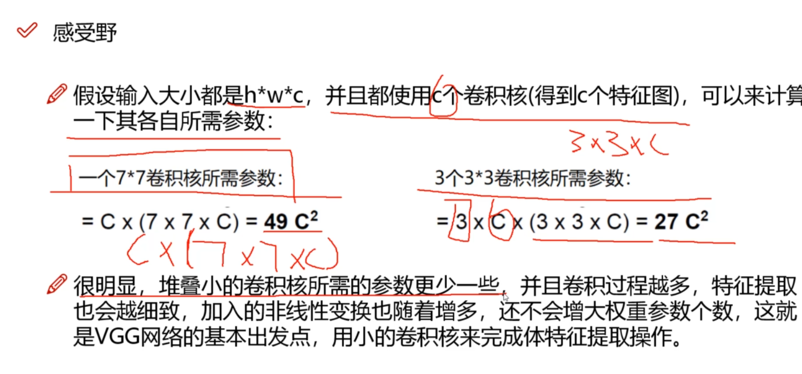

  * resnet，残差网络，神经网络变深也可以优化的设计方法

* 数据增强：对数据略加变换，生成新的可利用数据。

# 循环神经网络

## 循环神经网络

循环神经网络侧重于时间序列的分析，每一个单元对应于时间序列的一个时间步。 

每个单元结构相似，接受当前输入x、上一个隐藏状态$H_{t-1}$，并输出该单元的隐藏状态，作为下一个单元的输入参数之一，这就是“循环”的含义。 

$H_t=\phi(X_tW_{xh}+H_{t-1}W_{hh}+b)$ 


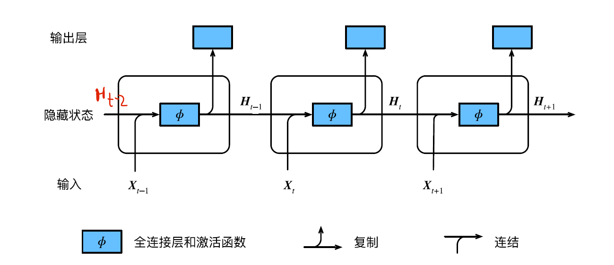


循环网络 预测下一个字符 示例：

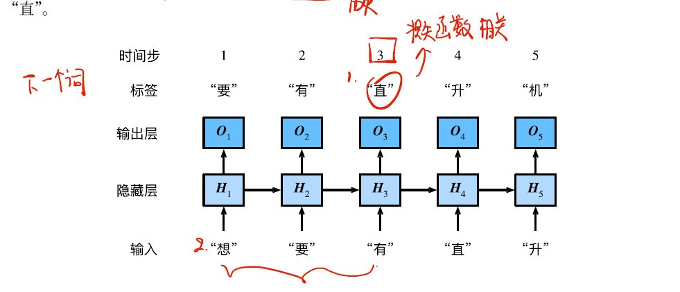


## 梯度爆炸衰减


梯度爆炸应对：梯度裁剪 

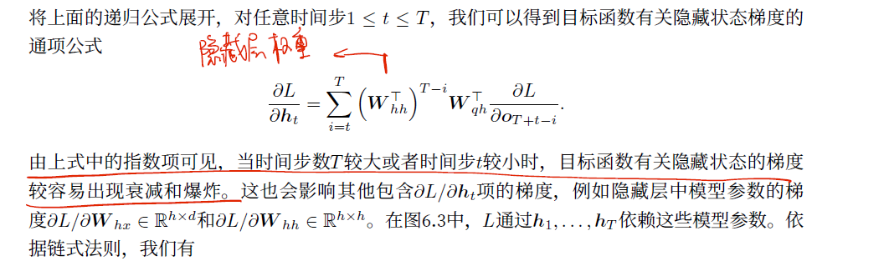


梯度衰减应对：捕捉时间步距离较大的依赖关系 为上一时间步隐藏状态分配权重。LSTM、GRU 等网络 


门控神经单元GRU ：增加了重置门，更新门 等结构 

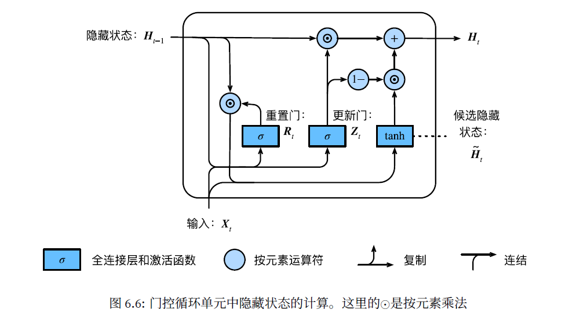

* 重置门R：重置上一时间步隐藏状态$H_{t-1}$，生成当前时间步的候选隐藏状态  

  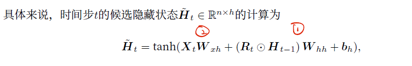
  
* 更新门Z：更新当前隐藏状态$H_t$，控制隐藏状态如何被当前时间步的候选隐藏状态更新 

  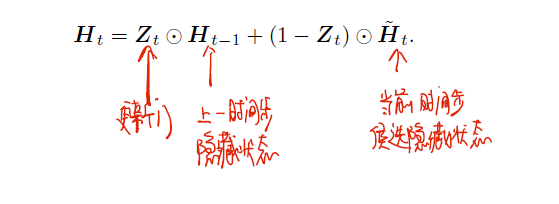


## LSTM

长短期记忆LSTM ，输入门I，遗忘门F控制信息的流动，输出门O  

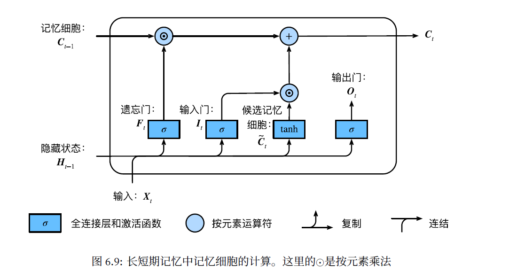


## 深度循环神经网络

增加了隐藏层H的层数。

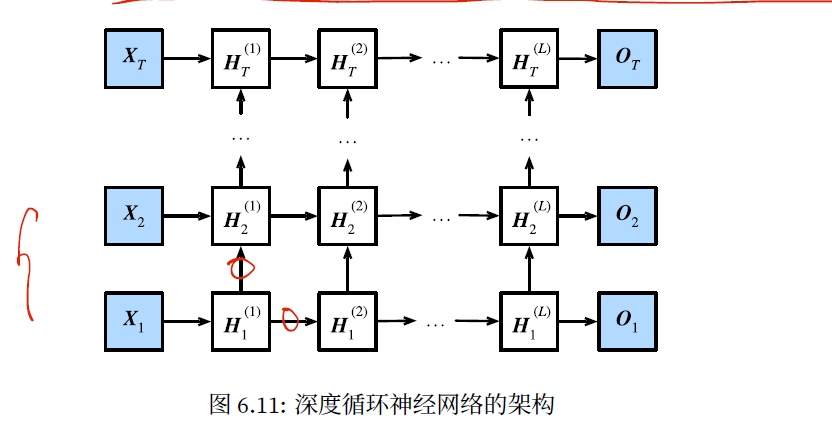

## 双向循环神经网络 

深度双向循环神经网络  ，当前时间步隐藏状态分为前向隐藏状态、后向隐藏状态，最后连接传入输出层 

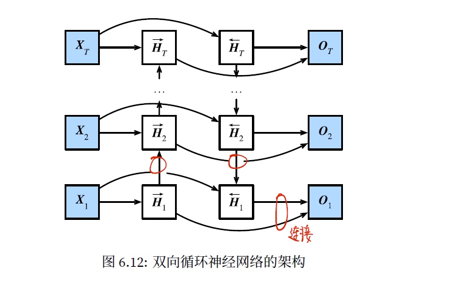


# 优化算法

梯度为0时函数的可能值 。按概率计算，鞍点的可能性更高（在其中一个维度是局部最小，其他维度却不是）

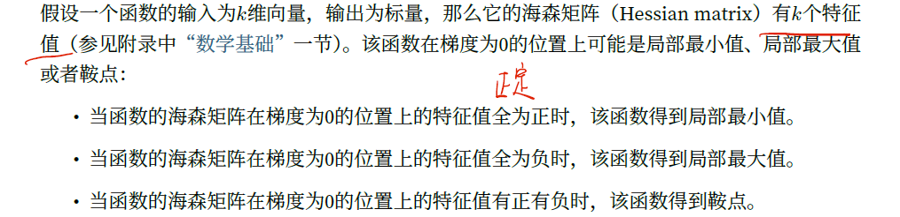

## 梯度 步长 

现有m个样本点，每一个样本是n维特征向量，欲求取梯度向量：

* 梯度下降：计算每一个样本的梯度，求平均，准确但是费时

* 随机梯度：随机取其中一个样本的梯度，计算快速但下降不够平滑 
* 小批量梯度下降：折中上述两种方法，取一个小批量样本的梯度，求平均 


梯度确定了损失函数下降的方向，下降幅度取决于步长（学习率 learing rate）。学习率作为超参数，步长过长，迭代容易越过最优点导致发散，步长过小，迭代周期变长。

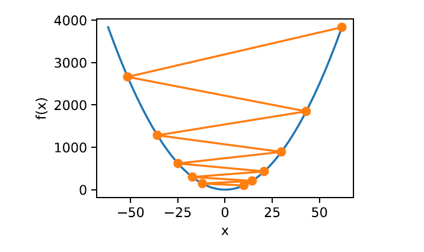


## 梯度下降算法 

我们希望迭代过程中，梯度下降是平稳快速的，但有时候会存在这么一个问题：多维向量中，其中一个维度的梯度小，另外一个维度的梯度大，导致移动时波动较大。


x2梯度较大，x1梯度较小 


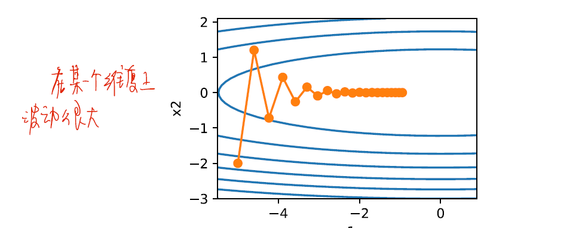

### **动量法**

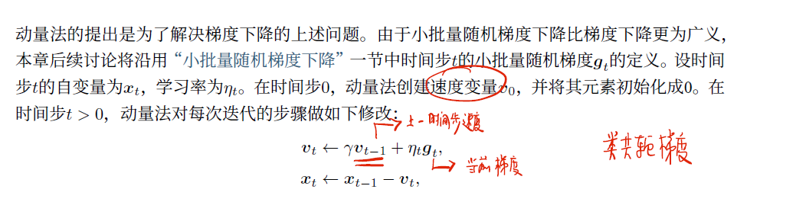


**下降方向为当前梯度方向、上一时间步的下降方向加权组合。**

**动量法使得相邻两次的下降方向更一致。**


### AdaGrad

依据每一维度变量的梯度值来调整学习率，**s随时间积累，步长逐渐衰减**。如果前期就已经衰减的很厉害，会导致后期步长过小，迭代变长。

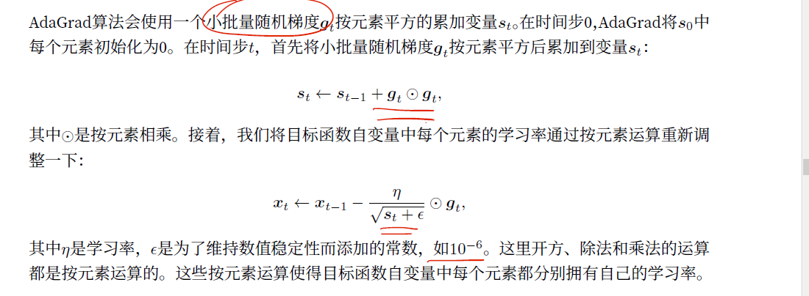

### RMProp 

解决AdaGrad的痛点，维度变量的学习率到后期不再衰减。

### AdaDelta

解决AdaGrad的痛点，维度变量的学习率到后期不再衰减

### Adam

Adam算法在RMSProp算法基础上对小批量随机梯度也做了指数加权移动平均。

# 自然语言处理

## 概述

自然语言处理层次  


文本处理的流程：

1. 输入文本
2. 分词 ， 此步可以进行词性标注、命名实体识别等
3. 信息抽取（关键词抽取等）、句法分析、文本分类
4. 语义分析：侧重语义，词义消歧、语义分析 


## 分词

### 词典分词

预定义词典，依照算法切割字符串匹配词典：

* 正向最长匹配分词、逆向最长匹配分词、双向最长匹配分词 
* 字典树： 叶节点作为一个词语的结束标记，从根开始遍历，寻找一条路径。


### 二元语法

语言模型：对语言的数学抽象 。


马尔科夫链用概率模型来考虑语言的生成，当前字符出现概率依赖前面出现的若干字符，$p(w_t|w_0...w_{t-1})$，n=1时为二元语法 ，常见的为1元、2元、3元。2元语法下，$p(s)=\Pi_{t=1}^{k+1}p(w_t|w_{t-1})$ 

当n取值过大时，会有以下问题：

* 数据稀疏，$p=\frac{count(w_0...w_t)}{count(w_0...w_{t-1})}$ ，很多片段在语料库根本不会出现。
* 计算量大，当序列变长的时候，每个分子分母计算都非常耗时 


用“平滑策略”来解决数据稀疏的问题，也就是用低阶n元语法来平滑高阶n元语法。以2元语法为例：

$p(w_t|w_{t-1})=\lambda p_{ML}(w_t|w_{t-1})+(1-\lambda)p(w_t)$ ，即使前一项概率为0，也能得到后面一项的概率支撑。lambda为常数平滑因子。


n元语法分词步骤：

1. 给定语料库 统计n元词 词频
2. 给定句子，构建词网
3. 利用维特比算法（也是一种路径算法），计算得到起点sos到终点eos的最长路径（最大可能）。


## 序列标注

### 词性标注

词典分词的不足：OOV（out-of-bag） ，袋外词语难以召回 。将词语的颗粒度降为字符。分词转为序列标注问题。常见的标注方法为`BEMS`，词语首尾BE、词中Middle、单字词S 。

例如

```
参 观 了 北 京 天 安 门
B  E  S B  E  B M  E
```

单词的数量无穷，而词性有限**。借助词性可以猜测OOV的用法（结合`BEMS`标签）**，而不是将所有的OOV标记为`UNK`，混为一谈。

```
商 B 名词
品 E 名词
和 S 连词
服 B 名词
务 E 连词 
```

### 命名实体识别

命名实体： 描述实体的词汇，比如人名、地名、机构名等，在不同领域各取所需。 

**序列标注要也可以应用在命名实体**（现实存在的实体，人名、地名、机构名）。复杂的命名实体多是由短单位组合成长单位，可以将标注对象从字符扩大为词语，并附着属性标签。例如

```
参观 了 北京 天安门
O    O B-地名 E-地名
```

### 隐马尔可夫

隐马尔可夫模型HMM：两个时序序列联合分布的概率模型

* 观测序列`x` ：字符本身。隐态序列`y`：字符之间的隐藏关联状态 
* 状态转移概率矩阵：从$y_t$到$y_{t+1}$的`N*N`矩阵，N是所有隐藏状态。
* 发射概率矩阵：从$y_t$到$x_{t}$的`N*M`矩阵，N是状态总和，M是x总和。


HMM 假设人们说的话仅仅取决于一个隐藏的状态序列`BEMS`，这个假设不符合语言规律，捕捉到的语言特征有限 。

### 条件随机场


**根据建模的究竟是联合概率分布$p(x,y)$还是条件概率分布$p(y|x)$，派生出生成式模型与判别式模型。** 

常见的生成式模型$p(x,y)$：隐马尔可夫模型HMM、朴素贝叶斯模型、高斯混合模型GMM、LDA 

常见的判别式模型$p(y|x)$：线性回归、决策树、支持向量机SVM、k近邻、神经网络 


undefined 18 20 undefined 

c  defer会阻塞dom事件 但不会阻塞onload事件

a 检查约束

c 5次 log220 + 1 

b 8 17 19 22  

获得奖励的期望是 

d -mtime -10 -exec 

c 212.212.2.0/24 

c a.a() 错误 

0.65


条件随机场（Condional Random Field，CRF）,给定输入随机变量x，求解条件概率$p(y|x)$的概率无向图。用于序列标注时，化为线性链（linear-chain）。

 相比于HMM，CRF能够提取的特征更加丰富，可以自由定义k个特征函数$f(x_t,y_{t-1},y_t)$ 用以提取特征，对每个特征函数赋予权重$w_k$，整个序列的分数$score(y_i|x)=\Pi_t^T {W*f(x_t,y_{t-1},y_t)}$ ，其中$W$是`k*1`的向量，在训练过程中会迭代更新。

在此基础上，遍历所有可能的标注序列y，对score进行归一化，$score=softmax(score)=\frac{e^{score}}{Z}$，$Z=\sum_{y_i}score(y_i|x)$ 

条件随机场、特征函数通俗理解： https://zhuanlan.zhihu.com/p/104562658 


条件随机场与感知机比较：摘录自《自然语言处理入门》P210

感知机与条件随机场相同点：

* 特征函数相同
* 权重向量相同
* 打分函数相同
* 预测算法相同


**他们最大的不同点在于训练算法**，这是两者准确率差异的唯一原因：

感知机属于在线学习，每次参数更新只使用一个训练实例（`x_i`与`y_hat_i`）。**条件随机场则定义在整个数据集之上，每次参数更新都是全盘考虑。**


在机器学习中，若权重向量的范数太大，意味着模型对自己的判断太过自信，会导致模型过拟合，**丧失泛化能力。常用的手段是正则化——让对数似然函数减去范数**，对那些范数较大的模型施加惩罚。$e=e-\frac{w}{2\sigma^2}$，$\sigma$作为惩罚项控制惩罚力度。


## 信息抽取

### 新词提取

给定一段文本，随机取一个片段，如何判断这个片段是否是一个词语：**互信息、信息熵** 


左右信息熵：**$H(x)=-\sum_x p(x)log{p(x)}$**，衡量片段的左右搭配是否丰富，如果是，那么该片段很有可能就是一个词语

互信息：$I(X,Y)=\sum_{x,y} p(x,y)log{\frac{p(x,y)}{p(x)p(y)}}$，衡量片段内部的搭配是否固定 。互信息越大，两个随机变量的关联就越密切。

统计一个语料库，可以计算某个片段的上述两项指标。例如

> 两只 蝴蝶 飞呀飞
>
> 这些 蝴蝶 飞走了 

“蝴蝶”的左右组合有`{只，些，飞}`，“蝴蝶”两个字的互信息统计整个语料库分别计算“蝴”、“蝶”的字频，同样可以计算。

### 关键词提取

关键词的定义标准不一，很难用有监督学习训练。这里介绍几个无监督学习。

#### 词频统计

关键词通常在文章中反复出现。

词频统计的流程一般是：分词、停用词低频词过滤、按词频取前n个。

#### TF-IDF

词频-倒排文档索引。词频统计的缺陷：出现频次高的不一定是关键词，也有可能是领域的共性词语。

$TF-IDF=\frac{TF(t,d)}{DF(t)}=TF(t,d)*IDF(t)$ ，t代表单词term，d代表文档document。

公式的含义也就是：**一个词的重要程度与它在文章中的频次成正比，与文档包含该词的频次成反比。** 

#### TextRank

TextRank是PageRank在文本上的应用。

pagerank是一种网页排序算法，它的工作原理是将网页看做有向图，网页视作节点，节点之间的链接视作有向边。每个节点的权重都是1，以迭代方式更新，迭代权重更新表达式：

$S(V_i)=(1-d)+d*\sum _{V_j\in In(V_i)}\frac{S(v_j)}{|Out(v_j)|}$ 

$V_i$是节点，d是0-1之间的常数因子，$In(V_i)$表示节点的入边节点集合，$Out(v_j)$表示节点的出边节点集合。

上述公式表示，一个网站给别的网站做的链接越多，每条外链的权重就越低$\frac{1}{Out}$ ，与每条外链本身的权重成正比$S(v_j)$ 。物以类聚，与垃圾网站交换的往往也是垃圾网站。pagerank捕捉到的刚好是这一点。


## 文本向量化 

将文本表示成向量，作为特征抽取的输入。 

文档的向量表示：

* 词袋模型： 文本由若干词语组成，`[w1,...,wn]`，**出现的词语统计词频**，最后得到`1*voc.nums`大小向量。这种方法简单，但是无词序，损失了部分语义。比方说，“人吃鱼”、“鱼吃人”会得到相同的向量表示。另外，**词频不是唯一指标，可以是tf-idf值，或者词向量本身。** 

  词袋模型中词语的过滤：有些词语没有实际意义，不适合作为特征，如英语的the、汉语的“的”

  * 停用词词典
  * **卡方特征**（有监督 文本分类）：摘录自P309（卡方、期望、置信度）。卡方检验常用与检验两个事件的独立性。将词语的出现与类别的出现作为两个随机事件，**类别独立性越高，越不适合作为特征**。


无监督的文本聚类算法无法学习人类的偏好对文档进行划分，也无法学习每个簇的意义（标签）。 


## 依存句法分析

语法分析：分析句子的语法结构并将其表示为树形结构 。

上下文无关文法（《编译原理》有讲过）：形式化地描述文法产生规则。终结符、非终结符、推导规则。

### 短语结构树

关注如何用语法生成句子  


### 依存句法树

依存句法树不关注如何产生句子，**而是句子中词语之间的语法联系**，并将其约束为树形结构。


修饰词、支配词：如果一个词语修饰了另外一个词，被修饰的词语称作“支配词”（修饰词语是为它服务的），修饰的词语称作“修饰词”。


## 深度学习的破局

**通过海量无标注样本的无监督训练自动抽取事物特征**，然后在相对少量的标注样本上进行微调，神经网络展现出强大的迁移学习能力。 

### 传统机器学习的局限

#### 数据稀疏

将离散符号转为向量作为机器学习的输入，一般采用独热编码（one hot）。所谓的独热编码（常见的是按照词典序编码），就是在n维向量中，只有1个维度为1，其余为0，形如`[0,...1,0...]`，彼此正交。**这样的向量维度庞大，数据稀疏，而且，词义上相近的两个词语，在向量上可能完全不搭边。**


**我们希望任意单词都能表示为具有合理相似的向量，那么OOV的问题就不复存在，因为模型看到的这个向量，必定和训练集中的某个向量存在较高的相似度，模型就能将其归为相似单词处理。这种技术在深度学习中被称作“词嵌入”**。


这来源于一个矛盾，**一方面，高级的NLP任务需要复杂的特征。另一方面，特征模板越复杂**，数据就会越稀疏，例如，一个特定单词很常见，两个组合的单词频率就会大幅降低，三个单词的组合更是如此，那些出现概率极低的组合在统计学上没有任何作用。

另外，在某些特定领域，比如电商、医疗，特征模板的抽取需要人们具备一定的专业知识。

#### 误差传播

传统的机器学习在自然语言处理上是一种流水线的作业，分为很多环节，分词、词性标注、停用过滤词、特征筛选（例如卡方检验）、送入分类器分类。

**这种流水线作业会造成严重的误差传播，前一个环节如果出错，后面的环节就会将错就错**。比如，“质量不过关”，错误地被分成“质量 不过 关”。

### 神经网络

**在深度学习中，特征模板抽取被多层感知机代替，这正是深度学习的精髓。** 

简单地理解，**可以将神经网络看做一个多元的非线性函数`f(x1,x2,...)`，输入是特征向量，输出另一个特征向量h，**其中h的每一维都是原始特征的若干次组合重构（从矩阵乘法的角度考虑）。

#### 稠密向量

神经网络输出的新特征h的长度是可以控制的，可以将h设定的较短（稠密向量），**这样子就实现了从高维向量到低维向量的转变，低维向量在空间上会拉近很多，彼此的相似度就容易体现**。

#### 特征自动抽取

神经网络两层之间一般为全连接，不需要根据具体问题来调整连接方式。**网络会自动根据损失函数的梯度来确定隐藏层的权重矩阵，从而自动学习到事物的特征表示。**

#### 端到端的设计

神经网络层之间、网络之间采用的都是统一的向量”语言“，这就很适合多个网络的组合，形成一种端到端的设计。

深度学习兴起之后，传统机器学的每一个环节都可以被（使用同一个损失函数的）神经网络取代，并且在误差传播方面取得更好的效果。

## word2vec

w2c：训练词向量的一种神经网络 


w2c分为跳字模型skip-gram 、连续词袋模型CBOW 

* 跳字模型skip-gram：由中心词$w_c$确定背景词 $w_o$

  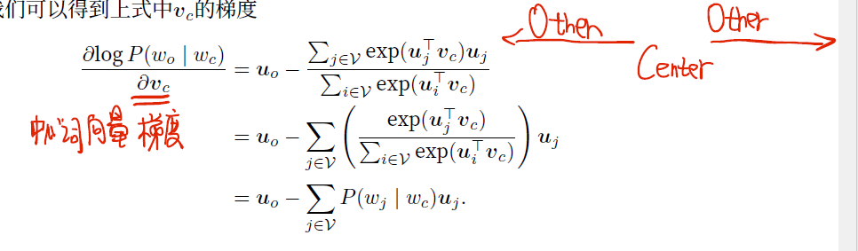

* 连续词袋模型CBOW：背景词确定中间词，利用中间词训练背景词。用背景词向量表征词 


跳字模型的梯度计算优化：更改损失函数 

* 初始损失函数计算不足：遍历词典
* 负采样，加入k个噪声词，时间复杂度与k相关

* **二次采样**：对无意义高频词概率丢弃，如the  ；过滤生僻词（出现频率低于阈值）


w2c 词向量的应用：

1. 词嵌入，作为词语表征
2. 词语聚类，利用余弦相似度来寻找近义词，更准确的说法应该是相关词，因为w2c在训练过程中是用上下文训练。一起在上下文出现的词语不一定是近义词，如美丽-丑陋。  


## glove

glove从另一种角度对跳字模型建模 ，表示的损失函数不同。

* 多重集计算需要预先知道语料的全局信息 。**多重集**，一个中心词在文本不同处的背景窗口词语的包含重复词的集合，可以理解为该中心词下可能生出的背景词集合（word2vec是考虑整个词典）
* 每个词的词向量是中间词+背景词向量之和。中间词与背景词等价（多重集对称）。
* glove模型表示词的相似度 
* 求近义词和类比词 b-a=d-c ,b类似于a犹如d类似于c ，`beijing:china :: tokyo:japan `
* glove训练模型命名规范：`模型.数据集(billion十亿).词向量维度（xxdimension）` ，如glove.30b.300d  


## 编码器-解码器 seq2seq

* 编码器 解码器 ，两个都是RNN 。在句子的开始、结尾加上sos、eos 。
* 编码器：输入不定长序列，输出固定长度的背景向量 
* 解码器：输入固定长度的背景向量，输出概率预测  


* 解码器的一个时间步输入：上一时间步解码器输出$y_{t'-1}$、上一时间步的隐藏状态$s_{t'-1}$、包含输入序列x的背景向量$c$ 。

  如果采用强制教学（teach forcing），解码器当前的输出$y_{t'-1}$改为目标值target传入下一个状态
  
  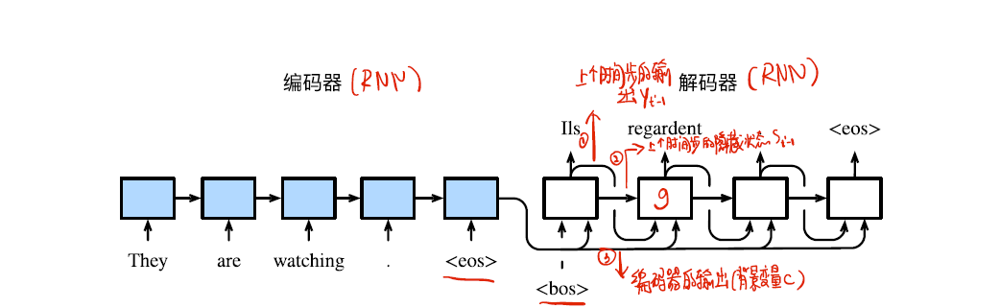 


## 束搜索

在解码器阶段，对贪心策略改进的一种候选字符选择算法。

解码器每一步骤输出概率预测，如果选用 贪心策略，虽然每一时间步都输出最大可能字符，但整体概率（条件概率，字符之间并非独立出现）并不一定最大。即贪心策略不能保证得到整体最优输出。

束搜索是对贪心策略的改进，每一次选择概率最大的若干候选词（超参数，束宽）送到下一时间步，直到字符中包含eos。

第一时间步是贪心，后面几步都是条件概率。

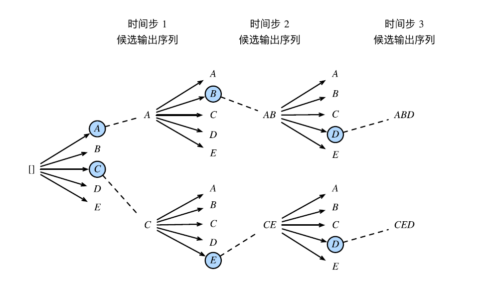


在候选中如何选择最终答案 （L是最终序列长度，$\alpha$是超参数）

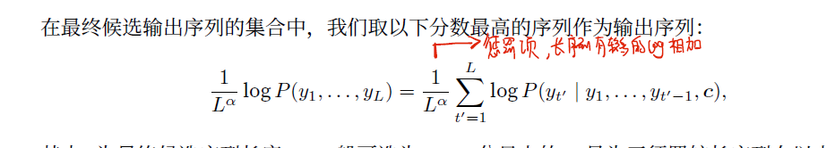


## 注意力机制

注意力机制来源于以下事实：解码器当前的输出可能只依赖输入序列中的某部分，而非全部。

在注意力机制以前，seq2seq的解码器采用编码器的输出的同一个背景变量。注意力机制会为编码器每个时间步的表征或分配不同的权重，通俗上看，就像分配了不同注意力一样。

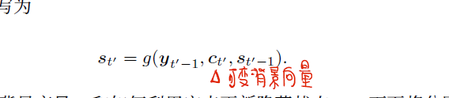 


**可变背景向量**的计算图

* 背景变量为编码器各个时间步的加权和 ，加权系数的计算参数：解码器上一时间步的隐藏状态、编码器各个时间步隐藏状态。 
* 函数a有多种选择，简单考虑可以选择内积 

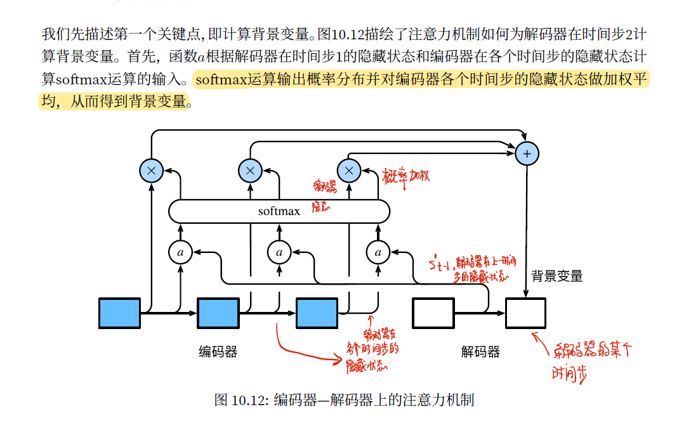


注意力机制的矢量化运算

* 注意力机制的输入应该包含：查询项q以及一一对应的键项k和值项v。 查询项是解码器的隐藏状态，键项、值项均为编码器的隐藏状态。

**Q通常就是 解码器当前时间步（或者上一步，依据注意力机制算法不同）的隐藏状态**

**K 就是编码器各个时间步的状态  V同K ，softmax将向量内积转为权值和为1的权重系数 ，这个权最后落到编码器各个时间步状态**  

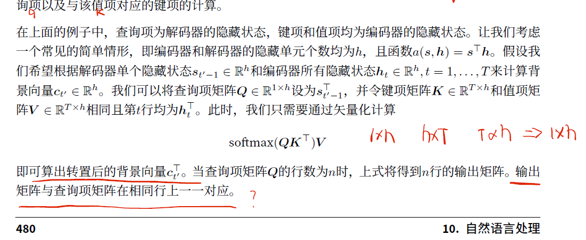


两种注意力机制 ：

https://blog.csdn.net/u010960155/article/details/82853632 


注意力机制的发展  ，transfomer ，bert 


# Transfomer and Bert 

## transformer

关键词 ：位置编码向量 并行输入 自注意力机制 多头 laynorm  ；解码器

### 基本结构

编码+解码 模型


每个encoder、每个decoder的结构相同，但是权重参数不同 


 

### encoder

 


#### 输入部分

embedding 词嵌入 + position encoding 位置编码向量


**位置编码**

rnn按照序列的先后顺序处理 

**transfomer并行处理**，会忽略单词之间的位置关系，所以需要位置编码来记录单词的位置信息。

位置编码应当记录**词之间的绝对位置、相对位置** 

奇数、偶数位置分别使用cos 、sin编码 ，长度和embedding词向量维度一致


**pos表示词在句子中的位置，i表示位置向量维度的第i维** 

pos + embedding 作为最终的输入向量 


为什么位置嵌入是有用的：相对位置k、绝对位置pos都被编码到一个向量里了


#### 注意力机制

TRM的 **self-attention 自注意力机制联系了词语的上下文信息对词向量编码**  。

对比word2vec：w2c改进了one-hot高维稀疏、向量无意义的问题。词与词之间可以通过相似度或者距离来表示关系，相关的词向量相似度比较高。**但是w2c训练好以后词向量就不会变化，同一个词就算在不同的上下文环境中都使用了同一个向量表示**，比如“歹徒被制服了”、“穿着制服上班”，这两个“制服”的意思是不一样的，理应得到不同的表示。

自注意力机制会为句子中的每个词依照相关度分配不同的权重，然后累计作为当前词词向量，即$z=\sum a*v$。**每个词的输出向量z都包含了其他词的信息，每个词都不再是孤立的了** 。

在rnn中，随着距离拉远，包含前面输入的信息越来越少。但是Transformer这个结构就不存在这个问题，不管当前词和其他词的空间距离有多远，包含其他词的信息不取决于距离，而是取决于两者的相关性，这是Transformer的第一个优势


##### 基本注意力机制

基本的注意力机制 QKV 矩阵 ；分母dk维度用来调节内积大小 （受维度影响大小）

**qk的点乘大小可以用来表示两者之间的相似度** ，softmax转为概率值后作为权 ，与v相乘 


a1……等表示最后的权值 


对于一个词，如何获取它的QKV

1. 初始化 三个矩阵 `wk wq wv` 
2. 用词向量和矩阵相乘，得到他各自的qkv 


实际运算时，为了计算并行化，不会一个个单词计算qkv，而是直接进行矩阵运算


##### 多头注意力机制

多头指的是有多套`wq,wk,wv`矩阵 ，所以，每个单词对应了不止一套`qkv`，这相当于增加了特征信息 

**多个头会得到多个z，最后需要进行拼接** 


#### 残差和LayNorm


连乘导致梯度消失 ，残差网络的缓解了梯度消失的问题 。

这就可以让神经网络扩展很多层 


BatchNorm   和 Laynorm 

对于每个特征维度 以batch为单位  量纲消除 


BN 缺点

* batchsize较小时 效果差。因为用batch的均值、方差来模拟数据集的方差
* 在rnn中效果差 rnn的输入是不定长的 不能得到整个batchsize的均值 方差 


laynorm ，在一个样本中缩放向量 。与BN相比，他们的缩放维度不一样  


### decoder

在全连接层前 可以分为2层 


#### masked multi-head attention 

就是在多头注意力基础上 增加了 mask机制 。那么为什么需要mask ？

预测（decoder）的时候，不应该看到当前及之后的单词，不然相当于作弊 


#### 交互层

encoder的每一个输出都和decoder做交互 


encoder生成kv矩阵 decoder生成q矩阵 


## Bert

### 整体模型架构

Bert（Bidirectional Encoder Representations from Transformers），**是一个无监督的预训练模型，只要有语料就可以训练，类似于Word2vec**。利用transform的encoder部分，将其视作一个基本单元，堆叠起来。

在做具体NLP任务时，**用一个通用模型，在非常大的语料库上进行预训练，然后在特定任务上进行微调**，BERT就是这套方案的集大成者。BERT不是第一个，但目前为止，是效果最好的方案。

word2vec 和 bert 比较： 

* w2c的思想是，一个词的意思由和他频繁出现的单词确定（cbow、skip-gram），有一种线性关系。但是，训练出来的单词向量是静态的，即使在不同的上下文环境中也是同一个表示 （简单地说就是一词多义）
* bert不同层提取了不同的特征，譬如语法、字符、句子等（得益于transformer的编码器结构），层次越高，学到的特征更加抽象 ，w2c并不具备这一点 


bert中输入向量的组成：`input=token emb+ segment emb+position emb` 


NSP，**bert预训练中的任务，用于处理两个句子之间的关系**，sep表示分隔符。 

[cls]是一个特殊的向量，后接一个二分类器用来做二分类任务。

token embed：包括特殊字符（sep等）在内的所有词都进行编码

segement embed：一个句子用统一的0或1标识，如下图中的EA、EB就表示不同的句子

position embed：随机初始化，参与学习迭代。 


关于CLS向量  


### 预训练 MLM+NSP

在训练 BERT 模型时，MLM 和 NSP 是一起训练的，目标就是要最小化两种策略的组合损失函数 。

#### MLM

MLM ,mask language model ，掩码语言模型 

Bert 的**B是bidirection 双向的意思，MLM通过掩盖单词，可以结合上下文（序列的两个方向）来预测单词**。 

AR：autoregressive ，自回归模型，**只考虑单侧信息（顺序 ）**，典型的是GPT

AE：autoencoder，自编码模型，**从损坏的输入数据中预测重建原始数据**。可以使用上下文信息，bert使用的AE 。损坏是指用mask掩盖了字符，模型从未掩盖的上下文信息中预测字符 


mask的缺点：认为mask之间是独立的，但是事实上并不是。很多mask之间是相互关联的。

例如 

```
我爱吃饭 我爱 mask mask
p(我爱吃饭)=p(吃|我爱)p(饭|我爱)
```

bert mlm的做法 


源码实现  


#### NSP

NSP ，Next Sentence Prediction 。 

在很多任务中，仅仅靠 encoding 是不足以完成任务的，这个只是学到了一堆 token 级的特征，还需要捕捉一些句子级的模式。bert在这方面做得工作就是 NSP。 

样本的构造模式 


主题预测是判断两端文字是不是来源于同一个文档，连贯性预测是判断两端文字有没有顺序关系。**主题预测非常容易学习，它的掺杂使连贯性的存在变得模糊**。也就是说，根据主题学习就能区分正负样本，连贯性的存在意义不大。在后续模型改进中，正负样本均来自于同一份文档。


### 微调bert


在实际工程应用中，都是使用别人训练好的bert，然后微调。 如何提升bert下游任务表现：


further-pretraining：

bert使用的是固定的mask，将文本mask后存在本地。


 


脱敏数据使用bert模型 


